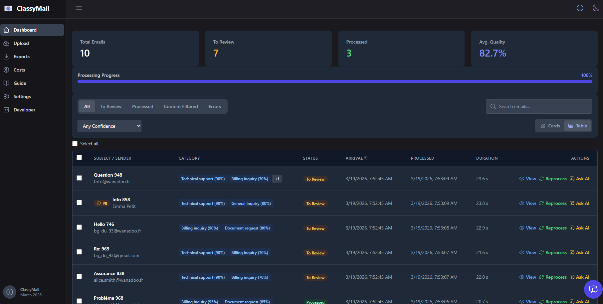
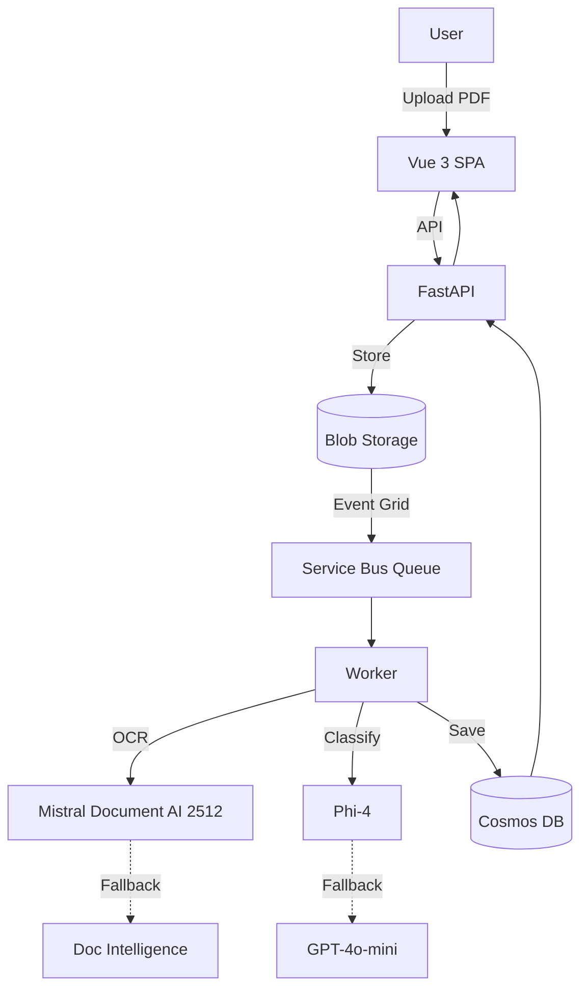

# ClassyMail

**GenAI that knows exactly where every email belongs.**

> **Short link**: [aka.ms/classymail](https://aka.ms/classymail)

ClassyMail is an open-source AI pipeline that automatically classifies emails and PDFs using multi-model inference on Azure. Upload a document, get structured intents with confidence scores — in seconds.

<p align="center">
  <a href="docs/assets/capture_process.png">
    
  </a>
</p>

---

## What It Does

1. **A PDF arrives** (scanned email, letter, invoice) — uploaded through the web dashboard, API, or automatically ingested from Blob Storage via Event Grid.
2. **Mistral Document AI** converts it to Markdown via specialized OCR — preserving layout, headers, and image descriptions. If Mistral is unavailable or rate-limited, the pipeline automatically falls back to **Azure Document Intelligence** via a circuit breaker pattern (a 📄 badge appears in the UI when this happens).
3. **Phi-4** (or a fallback model) reads the Markdown and classifies the email into one or more business intents with confidence scores and justification.
4. **Results appear in the dashboard** where a human reviewer can validate, correct, or reject the classification.
5. **Corrections feed back** into exportable fine-tuning datasets (JSONL) to improve the model over time.

The entire pipeline is event-driven: Blob Storage → Event Grid → Service Bus → Worker — so it scales from 1 email to 10,000+ without code changes.

---

## Principal Features

### AI Classification Pipeline
- **Hybrid OCR**: Mistral Document AI 2512 as primary, Azure Document Intelligence as automatic fallback with circuit breaker pattern. When Document Intelligence is used, a **📄 amber badge** appears on the email in the dashboard and detail modal so reviewers can see which OCR engine was used.
- **Multi-Model Classification**: Phi-4 (8K context) as primary, GPT-4o-mini (120K) as fallback — switch models from the Settings UI at any time
- **Multi-Intent Detection**: A single email can match multiple categories, each with its own confidence score (0.0–1.0) and text justification

### Configurable Categories & Settings
- **Custom Category Taxonomy**: Define your own business categories with name, slug, description, and exclusion rules — all editable from the Settings UI
- **Model Selection**: Switch classification model (Phi-4, GPT-4o-mini, GPT-5-mini, Kimi-K2.5, etc.) from Settings — **models are auto-discovered from your AI Foundry project deployments** with a hardcoded fallback list
- **Processing Strategies**: Choose between Standard (fast), Deep Reasoning (Chain-of-Thought), or Vision (image-aware) per processing run
- **Batch Reprocessing**: Reprocess all emails with a different model or strategy for A/B testing

### Dashboard & Export
- **Classification Dashboard**: Card or table view with confidence filters (high/low), status filters (processed/review/error), PII indicators, and real-time search
- **Email Detail Modal**: Side-by-side PDF preview + classified intents with confidence bars, justification text, and one-click correction
- **CSV Export**: Download classification results as semicolon-delimited CSV with intents, confidence scores, model used, processing time, and PII metadata
- **Batch Actions**: Mark emails as reviewed, reprocess selections, or export subsets

### Human Review & Fine-Tuning Loop
- **Correction Workflow**: Reviewers override wrong classifications with a reason — corrections are stored as golden labels with full audit trail
- **AI Feedback**: Each correction generates an LLM feedback message explaining what the model missed, used for prompt improvement
- **Auto-Feed to AI Search**: When a user corrects a classification, the email is automatically pushed as a negative example to the old (wrong) category and a positive example to the new (correct) category in the per-category AI Search indexes
- **One-Click Reinforcement**: Click "Reinforce" on any correctly classified email to push it as a `human_reinforced` positive example into its category's AI Search index — teaches the agentic pipeline "this is right"
- **Fine-Tuning Export**: Export anonymized JSONL datasets (train/test split) matching the production system prompt format — ready for Microsoft AI Foundry (Phi-4 LoRA, GPT-4o-mini)
- **Human Reinforcement**: Corrected examples are weighted higher in training data, closing the feedback loop between human reviewers and model quality
- **Category AI Assessment**: GPT-4.1-nano analyzes your category definitions and suggests improvements based on classification patterns
- **Per-Category AI Search Indexes**: Each category gets its own Azure AI Search index with positive and negative reference examples — agents use RAG to calibrate confidence (see [AI_SEARCH_INDEXES](docs/AI_SEARCH_INDEXES.md))

### RAG Chatbot
- **Chat with your emails**: GPT-5.2-chat with vector search over all processed documents, orchestrated by **Microsoft Agent Framework** (`agent-framework-core` + `agent-framework-openai`)
- **Agent-driven suggestions**: The LLM agent generates contextual follow-up action pills after each response — no hardcoded logic
- **Ask AI button**: Click ✨ on any email card or table row to open the chatbot pre-filled with that email’s context
- **12 agent tools**: Semantic search (with date filtering), keyword search (case-insensitive), reclassification handoff, sequential review, stats, error analysis, category explanation
- **Semantic vector search**: Emails are embedded with `text-embedding-3-small` (1536-dim) during processing. The chatbot uses Cosmos DB `VectorDistance()` for concept-level matching
- **Semantic cache**: Repeated similar questions are served from a vector cache (>99% similarity), saving tokens

### Security & Operations
- **Zero Secrets**: Managed Identity everywhere — no connection strings, no API keys in config
- **PII Detection**: LLM-based, Azure AI Language, or Hybrid mode (GDPR compliant)
- **Dynamic Cost Tracking**: Real token usage per email across 12+ model pricing tiers, with links to [Microsoft Azure OpenAI Pricing](https://azure.microsoft.com/en-us/pricing/details/cognitive-services/openai-service/)
- **Danger Zone**: Admin operations organized by severity — Maintenance (diagnostics), Bulk Operations (reprocess all, rebuild vector index, DLQ), and Destructive (atomic reset)
- **Rebuild Vector Index**: One-click re-embedding of all emails for semantic search repair
- **i18n**: 5 languages (EN, FR, DE, ES, IT) with 500+ translation keys
- **Build metadata**: Commit SHA and build timestamp baked into Docker image, visible in the Info modal

---

## Architecture



---

## Quick Start

```bash
# Prerequisites: Python 3.12, Node.js 18+, Azure CLI

# Generate secrets from Azure
./scripts/write_secrets_env.ps1 -ResourceGroup "<prefix>-rg" -Force

# Backend
uv sync && uv run uvicorn main:app --reload

# Frontend (separate terminal)
cd frontend && npm install && npm run dev

# Health check
curl http://localhost:8000/healthz
```

See [docs/LOCAL_DEVELOPMENT.md](docs/LOCAL_DEVELOPMENT.md) for full setup or [docs/DEPLOY_FROM_SCRATCH.md](docs/DEPLOY_FROM_SCRATCH.md) for a fresh Azure deployment.

---

## Tech Stack

- **Backend**: FastAPI (Python 3.12) + uv
- **Frontend**: Vue 3 + Vite + TailwindCSS + vue-i18n
- **Infra**: Terraform (azurerm v4 + azapi)
- **AI**: Microsoft AI Foundry (Mistral, Phi-4, GPT-4o-mini, GPT-5.2-chat) + Microsoft Agent Framework GA 1.0
- **Storage**: Cosmos DB (serverless + vector search + composite indexes), Blob Storage
- **Auth**: Managed Identity (zero secrets)
- **CI/CD**: GitHub Actions with OIDC

---

## AI Models

### Required Models (core pipeline)

| Model | Deployment Name | Purpose | SKU |
|-------|----------------|---------|-----|
| **Phi-4** | `phi-4` | Primary classification | GlobalStandard |
| **Mistral Document AI 2512** | `mistral-document-ai-2512` | OCR / PDF extraction | GlobalStandard |

### Optional Models (enhanced features)

| Model | Deployment Name | Purpose | Required for |
|-------|----------------|---------|-------------|
| GPT-4o-mini | `gpt-4o-mini` | Fallback classifier, PII detection | Large emails (>8K tokens) |
| text-embedding-3-small | `text-embedding-3-small` | Vector embeddings for RAG chatbot | Chat / semantic search |
| GPT-5.2-chat | `gpt-5.2-chat` | RAG chatbot conversations | Chat feature |

> **Not all models are required.** The pipeline works with just Phi-4 + Mistral OCR. Optional models enable fallback classification and RAG chat. Deploy only what you need.

> **Pricing in the Settings UI is hardcoded** (estimated Azure rates as of 2025-2026). Actual costs depend on your region and Azure agreement. The backend cost calculator uses the same hardcoded rates. See `classymail/services/costing.py` and `frontend/src/views/SettingsView.vue` for the pricing tables.

### RAG Chatbot (Vector Search)

The chatbot uses **semantic vector search** over all processed emails, powered by **Microsoft Agent Framework** GA 1.0:

1. **During processing**: Each email’s OCR markdown is embedded using `text-embedding-3-small` (1536 dimensions) and stored in Cosmos DB with `type: "email"`. Chunks are also embedded separately with `type: "chunk"`
2. **During chat**: User queries are embedded, then Cosmos DB `VectorDistance()` finds the most semantically similar emails — with optional date filtering (`days` parameter for “last week” queries)
3. **Chat model** (GPT-5.2-chat) generates answers grounded in retrieved context, with source citations
4. **Semantic cache**: Similar questions (>99% cosine similarity) return cached responses instantly
5. **Agent-driven actions**: The LLM appends contextual follow-up suggestions (hidden `<!-- ACTIONS -->` block) that appear as clickable pills in the UI

> **Rebuild embeddings**: If emails were processed before the embedding model was deployed, use **Settings → Danger Zone → Rebuild Vector Index** to regenerate all vectors.

> The chat button is **automatically hidden** in the UI if `CHAT_DEPLOYMENT` or `EMBEDDING_DEPLOYMENT` are not configured. Deploy the optional models to enable it.
> Category AI Assessment is also **automatically disabled** if the assessment model isn't deployed in your AI Foundry project.

---

## Documentation

| Category | Doc | Description |
|----------|-----|-------------|
| **Getting Started** | [LOCAL_DEVELOPMENT](docs/LOCAL_DEVELOPMENT.md) | Run locally with `uv` and `npm` |
| | [DEPLOY_FROM_SCRATCH](docs/DEPLOY_FROM_SCRATCH.md) | First-time Azure deployment (45–60 min) |
| **Architecture** | [ARCHITECTURE](docs/ARCHITECTURE.md) | System design, data flow, RBAC |
| | [INFRASTRUCTURE](docs/INFRASTRUCTURE.md) | Terraform resources and networking |
| | [MODELS](docs/MODELS.md) | AI models, fallback logic, fine-tuning |
| **Operations** | [TROUBLESHOOTING](docs/TROUBLESHOOTING_MAP.md) | Common issues and fixes |
| | [CICD_GITHUB](docs/CICD_GITHUB.md) | GitHub Actions CI/CD with OIDC |
| | [COSTS_LOGIC](docs/COSTS_LOGIC.md) | Cost estimation and token tracking |
| **Features** | [USER_INTERFACE](docs/USER_INTERFACE.md) | Dashboard and UI guide |
| | [CUSTOMIZATION](docs/CUSTOMIZATION.md) | Category taxonomy and configuration |
| | [AI_SEARCH_INDEXES](docs/AI_SEARCH_INDEXES.md) | Per-category AI Search indexes and examples |
| | [INTEGRATION](docs/INTEGRATION.md) | CSV export, slug system, API |

Full index: [docs/INDEX.md](docs/INDEX.md)

## License

MIT — see [LICENSE](LICENSE) for details.
