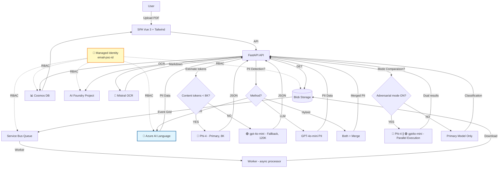

# ClassyMail — GenAI Email Classification

**GenAI that knows exactly where every email belongs.**

**Author:** Olivier Mertens — olmertens@microsoft.com
**Update:** Février 2026 (POC Refonte UI & Infra)

[](docs/assets/dashboard_preview.png)

## 📌 Pourquoi ClassyMail ?

**ClassyMail** est un **POC "agent + pipeline"** conçu pour traiter des emails/PDFs **à fort volume** avec **latence stable** et **coûts maîtrisés**.

Il valide une architecture moderne sur Azure :
*   **Architecture Événementielle** : Ingestion découplée du traitement (Event Grid + Service Bus).
*   **AI Hybride** : OCR spécialisé (Mistral) + SLM (Phi-4) avec fallback automatique (GPT-4o-mini).
*   **Review Humaine & Fine-Tuning** : Dashboard riche, correction manuelle et export de datasets via une boucle de feedback.
*   **Déploiement Prod-Ready** : Terraform, Azure Container Apps, Managed Identity.

---

## 🏗️ Architecture & Flux

1.  **Ingestion** : Upload PDF vers Blob Storage (API ou Portail).
2.  **Queue** : Event Grid détecte le fichier et notifie Service Bus.
3.  **Worker** : Consomme le message, valide le PDF, lance l'OCR (Mistral) puis la classification (Phi-4).
4.  **Stockage** : Résultats sauvegardés dans Cosmos DB.



---

## 🚀 Démarrage Rapide

### Pré-requis
*   Python 3.12 (uv recommandé)
*   Node.js 18+ (Frontend)
*   Azure CLI (`az login`)
*   **Variables d'environnement** : Voir [ENVIRONMENT_VARIABLES_AUDIT.md](ENVIRONMENT_VARIABLES_AUDIT.md) pour la liste complète

### Lancement Local
Voir [docs/LOCAL_DEVELOPMENT.md](docs/LOCAL_DEVELOPMENT.md) pour la configuration détaillée.

**Configuration des secrets :**
```bash
# Option 1: Générer automatiquement depuis Azure (recommandé)
.\scripts\write_secrets_env.ps1 -ResourceGroup "email-poc-rg" -Force

# Option 2: Copier l'exemple et ajuster manuellement
cp secrets.env.example secrets.env
# Puis éditer secrets.env avec vos valeurs
```

**Démarrage :**
```bash
# 1. Backend (API + Worker)
uv sync
uv run uvicorn main:app --reload

# 2. Frontend (dans un autre terminal)
cd frontend
npm install && npm run dev
```

**Vérification :**
```bash
# Santé de l'API
curl http://localhost:8000/healthz

# Diagnostics complets
curl http://localhost:8000/api/admin/diagnostics
```

---

## ✨ Fonctionnalités Clés

### 🧠 Stratégie "Broad Net"
Le pipeline utilise une approche à deux temps pour maximiser la précision des petits modèles (SLM) :
1.  **OCR Enrichi** : Mistral extrait le texte mais aussi la structure et décrit les images (Alt-Text).
2.  **Pré-Extraction** : Les entités clés (Noms, Dates, Montants) sont extraites en amont, permettant au modèle de classification de se concentrer uniquement sur l'intention.

### 🎯 Category Assessment AI Advice (NEW)
Optimisez vos catégories avec l'aide de l'IA :
*   **Assistant IA GPT-5 Nano** : Analyse vos définitions de catégories pour améliorer la précision de classification
*   **Prompt Engineering Focus** : Conseils spécifiques pour structurer vos prompts LLM
*   **Évaluation Qualité** : Note Good / Needs Improvement / Poor avec justifications détaillées
*   **Exemples Concrets** : Suggestions de reformulation copy-paste ready pour vos catégories
*   **Support Multi-Stratégies** : Conseils adaptés aux modes Standard, Reasoning et Vision
*   👉 **Accès :** Settings → Categories → "Get AI Advice" button

### 🔄 Per-Email Reprocessing (NEW)
Retraitez des emails individuels avec des stratégies personnalisées :
*   **Sélection Modèle** : Choisissez Phi-4, GPT-4o-mini, GPT-5-mini ou les deux (comparison mode)
*   **Stratégie Override** : Changez entre Standard/Reasoning/Vision pour un email spécifique
*   **Mode Sync/Async** : Traitement immédiat (<30s) ou en arrière-plan
*   **Comparaison A/B** : Testez plusieurs configurations sur le même email
*   👉 **Accès :** Dashboard → Email Details → "Reprocess" button

### ⚖️ Adversarial Model Comparison
Comparez en temps réel les performances de deux modèles (ex: Phi-4 vs GPT-4o-mini).
*   **Mode Parallèle** : Exécute les deux modèles simultanément.
*   **Analyse** : Affiche les deltas de confiance et les désaccords.
*   **Fine-Tuning** : Identifiez les cas limites pour réentraîner votre modèle.
*   👉 **Détails :** [docs/COMPARISON_ADVERSARIAL.md](docs/COMPARISON_ADVERSARIAL.md)

### 🛡️ PII Detection & Indicators (ENHANCED)
**Protection GDPR avec 3 méthodes configurables (Settings > Processing)** :
*   **LLM-based (default)** : Extraction contextuelle via GPT-4o-mini (~€0.002/email) - Détecte noms, emails, téléphones, adresses, NIR, IBAN
*   **Azure AI Language** : Service natif 43+ catégories prédéfinies (SSN, passeports, cartes bancaires) (~€0.001/email) - Requires `deploy_language_service=true` in Terraform
*   **Hybrid Mode** : Combine les deux méthodes, déduplique les résultats (précision maximale, ~€0.003/email)
*   **Indicateurs Visuels** : Shield icon (🛡️) dans les cards + badge "DCP" dans les tables
*   **Métadonnées Structurées** : Stockage JSON des entités PII détectées
*   **Anonymisation** : Support pour anonymiser les données avant export
*   👉 **Activation :** Configure via `email_preprocessing.detect_pii` setting + method selector

### 📊 Dynamic Cost Tracking (NEW)
Suivi précis des coûts par email et par modèle :
*   **12+ Modèles** : Pricing pour Phi-4, GPT-4o/4o-mini, GPT-5-mini/nano, GPT-4.1-nano, Mistral AI
*   **Token Usage Réel** : Coûts calculés à partir des tokens effectifs (non des estimations)
*   **Cost Breakdown** : Vue détaillée OCR + Classification + Embeddings par email
*   **Export CSV Enrichi** : Colonnes de coût dans les exports pour audit financier
*   **Configurabilité** : Ajustez les prix via Settings pour refléter votre région/tenant
*   👉 **Vue :** Dashboard → Costs tab + CSV exports

### 🧪 Générateur de Données de Test
Besoin de données ? Le script intégré génère des PDFs d'emails réalistes mais bruités (typos, argot, scans flous) pour tester la robustesse du pipeline.
*   👉 **Détails :** [docs/TESTING_EMAIL_GENERATION.md](docs/TESTING_EMAIL_GENERATION.md)

### 📧 Email Preprocessing (Client G2S)
Configuration avancée pour le traitement professionnel des emails :
*   **Extraction Intelligente** : LLM-based subject extraction et conversation isolée (sans historique/signatures)
*   **Catégories Enrichies** : Définitions + exclusions + AI assessment pour classification précise
*   **Slugs Techniques** : Identifiants stables pour export CSV
*   **Détection PII** : Extraction GDPR-compliant des données personnelles
*   **Export CSV Dual** : Format minimal (client) et enrichi (audit)
*   👉 **Guide Complet :** [docs/INTEGRATION_CLIENT_G2S.md](docs/INTEGRATION_CLIENT_G2S.md)

### 🔒 PII Anonymization & Fine-Tuning Export (NEW)
**Protection des données personnelles avec système dual-band pour fine-tuning** :
*   **Niveau 1 - Regex** : Suppression rapide (<1ms) des emails, téléphones, IPs, IBANs
*   **Niveau 2 - LLM (GPT-4o)** : Anonymisation contextuelle des noms, sociétés, adresses, montants
*   **Protection en couches** : L'IA anonymisatrice ne voit jamais les emails bruts (déjà scrubés par regex)
*   **Export JSONL sécurisé** : Format Azure AI Foundry avec anonymisation automatique (subject/sender inclus)
*   **Corrections utilisateur** : Tracking complet des modifications manuelles avec feedback AI
*   **Fail-safe design** : Si anonymisation échoue, l'exemple est ignoré (jamais de PII dans l'export)
*   **Dataset synthétique** : Génération de PDFs/emails réalistes pour tests sans données réelles
*   👉 **Documentation complète :** [docs/PII_ANONYMIZATION_AND_USER_CORRECTIONS.md](docs/PII_ANONYMIZATION_AND_USER_CORRECTIONS.md)

**Commandes rapides :**
```bash
# Export JSONL anonymisé pour fine-tuning (par défaut anonymize=true)
curl "http://localhost:8000/api/v1/emails/export-finetune-jsonl?split=train" > train.jsonl
curl "http://localhost:8000/api/v1/emails/export-finetune-jsonl?split=test" > test.jsonl

# Générer des emails synthétiques pour tests (fake data)
uv run python scripts/generate_realistic_emails.py --count 50 --out dataset/test_pdfs

# Uploader et traiter les PDFs générés
uv run python scripts/test_e2e_flow.py --count 50
```

### 🌍 Internationalization (i18n)
Interface multilingue complète :
*   **Français & Anglais** : Traductions exhaustives (500+ clés synchronisées)
*   **Terminologie Métier** : "Niveau de confiance" (FR), "Confidence Level" (EN)
*   **Vue Legacy-Free** : Utilise vue-i18n Composition API (`createI18n({ legacy: false })`)
*   **Maintenance** : Script `check_i18n.py` pour vérifier la cohérence EN/FR

---

## �️ Scripts & Outils de Développement

Le dossier `scripts/` contient des outils pour le développement, le déploiement et le débogage. Les scripts sont disponibles en versions **PowerShell (.ps1)** et **Bash (.sh)** pour la compatibilité cross-platform.

### 📋 Scripts de Vérification & Diagnostic

#### `verify-mvp-setup` (.ps1 / .sh) — **Vérification Infrastructure Complète**
Valide l'ensemble de l'infrastructure Azure déployée.

**⚠️ Important : Configuration Firewall Cosmos DB**
Pour que les scripts locaux (`verify_chat_vector.py`, `diagnose_pipeline.py`) puissent interroger Cosmos DB, votre IP publique doit être autorisée.
Si vous rencontrez des erreurs **403 Forbidden**, ajoutez votre IP :
```bash
# Ajouter votre IP actuelle au firewall Cosmos DB
az cosmosdb update --name email-poc-cosmos --resource-group email-poc-rg --ip-range-filter "$(curl -s ifconfig.me)"
```

**Usage :**
```bash
# PowerShell
.\scripts\verify-mvp-setup.ps1 -ResourceGroup "email-poc-rg"

# Bash
./scripts/verify-mvp-setup.sh email-poc-rg
```

**Vérifications effectuées :**
- ✅ Azure CLI authentication
- ✅ Resource Group existence
- ✅ Managed Identity (Principal ID, Client ID)
- ✅ Storage Account + containers
- ✅ Cosmos DB + databases + RBAC assignments
- ✅ Service Bus + queues + message counts
- ✅ Azure AI Foundry + model deployments
- ✅ Container Apps (API + Worker) running status
- ✅ RBAC role assignments (12 critical roles)
- ✅ API endpoints health checks (/health, /readyz, /admin/validate-aca-env)

**💡 À lancer après :** `terraform apply` ou tout changement d'infrastructure

---

#### `verify_infra` (.ps1 / .sh) — **Vérification RBAC Rapide**
Version allégée pour vérifier les rôles RBAC et la connectivité Azure.

**Usage :**
```bash
# PowerShell
.\scripts\verify_infra.ps1 -ResourceGroup "email-poc-rg"

# Bash
export RESOURCE_GROUP=email-poc-rg
./scripts/verify_infra.sh
```

**💡 À lancer après :** Changements de rôles ou problèmes d'authentification

---

#### `diagnose_pipeline.py` — **Diagnostics Pipeline OCR/Classification**
Teste le pipeline complet avec un PDF local.

**Usage :**
```bash
# Test avec un PDF local
uv run python scripts/diagnose_pipeline.py --pdf dataset/pdf/test.pdf

# Afficher les erreurs Cosmos DB (5 dernières)
uv run python scripts/diagnose_pipeline.py --show-errors

# Afficher 10 erreurs sans les logs détaillés
uv run python scripts/diagnose_pipeline.py --show-errors --limit 10 --no-log
```

**Prérequis :** `secrets.env` configuré avec les endpoints AI

---

#### `diagnose_failures.py` — **Analyse des Erreurs Cosmos DB**
Analyse les items en status ERROR dans Cosmos DB et catégorise les erreurs.

**Usage :**
```bash
uv run python scripts/diagnose_failures.py
```

**Détecte :**
- ⏱️ Timeouts (LLM/Network)
- 🔄 Worker restarts (deployment interruptions)
- 503/502 Service Unavailable
- 429 Rate limiting
- 📄 PDF corrompus

**Prérequis :** Connexion Cosmos DB configurée

---

#### `verify_chat_vector.py` — **Validation Embeddings + RAG**
Vérifie que le système d'embeddings et le chat RAG fonctionnent.

**Usage :**
```bash
uv run python scripts/verify_chat_vector.py
```

**Teste :**
- ✅ Génération d'embeddings (text-embedding-3-small)
- ✅ Recherche vectorielle dans Cosmos DB
- ✅ Agent de chat RAG avec requête test

**Prérequis :** `EMBEDDING_ENDPOINT` et `COSMOS_ENDPOINT` configurés

---

#### `verify_logs.py` — **Vérification Azure Monitor Logs**
Interroge Log Analytics pour récupérer les traces d'exécution.

**Usage :**
```bash
uv run python scripts/verify_logs.py
```

**Prérequis :** `LOG_ANALYTICS_WORKSPACE_ID` dans `secrets.env`

---

#### `verify_telemetry.py` — **Validation Application Insights**
Envoie un span de test vers Application Insights.

**Usage :**
```bash
uv run python scripts/verify_telemetry.py
```

**Prérequis :** `APPLICATIONINSIGHTS_CONNECTION_STRING` dans `secrets.env`

---

### 🔧 Scripts de Configuration

#### `write_secrets_env.ps1` — **Génération Fichier secrets.env**
Génère automatiquement le fichier `secrets.env` en interrogeant Azure CLI.

**Usage :**
```powershell
.\scripts\write_secrets_env.ps1 -ResourceGroup "email-poc-rg" -Prefix "email-poc"

# Écraser un fichier existant
.\scripts\write_secrets_env.ps1 -Force
```

**Génère :**
- Azure Client ID (Managed Identity)
- Service Bus FQDN + Queue
- Storage Account URL + Container
- Cosmos DB Endpoint + Database + Container
- AI Endpoint + Deployments

**💡 À lancer après :** `terraform apply` (première fois) ou changement de ressources

---

#### `check_i18n.py` — **Validation Locales i18n**
Vérifie que les fichiers `en.json` et `fr.json` sont synchronisés.

**Usage :**
```bash
uv run python scripts/check_i18n.py
```

**Intégré dans :** Pre-push hook (`.git/hooks/pre-push`)

---

### 🚢 Scripts de Déploiement

#### `build_acr` (.ps1 / .sh) — **Build & Push Image Docker**
Build une image Docker et la pousse vers Azure Container Registry.

**Usage :**
```bash
# PowerShell (méthode ACR build)
.\scripts\build_acr.ps1 -AcrName "emailpocacr" -ImageName "ClassyMail-agent" -Tag "v1.0" -PushMethod acr

# PowerShell (méthode Docker local)
.\scripts\build_acr.ps1 -AcrName "emailpocacr" -PushMethod docker

# Bash
export ACR_NAME=emailpocacr
export IMAGE_NAME=ClassyMail-agent
export TAG=v1.0
./scripts/build_acr.sh
```

**Méthodes disponibles :**
- `acr` : Build distant via `az acr build` (recommandé, pas besoin de Docker local)
- `docker` : Build local + push (nécessite Docker Desktop)

**Prérequis :**
- `az login` effectué
- Droits `AcrPush` sur le registry

---

#### `assign_storage_reader` (.ps1 / .sh) — **Assignation Rôle Storage**
Assigne le rôle "Storage Blob Data Reader" à une Managed Identity.

**Usage :**
```bash
# PowerShell
.\scripts\assign_storage_reader.ps1 `
  -ManagedIdentityClientId "12345678-abcd-1234-abcd-1234567890ab" `
  -StorageAccountName "emailpocstorage"

# Bash
./scripts/assign_storage_reader.sh \
  "12345678-abcd-1234-abcd-1234567890ab" \
  "emailpocstorage"
```

**💡 Note :** Généralement géré par Terraform, à utiliser uniquement pour debug

---

#### `fetch_vue_runtime` (.ps1 / .sh) — **Téléchargement Vue.js Runtime**
Télécharge le runtime Vue.js pour le frontend (offline fallback).

**Usage :**
```bash
# PowerShell
.\scripts\fetch_vue_runtime.ps1 -Version "3.5.13" -OutFile "static/js/vue.global.prod.js"

# Bash
./scripts/fetch_vue_runtime.sh "3.5.13" "static/js/vue.global.prod.js"
```

**Utilisé par :** Frontend build (automatique via npm scripts)

---

### 🧪 Scripts de Test & Génération de Données

#### `generate_dummy_pdfs.py` — **Génération PDFs de Test Bruités**
Génère des PDFs d'emails réalistes avec typos, argot, multilangue, et données fictives.

**Usage :**
```bash
# Génération standard (75 PDFs avec ~300 mots chacun)
uv run python scripts/generate_dummy_pdfs.py --count 75 --out dataset/pdf_test

# Génération avec Azure OpenAI (emails plus réalistes)
uv run python scripts/generate_dummy_pdfs.py --count 50 --use-aoai --aoai-deployment gpt-4o-mini

# Génération courte pour tests rapides
uv run python scripts/generate_dummy_pdfs.py --count 10 --target-words 100
```

**Prérequis pour --use-aoai :**
- `AZURE_OPENAI_ENDPOINT` dans `secrets.env`
- `AZURE_OPENAI_API_KEY` ou authentification Entra ID

**Catégories générées :**
- habitation, scolaire, releve_compte, domm_elec, evt_naturel
- Catégories mixtes (multi-intent)
- hors_sujet, incompréhensible

---

#### `generate_realistic_emails.py` — **Génération Emails Professionnels**
Génère des PDFs d'emails professionnels français pour tests réalistes.

**Usage :**
```bash
# Génération standard (10 PDFs variés)
uv run python scripts/generate_realistic_emails.py --count 10 --out dataset/pdf

# Génération ciblée sur certaines catégories
uv run python scripts/generate_realistic_emails.py --count 20 \
  --categories "Attestation habitation" "Résiliation" "Réclamation"
```

**Catégories disponibles :**
- Attestation habitation, Résiliation, Dommages électriques
- Sinistre dégât des eaux, Modification contrat, Demande de devis, Réclamation

---

#### `test_e2e_flow.py` — **Test End-to-End Complet**
Upload des PDFs générés vers l'API et vérifie le traitement.

**Usage :**
```bash
# Test local (API sur localhost:8000)
uv run python scripts/test_e2e_flow.py --count 5 --wait 10

# Test sur environnement déployé
uv run python scripts/test_e2e_flow.py --count 10 \
  --api-url "https://email-poc-api.azurecontainerapps.io" \
  --use-aoai
```

**Workflow :**
1. Génère des PDFs réalistes
2. Upload via `/api/upload`
3. Attend traitement (configurable avec --wait)
4. Affiche résumé avec IDs pour suivi

**Prérequis :** API démarrée (`uvicorn main:app`)

---

#### `test_e2e_local.py` — **Test End-to-End Local Automatisé**
Lance l'API + Worker en arrière-plan, génère et upload un PDF, puis vérifie le traitement.

**Usage :**
```bash
uv run python scripts/test_e2e_local.py
```

**Workflow automatique :**
1. Génère 1 PDF de test
2. Démarre API + Worker (port 8001)
3. Upload le PDF
4. Poll Cosmos DB jusqu'à status=PROCESSED ou ERROR
5. Affiche le résultat final

**Prérequis :** `secrets.env` complet (Cosmos, AI, Storage, Service Bus)

---

#### `simulate_corrupted_pdf.py` — **Test de Fichier Corrompu**
Upload un fichier corrompu (non-PDF) pour tester la gestion d'erreur.

**Usage :**
```bash
# Test local
uv run python scripts/simulate_corrupted_pdf.py

# Test sur environnement déployé
uv run python scripts/simulate_corrupted_pdf.py \
  --base-url "https://email-poc-api.azurecontainerapps.io"
```

**Résultat attendu :** Status ERROR avec `error_stage=download`

---

### 🔍 Scripts de Validation

#### `validate_mermaid.py` — **Validation Diagrammes Mermaid**
Vérifie la syntaxe des diagrammes Mermaid dans les fichiers Markdown.

**Usage :**
```bash
# Valider un fichier
uv run python scripts/validate_mermaid.py docs/ARCHITECTURE.md

# Valider plusieurs fichiers
uv run python scripts/validate_mermaid.py docs/*.md
```

**Vérifie :**
- ❌ Pas de tags HTML (`<br/>`, `<b>`) dans les labels
- ✅ Types de diagrammes valides (flowchart, sequenceDiagram, etc.)
- ✅ Indentation cohérente
- ✅ Syntaxe des flèches

**Intégré dans :** Pre-push hook (automatique)

---

#### `pre-push` (.ps1 / .sh) — **Pre-Push Hook Git**
Script de vérification avant chaque `git push`.

**Usage :**
```bash
# Installation du hook
ln -s ../../scripts/pre-push.sh .git/hooks/pre-push  # Linux/Mac
# ou copier manuellement pre-push.ps1 dans .git/hooks/ (Windows)

# Exécution manuelle (test)
./scripts/pre-push.sh
```

**Vérifications :**
1. ✅ Ruff linting (`uv run ruff check .`)
2. ✅ Tests smoke (`uv run pytest -q tests/test_smoke.py`)
3. ✅ Synchronisation i18n (`python scripts/check_i18n.py`)

**Résultat :** Bloque le push si erreurs détectées

---

### 📦 Ordre d'Exécution Recommandé

#### **🏗️ Setup Initial (après `terraform apply`)**
```bash
# 1. Générer secrets.env avec les ressources Azure
.\scripts\write_secrets_env.ps1 -ResourceGroup "email-poc-rg" -Force

# 2. Vérifier l'infrastructure complète
.\scripts\verify-mvp-setup.ps1 -ResourceGroup "email-poc-rg"

# 3. Tester les endpoints AI
uv run python scripts/verify_chat_vector.py
uv run python scripts/verify_telemetry.py
```

#### **🧪 Développement & Tests**
```bash
# 1. Générer des données de test
uv run python scripts/generate_realistic_emails.py --count 20

# 2. Tester le pipeline complet
uv run python scripts/test_e2e_local.py

# 3. Debug si problèmes
uv run python scripts/diagnose_pipeline.py --pdf dataset/pdf/test.pdf
uv run python scripts/diagnose_failures.py
```

#### **🚀 Avant Deployment**
```bash
# 1. Vérifications qualité (automatique via pre-push hook)
.\scripts\pre-push.ps1  # ou ./scripts/pre-push.sh

# 2. Build & Push image Docker
.\scripts\build_acr.ps1 -AcrName "emailpocacr" -Tag "v1.0.0" -PushMethod acr

# 3. Vérification post-déploiement
.\scripts\verify-mvp-setup.ps1 -ResourceGroup "email-poc-rg"
```

#### **🔧 Troubleshooting**
```bash
# Erreurs de traitement
uv run python scripts/diagnose_failures.py
uv run python scripts/diagnose_pipeline.py --show-errors --limit 10

# Logs Azure Monitor
uv run python scripts/verify_logs.py

# Test fichier corrompu
uv run python scripts/simulate_corrupted_pdf.py
```

---

## �📚 Documentation

L'index complet est disponible ici : **[docs/INDEX.md](docs/INDEX.md)**.
- [CLI_SETUP](docs/CLI_SETUP.md)
- [CLI_RAG](docs/CLI_RAG.md)
- **[ENVIRONMENT_VARIABLES_AUDIT](ENVIRONMENT_VARIABLES_AUDIT.md)** - Liste complète des variables d'environnement

### Parcours Recommandé

0.  **Configuration** : [ENVIRONMENT_VARIABLES_AUDIT.md](ENVIRONMENT_VARIABLES_AUDIT.md) (Variables d'environnement complètes)
1.  **Démarrer** : [docs/SCENARIO_E2E.md](docs/SCENARIO_E2E.md) (Test complet end-to-end)
2.  **Développer** : [docs/LOCAL_DEVELOPMENT.md](docs/LOCAL_DEVELOPMENT.md) (Configuration, Env Vars, Build)
3.  **Comprendre** : [docs/ARCHITECTURE.md](docs/ARCHITECTURE.md) (Composants, Flux, Sécurité)
4.  **Optimiser** : [docs/MODELS.md](docs/MODELS.md) (Choix des modèles, Coûts, Fine-tuning)
5.  **Déployer** : [docs/INFRASTRUCTURE.md](docs/INFRASTRUCTURE.md) (Terraform) et [docs/CICD_GITHUB.md](docs/CICD_GITHUB.md) (GitHub Actions)

---

## 🔗 Références & Liens Utiles

*   **Pricing Azure AI** : [Azure AI Foundry Models](https://azure.microsoft.com/fr-fr/pricing/details/ai-foundry-models/microsoft/)
*   **Fine-tuning** : [Guide Azure OpenAI/Foundry](https://learn.microsoft.com/en-us/azure/ai-foundry/openai/how-to/fine-tuning?view=foundry-classic&tabs=oai-sdk%2Cazure-openai&pivots=programming-language-python)
*   **Phi-4 Local** : [Running Phi-4 with Foundry Local](https://techcommunity.microsoft.com/blog/educatordeveloperblog/running-phi-4-locally-with-microsoft-foundry-local-a-step-by-step-guide/4466304)

---
*Ce projet est une preuve de concept (POC) Microsoft.*
