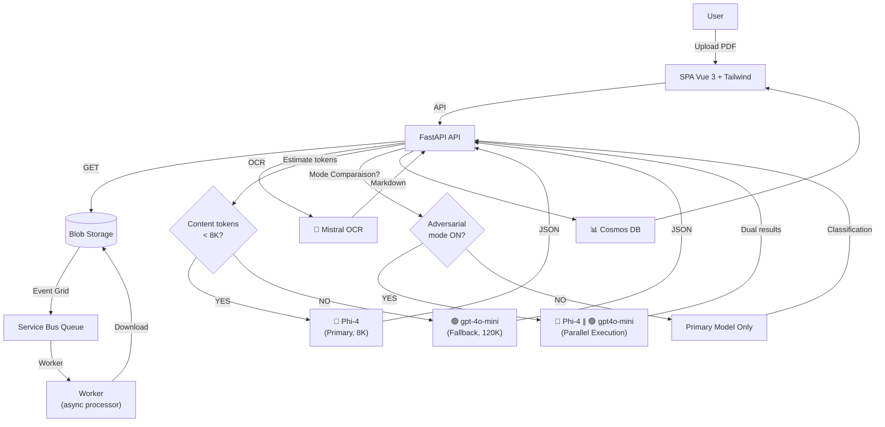

# ClassyMail — GenAI Email Classification

**GenAI that knows exactly where every email belongs.**

**Author:** Olivier Mertens — olmertens@microsoft.com
**Update:** Février 2026 (POC Refonte UI & Infra)

[](docs/assets/dashboard_preview.png)

## 📌 Pourquoi ClassyMail ?

**ClassyMail** est un **POC "agent + pipeline"** conçu pour traiter des emails/PDFs **à fort volume** avec **latence stable** et **coûts maîtrisés**.

Il valide une architecture moderne sur Azure :
*   **Architecture Événementielle** : Ingestion découplée du traitement (Event Grid + Service Bus).
*   **AI Hybride** : OCR spécialisé (Mistral) + SLM (Phi-4) avec fallback automatique (GPT-4o-mini).
*   **Review Humaine & Fine-Tuning** : Dashboard riche, correction manuelle et export de datasets via une boucle de feedback.
*   **Déploiement Prod-Ready** : Terraform, Azure Container Apps, Managed Identity.

---

## 🏗️ Architecture & Flux

1.  **Ingestion** : Upload PDF vers Blob Storage (API ou Portail).
2.  **Queue** : Event Grid détecte le fichier et notifie Service Bus.
3.  **Worker** : Consomme le message, valide le PDF, lance l'OCR (Mistral) puis la classification (Phi-4).
4.  **Stockage** : Résultats sauvegardés dans Cosmos DB.



---

## 🚀 Démarrage Rapide

### Pré-requis
*   Python 3.12 (uv recommandé)
*   Node.js 18+ (Frontend)
*   Azure CLI (`az login`)

### Lancement Local
Voir [docs/LOCAL_DEVELOPMENT.md](docs/LOCAL_DEVELOPMENT.md) pour la configuration détaillée (`secrets.env`).

```bash
# 1. Backend (API + Worker)
uv sync
uv run uvicorn main:app --reload

# 2. Frontend (dans un autre terminal)
cd frontend
npm install && npm run dev
```

---

## ✨ Fonctionnalités Clés

### 🧠 Stratégie "Broad Net"
Le pipeline utilise une approche à deux temps pour maximiser la précision des petits modèles (SLM) :
1.  **OCR Enrichi** : Mistral extrait le texte mais aussi la structure et décrit les images (Alt-Text).
2.  **Pré-Extraction** : Les entités clés (Noms, Dates, Montants) sont extraites en amont, permettant au modèle de classification de se concentrer uniquement sur l'intention.

### ⚖️ Adversarial Model Comparison
Comparez en temps réel les performances de deux modèles (ex: Phi-4 vs GPT-4o-mini).
*   **Mode Parallèle** : Exécute les deux modèles simultanément.
*   **Analyse** : Affiche les deltas de confiance et les désaccords.
*   **Fine-Tuning** : Identifiez les cas limites pour réentraîner votre modèle.
*   👉 **Détails :** [docs/COMPARISON_ADVERSARIAL.md](docs/COMPARISON_ADVERSARIAL.md)

### 🧪 Générateur de Données de Test
Besoin de données ? Le script intégré génère des PDFs d'emails réalistes mais bruités (typos, argot, scans flous) pour tester la robustesse du pipeline.
*   👉 **Détails :** [docs/TESTING_EMAIL_GENERATION.md](docs/TESTING_EMAIL_GENERATION.md)

---

## 📚 Documentation

L'index complet est disponible ici : **[docs/INDEX.md](docs/INDEX.md)**.

### Parcours Recommandé

1.  **Démarrer** : [docs/SCENARIO_E2E.md](docs/SCENARIO_E2E.md) (Test complet end-to-end)
2.  **Développer** : [docs/LOCAL_DEVELOPMENT.md](docs/LOCAL_DEVELOPMENT.md) (Configuration, Env Vars, Build)
3.  **Comprendre** : [docs/ARCHITECTURE.md](docs/ARCHITECTURE.md) (Composants, Flux, Sécurité)
4.  **Optimiser** : [docs/MODELS.md](docs/MODELS.md) (Choix des modèles, Coûts, Fine-tuning)
5.  **Déployer** : [docs/INFRASTRUCTURE.md](docs/INFRASTRUCTURE.md) (Terraform) et [docs/CICD_GITHUB.md](docs/CICD_GITHUB.md) (GitHub Actions)

---

## 🔗 Références & Liens Utiles

*   **Pricing Azure AI** : [Azure AI Foundry Models](https://azure.microsoft.com/fr-fr/pricing/details/ai-foundry-models/microsoft/)
*   **Fine-tuning** : [Guide Azure OpenAI/Foundry](https://learn.microsoft.com/en-us/azure/ai-foundry/openai/how-to/fine-tuning?view=foundry-classic&tabs=oai-sdk%2Cazure-openai&pivots=programming-language-python)
*   **Phi-4 Local** : [Running Phi-4 with Foundry Local](https://techcommunity.microsoft.com/blog/educatordeveloperblog/running-phi-4-locally-with-microsoft-foundry-local-a-step-by-step-guide/4466304)

---
*Ce projet est une preuve de concept (POC) Microsoft.*
