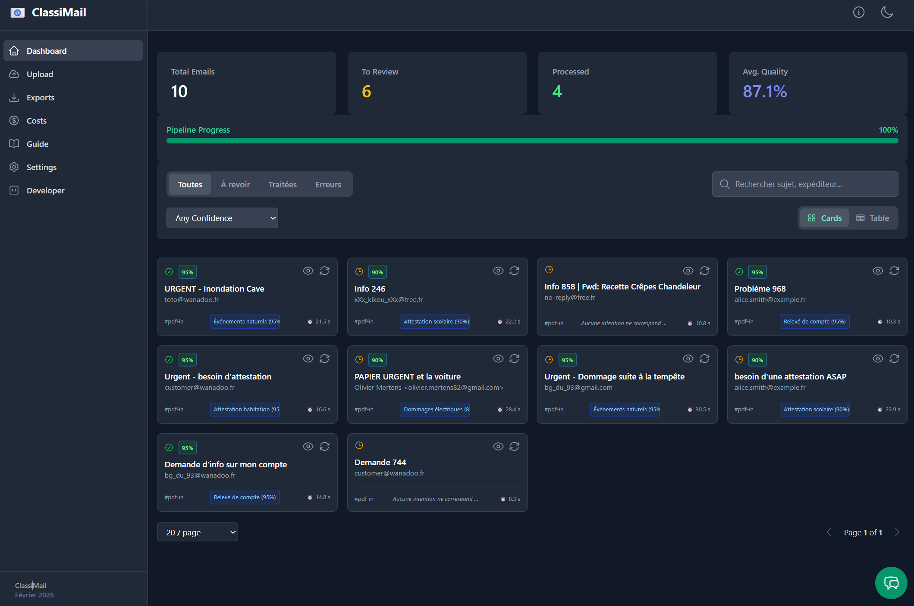
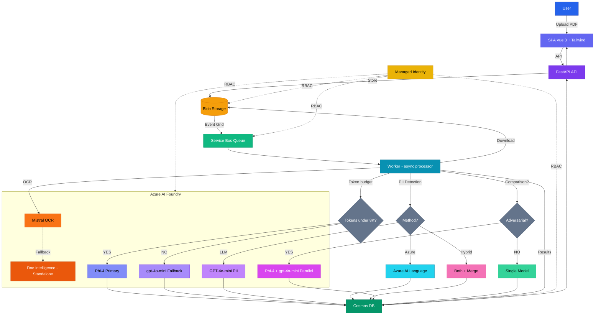

# ClassyMail — GenAI Email Classification

**GenAI that knows exactly where every email belongs.**

**Author:** Olivier Mertens — olmertens@microsoft.com
**Update:** Février 2026 (POC Refonte UI & Infra)

> 📝 **Naming convention**: Throughout this document, `<prefix>` refers to your Terraform `prefix` variable (default: `email-poc`). All Azure resource names are derived from it (e.g. `<prefix>-rg`, `<prefix>-api`).

[](docs/assets/dashboard_preview.png)

## 📌 Pourquoi ClassyMail ?

**ClassyMail** est un **POC "agent + pipeline"** conçu pour traiter des emails/PDFs **à fort volume** avec **latence stable** et **coûts maîtrisés**.

Il valide une architecture moderne sur Azure :
*   **Architecture Événementielle** : Ingestion découplée du traitement (Event Grid + Service Bus).
*   **AI Hybride** : OCR spécialisé (Mistral) + SLM (Phi-4) avec fallback automatique (GPT-4o-mini).
*   **Review Humaine & Fine-Tuning** : Dashboard riche, correction manuelle et export de datasets via une boucle de feedback.
*   **Déploiement Prod-Ready** : Terraform, Azure Container Apps, Managed Identity.

---

## 🏗️ Architecture & Flux

1.  **Ingestion** : Upload PDF vers Blob Storage (API ou Portail).
2.  **Queue** : Event Grid détecte le fichier et notifie Service Bus.
3.  **Worker** : Consomme le message, valide le PDF, lance l'OCR (Mistral, avec fallback Document Intelligence) puis la classification (Phi-4).
4.  **Stockage** : Résultats sauvegardés dans Cosmos DB.



---

## 🚀 Démarrage Rapide

### Pré-requis
*   Python 3.12 (uv recommandé)
*   Node.js 18+ (Frontend)
*   Azure CLI (`az login`)
*   **Variables d'environnement** : Voir [ENVIRONMENT_VARIABLES_AUDIT.md](ENVIRONMENT_VARIABLES_AUDIT.md) pour la liste complète

### Lancement Local
Voir [docs/LOCAL_DEVELOPMENT.md](docs/LOCAL_DEVELOPMENT.md) pour la configuration détaillée.

**Configuration des secrets :**
```bash
# Option 1: Générer automatiquement depuis Azure (recommandé)
.\scripts\write_secrets_env.ps1 -ResourceGroup "<prefix>-rg" -Force

# Option 2: Copier l'exemple et ajuster manuellement
cp secrets.env.example secrets.env
# Puis éditer secrets.env avec vos valeurs
```

**Démarrage :**
```bash
# 1. Backend (API + Worker)
uv sync
uv run uvicorn main:app --reload

# 2. Frontend (dans un autre terminal)
cd frontend
npm install && npm run dev
```

**Vérification :**
```bash
# Santé de l'API
curl http://localhost:8000/healthz

# Diagnostics complets
curl http://localhost:8000/api/admin/diagnostics
```

---

## ✨ Fonctionnalités Clés

### 🧠 Stratégie "Broad Net"
Le pipeline utilise une approche à deux temps pour maximiser la précision des petits modèles (SLM) :
1.  **OCR Enrichi** : Mistral extrait le texte mais aussi la structure et décrit les images (Alt-Text).
2.  **Pré-Extraction** : Les entités clés (Noms, Dates, Montants) sont extraites en amont, permettant au modèle de classification de se concentrer uniquement sur l'intention.

### 🔄 OCR Fallback — Document Intelligence Standalone
Résilience OCR avec basculement automatique vers Azure Document Intelligence via une ressource dédiée :
*   **Fallback Transparent** : Si Mistral OCR échoue (timeout, quota, erreur), le pipeline bascule automatiquement vers Azure Document Intelligence
*   **Ressource Dédiée** : Document Intelligence est déployé comme ressource standalone `FormRecognizer` (l'endpoint AI Foundry v2 ne supporte pas le chemin REST `/documentintelligence/`)
*   **Circuit Breaker** : Chaque provider a son propre circuit breaker (Mistral: 5 échecs / 60s reset, DI: 5 échecs / 120s reset, Classification: 7 échecs / 45s reset)
*   **ConnectTimeout Fast-Fail** : Les erreurs de connexion ne sont pas réessayées, déclenchant immédiatement le fallback
*   **Tracking Provider** : Le dashboard affiche un badge ambre "Doc Intelligence" quand le fallback est utilisé
*   **Activation** : `deploy_document_intelligence=true` dans Terraform (recommandé pour la production)
*   **Coût Minime** : S0 tier, facturé à l'usage (~$1.50/1K pages)

### 🎯 Category Assessment AI Advice (NEW)
Optimisez vos catégories avec l'aide de l'IA :
*   **Assistant IA GPT-4.1-nano** : Analyse vos définitions de catégories pour améliorer la précision de classification
*   **Prompt Engineering Focus** : Conseils spécifiques pour structurer vos prompts LLM
*   **Évaluation Qualité** : Note Good / Needs Improvement / Poor avec justifications détaillées
*   **Exemples Concrets** : Suggestions de reformulation copy-paste ready pour vos catégories
*   **Support Multi-Stratégies** : Conseils adaptés aux modes Standard, Reasoning et Vision
*   👉 **Accès :** Settings → Categories → "Get AI Advice" button

### 🔄 Per-Email Reprocessing (NEW)
Retraitez des emails individuels avec des stratégies personnalisées :
*   **Sélection Modèle** : Choisissez Phi-4, GPT-4o-mini ou les deux (comparison mode)
*   **Stratégie Override** : Changez entre Standard/Reasoning/Vision pour un email spécifique
*   **Mode Sync/Async** : Traitement immédiat (<30s) ou en arrière-plan
*   **Comparaison A/B** : Testez plusieurs configurations sur le même email
*   👉 **Accès :** Dashboard → Email Details → "Reprocess" button

### 🔁 Batch Reprocess All Emails (NEW)
Relancez le traitement complet de tous les emails avec de nouveaux paramètres LLM pour comparaison A/B à grande échelle :
*   **Auto-save** : Sauvegarde automatique des settings avant relancement
*   **Scope** : Tous les emails PROCESSED + REVIEW_REQUIRED (les ERROR sont exclus)
*   **DLQ Replay** : Rejoue aussi les messages Dead Letter Queue dans la même opération
*   **Double confirmation** : Deux dialogues de vérification avant exécution
*   **Stratégie configurable** : Standard / Reasoning / Vision appliquée à tous les emails
*   👉 **Accès :** Settings → Processing tab → "Reprocess All Emails" button

### ⚖️ Adversarial Model Comparison
Comparez en temps réel les performances de deux modèles (ex: Phi-4 vs GPT-4o-mini).
*   **Mode Parallèle** : Exécute les deux modèles simultanément.
*   **Analyse** : Affiche les deltas de confiance et les désaccords.
*   **Fine-Tuning** : Identifiez les cas limites pour réentraîner votre modèle.
*   👉 **Détails :** [docs/COMPARISON_ADVERSARIAL.md](docs/COMPARISON_ADVERSARIAL.md)

### 🛡️ PII Detection & Indicators (ENHANCED)
**Protection GDPR avec 3 méthodes configurables (Settings > Processing)** :
*   **LLM-based (default)** : Extraction contextuelle via GPT-4o-mini (~€0.002/email) - Détecte noms, emails, téléphones, adresses, NIR, IBAN
*   **Azure AI Language** : Service natif 43+ catégories prédéfinies (SSN, passeports, cartes bancaires) (~€0.001/email) - Requires `deploy_language_service=true` in Terraform
*   **Hybrid Mode** : Combine les deux méthodes, déduplique les résultats (précision maximale, ~€0.003/email)
*   **Indicateurs Visuels** : Shield icon (🛡️) dans les cards + badge "DCP" dans les tables
*   **Métadonnées Structurées** : Stockage JSON des entités PII détectées
*   **Anonymisation** : Support pour anonymiser les données avant export
*   👉 **Activation :** Configure via `email_preprocessing.detect_pii` setting + method selector

### 📊 Dynamic Cost Tracking (NEW)
Suivi précis des coûts par email et par modèle :
*   **12+ Modèles** : Pricing pour Phi-4, GPT-4o/4o-mini, GPT-5-mini/nano, GPT-4.1-nano, Mistral AI
*   **Token Usage Réel** : Coûts calculés à partir des tokens effectifs (non des estimations)
*   **Cost Breakdown** : Vue détaillée OCR + Classification + Embeddings par email
*   **Export CSV Enrichi** : Colonnes de coût dans les exports pour audit financier
*   **Configurabilité** : Ajustez les prix via Settings pour refléter votre région/tenant
*   👉 **Vue :** Dashboard → Costs tab + CSV exports

### 🧪 Générateur de Données de Test
Besoin de données ? Le script intégré génère des PDFs d'emails réalistes mais bruités (typos, argot, scans flous) pour tester la robustesse du pipeline.
*   👉 **Détails :** [docs/TESTING_EMAIL_GENERATION.md](docs/TESTING_EMAIL_GENERATION.md)

### 📧 Email Preprocessing (Client G2S)
Configuration avancée pour le traitement professionnel des emails :
*   **Extraction Intelligente** : LLM-based subject extraction et conversation isolée (sans historique/signatures)
*   **Catégories Enrichies** : Définitions + exclusions + AI assessment pour classification précise
*   **Slugs Techniques** : Identifiants stables pour export CSV
*   **Détection PII** : Extraction GDPR-compliant des données personnelles
*   **Export CSV Dual** : Format minimal (client) et enrichi (audit)
*   **Streaming CSV** : Export progressif row-by-row depuis Cosmos DB — supporte des milliers d'emails sans timeout 502
*   **Source OCR** : Colonne `SOURCE_OCR` dans l'export enrichi indiquant le provider OCR utilisé (`mistral_ocr` ou `document_intelligence`)
*   👉 **Guide Complet :** [docs/INTEGRATION_CLIENT_G2S.md](docs/INTEGRATION_CLIENT_G2S.md)

### 🔒 PII Anonymization & Fine-Tuning Export (NEW)
**Protection des données personnelles avec système dual-band pour fine-tuning** :
*   **Niveau 1 - Regex** : Suppression rapide (<1ms) des emails, téléphones, IPs, IBANs
*   **Niveau 2 - LLM (GPT-4o-mini)** : Anonymisation contextuelle des noms, sociétés, adresses, montants
*   **Protection en couches** : L'IA anonymisatrice ne voit jamais les emails bruts (déjà scrubés par regex)
*   **Export JSONL sécurisé** : Format Azure AI Foundry avec anonymisation automatique (subject/sender inclus)
*   **Corrections utilisateur** : Tracking complet des modifications manuelles avec feedback AI
*   **Fail-safe design** : Si anonymisation échoue, l'exemple est ignoré (jamais de PII dans l'export)
*   **Dataset synthétique** : Génération de PDFs/emails réalistes pour tests sans données réelles
*   👉 **Documentation complète :** [docs/PII_ANONYMIZATION_AND_USER_CORRECTIONS.md](docs/PII_ANONYMIZATION_AND_USER_CORRECTIONS.md)

**Commandes rapides :**
```bash
# Export JSONL anonymisé pour fine-tuning (par défaut anonymize=true)
curl "http://localhost:8000/api/emails/export-finetune-jsonl?split=train" > train.jsonl
curl "http://localhost:8000/api/emails/export-finetune-jsonl?split=test" > test.jsonl

# Uploader et traiter les PDFs générés
uv run python scripts/test_e2e_flow.py --count 50
```

### 🌍 Internationalization (i18n)
Interface multilingue complète :
*   **5 Langues** : Allemand (DE), Anglais (EN), Espagnol (ES), Français (FR), Italien (IT) — 500+ clés synchronisées
*   **Terminologie Métier** : "Niveau de confiance" (FR), "Confidence Level" (EN), "Konfidenzniveau" (DE)
*   **Vue Legacy-Free** : Utilise vue-i18n Composition API (`createI18n({ legacy: false })`)
*   **Guide Intégré** : Vue `UsageDocsView` avec flowchart interactif, légende couleur et stratégies de traitement

---
## 💪 Résilience & Tolérance aux Pannes

ClassyMail est conçu pour survivre aux échecs transitoires et aux pics de charge sans perte de données.

### 1. Gestion des Quotas (TPM/RPM)
Les modèles Azure OpenAI/Mistral ont des limites strictes (Tokens/Requests Per Minute).
*   **Token Leaky Bucket** : Le système estime les tokens AVANT l'appel. Si le quota est atteint, le worker se met en pause ("sleep") intelligemment.
*   **Retry Exponential** : En cas d'erreur 429 (Too Many Requests), la librairie `tenacity` réessaie avec un délai progressif (2s, 4s, 8s...).

### 2. Garantie "At-Least-Once" (Service Bus)
Le pipeline utilise le pattern **Peek-Lock** de Service Bus :
*   Le worker "emprunte" le message sans le supprimer.
*   Le message n'est supprimé (`complete_message`) **QUE** si le traitement (OCR + Classif + Save) réussit.
*   **Crash Recovery** : Si le worker crashe (OOM, restart) pendant le traitement, le "Lock" expire (par défaut 5min). Le message redevient visible et sera repris par un autre worker.

### 3. Dead Letter Queue (DLQ)
Si un email échoue systématiquement (ex: PDF corrompu faisant crasher le parser) après 10 tentatives (configurable) :
*   Il est déplacé vers la **Dead Letter Queue**.
*   Il ne bloque plus la file principale.
*   **Dashboard** : L'onglet "Failures" permet de voir ces messages, analyser l'erreur, et les rejouer (`/reprocess`) ou les purger.

---
## 🛠️ Scripts & Outils de Développement

Le dossier `scripts/` contient des outils pour le développement, le déploiement et le débogage. Les scripts sont disponibles en versions **PowerShell (.ps1)** et **Bash (.sh)** pour la compatibilité cross-platform.

### 📋 Scripts de Vérification & Diagnostic

#### `update_cosmos_firewall` (.ps1 / .sh) — **🆕 Mise à Jour Automatique Firewall Cosmos DB**
**⚠️ CRITIQUE** : Les IPs sortantes des Container Apps changent à chaque redéploiement. Ce script automatise la mise à jour du firewall Cosmos DB.

**Usage :**
```bash
# PowerShell - Ajouter les IPs des Container Apps
.\scripts\update_cosmos_firewall.ps1 -ResourceGroup "<prefix>-rg"

# PowerShell - Inclure aussi votre IP locale (pour scripts de debug)
.\scripts\update_cosmos_firewall.ps1 -ResourceGroup "<prefix>-rg" -IncludeLocalIP

# Bash
./scripts/update_cosmos_firewall.sh -g <prefix>-rg

# Bash avec IP locale
./scripts/update_cosmos_firewall.sh -g <prefix>-rg --include-local-ip
```

**Ce que fait le script :**
1. ✅ Récupère les IPs sortantes de `<prefix>-api`
2. ✅ Récupère les IPs sortantes de `<prefix>-worker`
3. ✅ Ajoute `0.0.0.0` (Azure Services)
4. ✅ (Optionnel) Ajoute votre IP publique pour développement local
5. ✅ Met à jour le firewall Cosmos DB avec la liste complète dédupliquée

**💡 À lancer après :**
- Chaque déploiement de Container App (`az containerapp update`)
- Si vous voyez des erreurs **403 Forbidden** dans les logs Worker
- Avant d'exécuter des scripts Python locaux qui accèdent à Cosmos DB

**Note :** Si vous voyez "operation in progress", attendez 1-2 minutes et relancez le script.

---

#### `verify_security_cost_tags.sh` — **🆕 Vérification & Application Politique de Tags**
**🏷️ GOUVERNANCE** : Vérifie et applique automatiquement les tags `SecurityControl` et `CostControl` requis sur toutes les ressources Azure.

**Usage :**
```bash
# Vérification uniquement (compliance check)
./scripts/verify_security_cost_tags.sh <prefix>-rg

# Créer/Mettre à jour la définition et l'assignation de la politique
./scripts/verify_security_cost_tags.sh <prefix>-rg --apply

# Créer la tâche de remédiation pour corriger les ressources non-conformes
./scripts/verify_security_cost_tags.sh <prefix>-rg --remediate

# Workflow complet : appliquer la politique ET corriger les ressources
./scripts/verify_security_cost_tags.sh <prefix>-rg --apply --remediate
```

**Ce que fait le script :**
1. ✅ **Scan** : Liste toutes les ressources du Resource Group
2. ✅ **Vérification** : Vérifie la présence des tags `SecurityControl` et `CostControl`
3. ✅ **Rapport** : Affiche le statut de conformité (Compliant/Non-Compliant/Excluded)
4. ✅ **Application (--apply)** : Crée la définition de politique Azure et l'assigne au RG
5. ✅ **Remédiation (--remediate)** : Lance une tâche de remédiation asynchrone pour ajouter les tags manquants

**Politique appliquée :**
- **Effet** : `modify` (ajout/remplacement automatique)
- **Tags ajoutés** : `SecurityControl=ignore`, `CostControl=ignore`
- **Ressources exclues** : Subscriptions, Resource Groups, Deployments, Management Groups
- **Rôle requis** : Contributor (automatiquement assigné via Managed Identity)

**💡 À lancer après :**
- Déploiement Terraform initial (`terraform apply`)
- Ajout de nouvelles ressources Azure
- Audits de conformité trimestriels

**Exemple de sortie :**
```
Resource Compliance Report:
━━━━━━━━━━━━━━━━━━━━━━━━━━━━━━━━━━━━━━━━━━━━━━━━━━━━━━━━━━━━━━━━━━
✓ <prefix>-cosmos (Microsoft.DocumentDB/databaseAccounts)
  Status: COMPLIANT
  Tags: SecurityControl=ignore, CostControl=ignore

✗ <prefix>-storage (Microsoft.Storage/storageAccounts)
  Status: NON-COMPLIANT
  Missing: SecurityControl tag
  Missing: CostControl tag
━━━━━━━━━━━━━━━━━━━━━━━━━━━━━━━━━━━━━━━━━━━━━━━━━━━━━━━━━━━━━━━━━━

Summary:
  Compliant:     5
  Non-Compliant: 3
  Excluded:      1
  Total:         9
```

**Note :** La remédiation est asynchrone. Attendez 5-10 minutes puis relancez sans `--remediate` pour vérifier.

---

#### `verify-mvp-setup` (.ps1 / .sh) — **Vérification Infrastructure Complète**
Valide l'ensemble de l'infrastructure Azure déployée.

**Usage :**
```bash
# PowerShell
.\scripts\verify-mvp-setup.ps1 -ResourceGroup "<prefix>-rg"

# Bash
./scripts/verify-mvp-setup.sh <prefix>-rg
```

**Vérifications effectuées :**
- ✅ Azure CLI authentication
- ✅ Resource Group existence
- ✅ Managed Identity (Principal ID, Client ID)
- ✅ Storage Account + containers
- ✅ Cosmos DB + databases + RBAC assignments
- ✅ Service Bus + queues + message counts
- ✅ Azure AI Foundry + model deployments
- ✅ Container Apps (API + Worker) running status
- ✅ RBAC role assignments (12 critical roles)
- ✅ API endpoints health checks (/health, /readyz, /admin/validate-aca-env)

**💡 À lancer après :** `terraform apply` ou tout changement d'infrastructure

---

#### `verify_infra` (.ps1 / .sh) — **Vérification RBAC Rapide**
Version allégée pour vérifier les rôles RBAC et la connectivité Azure.

**Usage :**
```bash
# PowerShell
.\scripts\verify_infra.ps1 -ResourceGroup "<prefix>-rg"

# Bash
export RESOURCE_GROUP=<prefix>-rg
./scripts/verify_infra.sh
```

**💡 À lancer après :** Changements de rôles ou problèmes d'authentification

---

### 🔧 Scripts de Configuration

#### `write_secrets_env.ps1` — **Génération Fichier secrets.env**
Génère automatiquement le fichier `secrets.env` en interrogeant Azure CLI.

**Usage :**
```powershell
.\scripts\write_secrets_env.ps1 -ResourceGroup "<prefix>-rg" -Prefix "<prefix>"

# Écraser un fichier existant
.\scripts\write_secrets_env.ps1 -Force
```

**Génère :**
- Azure Client ID (Managed Identity)
- Service Bus FQDN + Queue
- Storage Account URL + Container
- Cosmos DB Endpoint + Database + Container
- AI Endpoint + Deployments

**💡 À lancer après :** `terraform apply` (première fois) ou changement de ressources

---

### 🚢 Scripts de Déploiement

#### `bootstrap.ps1` — **🆕 Déploiement Complet Depuis Zéro**
Script tout-en-un qui orchestre la création complète de l'infrastructure Azure (Terraform init + apply + secrets.env + verify).

**Usage :**
```powershell
# Déploiement standard
.\scripts\bootstrap.ps1 -TenantId "<tenant-id>" -SubscriptionId "<sub-id>"

# Avec un prefix custom et ACR existant
.\scripts\bootstrap.ps1 -Prefix "email-poc-test" -AcrName "myexistingacr" -AcrResourceGroup "my-acr-rg"
```

**Ce que fait le script :**
1. ✅ Vérifie les prérequis (az, terraform, uv)
2. ✅ `terraform init` + `terraform apply`
3. ✅ Génère `secrets.env` via `write_secrets_env.ps1`
4. ✅ Assigne les rôles RBAC locaux via `assign_local_dev_roles.ps1`
5. ✅ Vérifie l'infrastructure via `verify-mvp-setup.ps1`

**💡 Voir aussi :** [docs/DEPLOY_FROM_SCRATCH.md](docs/DEPLOY_FROM_SCRATCH.md)

---

#### `assign_local_dev_roles.ps1` — **🆕 RBAC pour Développement Local**
Assigne les rôles Azure nécessaires à un développeur pour travailler en local.

**Usage :**
```powershell
.\scripts\assign_local_dev_roles.ps1 -Prefix "<prefix>"
```

**Rôles assignés :** Storage Blob Data Contributor, Service Bus Sender/Receiver, Cognitive Services User

---

#### `build_acr` (.ps1 / .sh) — **Build & Push Image Docker**
Build une image Docker et la pousse vers Azure Container Registry.

**Usage :**
```bash
# PowerShell (méthode ACR build)
.\.scripts\build_acr.ps1 -AcrName "emailpocacr" -ImageName "classymail-agent" -Tag "v1.0" -PushMethod acr

# PowerShell (méthode Docker local)
.\scripts\build_acr.ps1 -AcrName "emailpocacr" -PushMethod docker

# Bash
export ACR_NAME=emailpocacr
export IMAGE_NAME=classymail-agent
export TAG=v1.0
./scripts/build_acr.sh
```

**Méthodes disponibles :**
- `acr` : Build distant via `az acr build` (recommandé, pas besoin de Docker local)
- `docker` : Build local + push (nécessite Docker Desktop)

**Prérequis :**
- `az login` effectué
- Droits `AcrPush` sur le registry

---

#### `assign_storage_reader` (.ps1 / .sh) — **Assignation Rôle Storage**
Assigne le rôle "Storage Blob Data Reader" à une Managed Identity.

**Usage :**
```bash
# PowerShell
.\scripts\assign_storage_reader.ps1 `
  -ManagedIdentityClientId "12345678-abcd-1234-abcd-1234567890ab" `
  -StorageAccountName "emailpocstorage"

# Bash
./scripts/assign_storage_reader.sh \
  "12345678-abcd-1234-abcd-1234567890ab" \
  "emailpocstorage"
```

**💡 Note :** Généralement géré par Terraform, à utiliser uniquement pour debug

---

#### `fetch_vue_runtime` (.ps1 / .sh) — **Téléchargement Vue.js Runtime**
Télécharge le runtime Vue.js pour le frontend (offline fallback).

**Usage :**
```bash
# PowerShell
.\scripts\fetch_vue_runtime.ps1 -Version "3.5.13" -OutFile "static/js/vue.global.prod.js"

# Bash
./scripts/fetch_vue_runtime.sh "3.5.13" "static/js/vue.global.prod.js"
```

**Utilisé par :** Frontend build (automatique via npm scripts)

---

### 🧪 Scripts de Test


#### `test_vision_performance.py` — **Benchmark Performance Vision**
Compare les performances des stratégies OCR/Vision sur un jeu de PDFs.

**Usage :**
```bash
uv run python scripts/test_vision_performance.py
```

---

#### `test_e2e_flow.py` — **Test End-to-End Complet**
Upload des PDFs générés vers l'API et vérifie le traitement.

**Usage :**
```bash
# Test local (API sur localhost:8000)
uv run python scripts/test_e2e_flow.py --count 5 --wait 10

# Test sur environnement déployé
uv run python scripts/test_e2e_flow.py --count 10 \
  --api-url "https://<prefix>-api.azurecontainerapps.io" \
  --use-aoai
```

**Workflow :**
1. Génère des PDFs réalistes (via génération inline)
2. Upload via `/api/upload`
3. Attend traitement (configurable avec --wait)
4. Affiche résumé avec IDs pour suivi

**Prérequis :** API démarrée (`uvicorn main:app`) ou URL déployée

---

### 🔍 Scripts de Validation

#### `validate_terraform` (.ps1 / .sh) — **Validation Configuration Terraform**
Vérifie la configuration Terraform (format, validation, plan).

**Usage :**
```bash
# PowerShell
.\scripts\validate_terraform.ps1

# Bash
./scripts/validate_terraform.sh
```

**Vérifie :**
- ✅ `terraform fmt -check`
- ✅ `terraform validate`
- ✅ `terraform plan` (dry-run)

---

#### `list_deployments.py` — **Liste des Déploiements AI Foundry**
Liste les modèles déployés sur votre endpoint AI Foundry.

**Usage :**
```bash
uv run python scripts/list_deployments.py
```

---

#### `validate_mermaid.py` — **Validation Diagrammes Mermaid**
Vérifie la syntaxe des diagrammes Mermaid dans les fichiers Markdown.

**Usage :**
```bash
# Valider un fichier
uv run python scripts/validate_mermaid.py docs/ARCHITECTURE.md

# Valider plusieurs fichiers
uv run python scripts/validate_mermaid.py docs/*.md
```

**Vérifie :**
- ❌ Pas de tags HTML (`<br/>`, `<b>`) dans les labels
- ✅ Types de diagrammes valides (flowchart, sequenceDiagram, etc.)
- ✅ Indentation cohérente
- ✅ Syntaxe des flèches

**Intégré dans :** Pre-push hook (automatique)

---

#### `pre-push` (.ps1 / .sh) — **Pre-Push Hook Git**
Script de vérification avant chaque `git push`.

**Usage :**
```bash
# Installation du hook
ln -s ../../scripts/pre-push.sh .git/hooks/pre-push  # Linux/Mac
# ou copier manuellement pre-push.ps1 dans .git/hooks/ (Windows)

# Exécution manuelle (test)
./scripts/pre-push.sh
```

**Vérifications :**
1. ✅ Ruff linting (`uv run ruff check .`)
2. ✅ Tests smoke (`uv run pytest -q tests/test_smoke.py`)
3. ✅ Validation Mermaid (`python scripts/validate_mermaid.py`)
4. ✅ ESLint frontend (`npm run lint`)

**Résultat :** Bloque le push si erreurs détectées

---

### 📦 Ordre d'Exécution Recommandé

#### **🏗️ Setup Initial (après `terraform apply`)**
```bash
# 1. Générer secrets.env avec les ressources Azure
.\scripts\write_secrets_env.ps1 -ResourceGroup "<prefix>-rg" -Force

# 2. Mettre à jour le firewall Cosmos DB avec les IPs des Container Apps
.\scripts\update_cosmos_firewall.ps1 -ResourceGroup "<prefix>-rg" -IncludeLocalIP

# 3. Vérifier et appliquer la politique de tags (gouvernance)
./scripts/verify_security_cost_tags.sh <prefix>-rg --apply --remediate

# 4. Vérifier l'infrastructure complète
.\scripts\verify-mvp-setup.ps1 -ResourceGroup "<prefix>-rg"
```

#### **🧪 Développement & Tests**
```bash
# 1. Tester le pipeline complet avec l'API déployée
uv run python scripts/test_e2e_flow.py --api-url https://<prefix>-api.azurecontainerapps.io --count 5

# 2. Tester en local
uvicorn main:app --reload  # Terminal 1
uv run python scripts/test_e2e_flow.py --count 3  # Terminal 2
```

#### **🚀 Avant Deployment**
```bash
# 1. Vérifications qualité (automatique via pre-push hook)
.\scripts\pre-push.ps1  # ou ./scripts/pre-push.sh

# 2. Build & Push image Docker
.\scripts\build_acr.ps1 -AcrName "emailpocacr" -Tag "v1.0.0" -PushMethod acr

# 3. Mise à jour firewall Cosmos DB après déploiement
.\scripts\update_cosmos_firewall.ps1 -ResourceGroup "<prefix>-rg"

# 4. Vérification post-déploiement
.\scripts\verify-mvp-setup.ps1 -ResourceGroup "<prefix>-rg"
```

#### **🔧 Troubleshooting**
```bash
# 403 Forbidden depuis Container Apps vers Cosmos DB
.\scripts\update_cosmos_firewall.ps1 -ResourceGroup "<prefix>-rg"

# Vérifier la santé de l'infrastructure
.\scripts\verify-mvp-setup.ps1 -ResourceGroup "<prefix>-rg"

# Vérifier la conformité des tags (audit gouvernance)
./scripts/verify_security_cost_tags.sh <prefix>-rg

# Tester l'API end-to-end
uv run python scripts/test_e2e_flow.py --api-url https://your-api.azurecontainerapps.io --count 2
```

---

## 📚 Documentation

L'index complet est disponible ici : **[docs/INDEX.md](docs/INDEX.md)**.

### Parcours Recommandé

0.  **Configuration** : [ENVIRONMENT_VARIABLES_AUDIT.md](ENVIRONMENT_VARIABLES_AUDIT.md) (Variables d'environnement complètes)
1.  **Démarrer** : [docs/SCENARIO_E2E.md](docs/SCENARIO_E2E.md) (Test complet end-to-end)
2.  **Développer** : [docs/LOCAL_DEVELOPMENT.md](docs/LOCAL_DEVELOPMENT.md) (Configuration, Env Vars, Build)
3.  **Comprendre** : [docs/ARCHITECTURE.md](docs/ARCHITECTURE.md) (Composants, Flux, Sécurité)
4.  **Optimiser** : [docs/MODELS.md](docs/MODELS.md) (Choix des modèles, Coûts, Fine-tuning)
5.  **Déployer** : [docs/INFRASTRUCTURE.md](docs/INFRASTRUCTURE.md) (Terraform) et [docs/CICD_GITHUB.md](docs/CICD_GITHUB.md) (GitHub Actions)
6.  **Nouveau Tenant** : [docs/DEPLOY_FROM_SCRATCH.md](docs/DEPLOY_FROM_SCRATCH.md) (Déploiement complet depuis zéro + script bootstrap)

### Référence Complète

| Catégorie | Document | Description |
|-----------|----------|-------------|
| **Architecture** | [ARCHITECTURE](docs/ARCHITECTURE.md) | Système, RBAC, pipeline |
| | [MODELS](docs/MODELS.md) | Modèles AI, API params |
| | [COSTS_LOGIC](docs/COSTS_LOGIC.md) | Analyse coûts (12+ modèles) |
| | [IMPLEMENTATION_STATUS](docs/IMPLEMENTATION_STATUS.md) | État features (Feb 2026) |
| **Déploiement** | [DEPLOY_FROM_SCRATCH](docs/DEPLOY_FROM_SCRATCH.md) | Déploiement depuis zéro + bootstrap |
| | [INFRASTRUCTURE](docs/INFRASTRUCTURE.md) | Terraform, Event Grid, RBAC |
| | [AZURE_AI_FOUNDRY_SETUP](docs/AZURE_AI_FOUNDRY_SETUP.md) | Setup modèles AI Foundry |
| | [ACA_ENVIRONMENT_VARIABLES](docs/ACA_ENVIRONMENT_VARIABLES.md) | Env vars Container Apps |
| | [CLI_REFERENCE](docs/CLI_REFERENCE.md) | CLI : setup, auth, RAG |
| **Développement** | [LOCAL_DEVELOPMENT](docs/LOCAL_DEVELOPMENT.md) | Setup local, Docker, testing |
| | [CICD_GITHUB](docs/CICD_GITHUB.md) | Pipeline CI/CD GitHub |
| **Testing** | [SCENARIO_E2E](docs/SCENARIO_E2E.md) | Scénarios end-to-end |
| | [TESTING_EMAIL_GENERATION](docs/TESTING_EMAIL_GENERATION.md) | Génération emails de test |
| | [FINE_TUNING_DATA](docs/FINE_TUNING_DATA.md) | Datasets fine-tuning |
| | [COMPARISON_ADVERSARIAL](docs/COMPARISON_ADVERSARIAL.md) | Comparaison adversariale |
| **Sécurité & PII** | [PII_ANONYMIZATION](docs/PII_ANONYMIZATION_AND_USER_CORRECTIONS.md) | Anonymisation PII, corrections |
| | [RBAC_AUDIT](docs/RBAC_AUDIT.md) | Audit RBAC détaillé |
| **Interface** | [USER_INTERFACE](docs/USER_INTERFACE.md) | Dashboard, features UI |
| | [README_DIAGRAMS](docs/README_DIAGRAMS.md) | Diagrammes interactifs |
| **Analyse** | [ADR_OCR_STRATEGY](docs/ADR_OCR_STRATEGY.md) | ADR: Stratégie OCR |
| | [VISION_STRATEGY](docs/VISION_STRATEGY_PERFORMANCE_ANALYSIS.md) | Performance Vision |
| | [TROUBLESHOOTING_MAP](docs/TROUBLESHOOTING_MAP.md) | Troubleshooting architecture |
| | [COMPARISON_CONTENT_UNDERSTANDING](docs/COMPARISON_CONTENT_UNDERSTANDING.md) | ClassyMail vs Azure Content Understanding |
| **G2S** | [G2S_CUSTOMIZATION](docs/G2S_CUSTOMIZATION.md) | Tags, catégories, policy |
| | [INTEGRATION_CLIENT_G2S](docs/INTEGRATION_CLIENT_G2S.md) | Preprocessing, slugs, CSV |
| **Config** | [ENVIRONMENT_VARIABLES_AUDIT](ENVIRONMENT_VARIABLES_AUDIT.md) | Variables d'env complètes |

---

## 🔗 Références & Liens Utiles

*   **Pricing Azure AI** : [Azure AI Foundry Models](https://azure.microsoft.com/fr-fr/pricing/details/ai-foundry-models/microsoft/)
*   **Fine-tuning** : [Guide Azure OpenAI/Foundry](https://learn.microsoft.com/en-us/azure/ai-foundry/openai/how-to/fine-tuning?view=foundry-classic&tabs=oai-sdk%2Cazure-openai&pivots=programming-language-python)
*   **Phi-4 Local** : [Running Phi-4 with Foundry Local](https://techcommunity.microsoft.com/blog/educatordeveloperblog/running-phi-4-locally-with-microsoft-foundry-local-a-step-by-step-guide/4466304)

---
*Ce projet est une preuve de concept (POC) Microsoft.*
