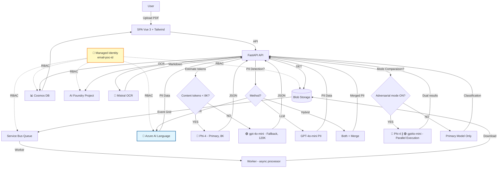

# ClassyMail — GenAI Email Classification

**GenAI that knows exactly where every email belongs.**

**Author:** Olivier Mertens — olmertens@microsoft.com
**Update:** Février 2026 (POC Refonte UI & Infra)

[](docs/assets/dashboard_preview.png)

## 📌 Pourquoi ClassyMail ?

**ClassyMail** est un **POC "agent + pipeline"** conçu pour traiter des emails/PDFs **à fort volume** avec **latence stable** et **coûts maîtrisés**.

Il valide une architecture moderne sur Azure :
*   **Architecture Événementielle** : Ingestion découplée du traitement (Event Grid + Service Bus).
*   **AI Hybride** : OCR spécialisé (Mistral) + SLM (Phi-4) avec fallback automatique (GPT-4o-mini).
*   **Review Humaine & Fine-Tuning** : Dashboard riche, correction manuelle et export de datasets via une boucle de feedback.
*   **Déploiement Prod-Ready** : Terraform, Azure Container Apps, Managed Identity.

---

## 🏗️ Architecture & Flux

1.  **Ingestion** : Upload PDF vers Blob Storage (API ou Portail).
2.  **Queue** : Event Grid détecte le fichier et notifie Service Bus.
3.  **Worker** : Consomme le message, valide le PDF, lance l'OCR (Mistral) puis la classification (Phi-4).
4.  **Stockage** : Résultats sauvegardés dans Cosmos DB.



---

## 🚀 Démarrage Rapide

### Pré-requis
*   Python 3.12 (uv recommandé)
*   Node.js 18+ (Frontend)
*   Azure CLI (`az login`)

### Lancement Local
Voir [docs/LOCAL_DEVELOPMENT.md](docs/LOCAL_DEVELOPMENT.md) pour la configuration détaillée (`secrets.env`).

```bash
# 1. Backend (API + Worker)
uv sync
uv run uvicorn main:app --reload

# 2. Frontend (dans un autre terminal)
cd frontend
npm install && npm run dev
```

---

## ✨ Fonctionnalités Clés

### 🧠 Stratégie "Broad Net"
Le pipeline utilise une approche à deux temps pour maximiser la précision des petits modèles (SLM) :
1.  **OCR Enrichi** : Mistral extrait le texte mais aussi la structure et décrit les images (Alt-Text).
2.  **Pré-Extraction** : Les entités clés (Noms, Dates, Montants) sont extraites en amont, permettant au modèle de classification de se concentrer uniquement sur l'intention.

### 🎯 Category Assessment AI Advice (NEW)
Optimisez vos catégories avec l'aide de l'IA :
*   **Assistant IA GPT-5 Nano** : Analyse vos définitions de catégories pour améliorer la précision de classification
*   **Prompt Engineering Focus** : Conseils spécifiques pour structurer vos prompts LLM
*   **Évaluation Qualité** : Note Good / Needs Improvement / Poor avec justifications détaillées
*   **Exemples Concrets** : Suggestions de reformulation copy-paste ready pour vos catégories
*   **Support Multi-Stratégies** : Conseils adaptés aux modes Standard, Reasoning et Vision
*   👉 **Accès :** Settings → Categories → "Get AI Advice" button

### 🔄 Per-Email Reprocessing (NEW)
Retraitez des emails individuels avec des stratégies personnalisées :
*   **Sélection Modèle** : Choisissez Phi-4, GPT-4o-mini, GPT-5-mini ou les deux (comparison mode)
*   **Stratégie Override** : Changez entre Standard/Reasoning/Vision pour un email spécifique
*   **Mode Sync/Async** : Traitement immédiat (<30s) ou en arrière-plan
*   **Comparaison A/B** : Testez plusieurs configurations sur le même email
*   👉 **Accès :** Dashboard → Email Details → "Reprocess" button

### ⚖️ Adversarial Model Comparison
Comparez en temps réel les performances de deux modèles (ex: Phi-4 vs GPT-4o-mini).
*   **Mode Parallèle** : Exécute les deux modèles simultanément.
*   **Analyse** : Affiche les deltas de confiance et les désaccords.
*   **Fine-Tuning** : Identifiez les cas limites pour réentraîner votre modèle.
*   👉 **Détails :** [docs/COMPARISON_ADVERSARIAL.md](docs/COMPARISON_ADVERSARIAL.md)

### 🛡️ PII Detection & Indicators (ENHANCED)
**Protection GDPR avec 3 méthodes configurables (Settings > Processing)** :
*   **LLM-based (default)** : Extraction contextuelle via GPT-4o-mini (~€0.002/email) - Détecte noms, emails, téléphones, adresses, NIR, IBAN
*   **Azure AI Language** : Service natif 43+ catégories prédéfinies (SSN, passeports, cartes bancaires) (~€0.001/email) - Requires `deploy_language_service=true` in Terraform
*   **Hybrid Mode** : Combine les deux méthodes, déduplique les résultats (précision maximale, ~€0.003/email)
*   **Indicateurs Visuels** : Shield icon (🛡️) dans les cards + badge "DCP" dans les tables
*   **Métadonnées Structurées** : Stockage JSON des entités PII détectées
*   **Anonymisation** : Support pour anonymiser les données avant export
*   👉 **Activation :** Configure via `email_preprocessing.detect_pii` setting + method selector

### 📊 Dynamic Cost Tracking (NEW)
Suivi précis des coûts par email et par modèle :
*   **12+ Modèles** : Pricing pour Phi-4, GPT-4o/4o-mini, GPT-5-mini/nano, GPT-4.1-nano, Mistral AI
*   **Token Usage Réel** : Coûts calculés à partir des tokens effectifs (non des estimations)
*   **Cost Breakdown** : Vue détaillée OCR + Classification + Embeddings par email
*   **Export CSV Enrichi** : Colonnes de coût dans les exports pour audit financier
*   **Configurabilité** : Ajustez les prix via Settings pour refléter votre région/tenant
*   👉 **Vue :** Dashboard → Costs tab + CSV exports

### 🧪 Générateur de Données de Test
Besoin de données ? Le script intégré génère des PDFs d'emails réalistes mais bruités (typos, argot, scans flous) pour tester la robustesse du pipeline.
*   👉 **Détails :** [docs/TESTING_EMAIL_GENERATION.md](docs/TESTING_EMAIL_GENERATION.md)

### 📧 Email Preprocessing (Client G2S)
Configuration avancée pour le traitement professionnel des emails :
*   **Extraction Intelligente** : LLM-based subject extraction et conversation isolée (sans historique/signatures)
*   **Catégories Enrichies** : Définitions + exclusions + AI assessment pour classification précise
*   **Slugs Techniques** : Identifiants stables pour export CSV
*   **Détection PII** : Extraction GDPR-compliant des données personnelles
*   **Export CSV Dual** : Format minimal (client) et enrichi (audit)
*   👉 **Guide Complet :** [docs/INTEGRATION_CLIENT_G2S.md](docs/INTEGRATION_CLIENT_G2S.md)

### 🔒 PII Anonymization & Fine-Tuning Export (NEW)
**Protection des données personnelles avec système dual-band pour fine-tuning** :
*   **Niveau 1 - Regex** : Suppression rapide (<1ms) des emails, téléphones, IPs, IBANs
*   **Niveau 2 - LLM (GPT-4o)** : Anonymisation contextuelle des noms, sociétés, adresses, montants
*   **Protection en couches** : L'IA anonymisatrice ne voit jamais les emails bruts (déjà scrubés par regex)
*   **Export JSONL sécurisé** : Format Azure AI Foundry avec anonymisation automatique (subject/sender inclus)
*   **Corrections utilisateur** : Tracking complet des modifications manuelles avec feedback AI
*   **Fail-safe design** : Si anonymisation échoue, l'exemple est ignoré (jamais de PII dans l'export)
*   **Dataset synthétique** : Génération de PDFs/emails réalistes pour tests sans données réelles
*   👉 **Documentation complète :** [docs/PII_ANONYMIZATION_AND_USER_CORRECTIONS.md](docs/PII_ANONYMIZATION_AND_USER_CORRECTIONS.md)

**Commandes rapides :**
```bash
# Export JSONL anonymisé pour fine-tuning (par défaut anonymize=true)
curl "http://localhost:8000/api/v1/emails/export-finetune-jsonl?split=train" > train.jsonl
curl "http://localhost:8000/api/v1/emails/export-finetune-jsonl?split=test" > test.jsonl

# Générer des emails synthétiques pour tests (fake data)
uv run python scripts/generate_realistic_emails.py --count 50 --out dataset/test_pdfs

# Uploader et traiter les PDFs générés
uv run python scripts/test_e2e_flow.py --count 50
```

### 🌍 Internationalization (i18n)
Interface multilingue complète :
*   **Français & Anglais** : Traductions exhaustives (500+ clés synchronisées)
*   **Terminologie Métier** : "Niveau de confiance" (FR), "Confidence Level" (EN)
*   **Vue Legacy-Free** : Utilise vue-i18n Composition API (`createI18n({ legacy: false })`)
*   **Maintenance** : Script `check_i18n.py` pour vérifier la cohérence EN/FR

---

## 📚 Documentation

L'index complet est disponible ici : **[docs/INDEX.md](docs/INDEX.md)**.
- [CLI_SETUP](docs/CLI_SETUP.md)
- [CLI_RAG](docs/CLI_RAG.md)

### Parcours Recommandé

1.  **Démarrer** : [docs/SCENARIO_E2E.md](docs/SCENARIO_E2E.md) (Test complet end-to-end)
2.  **Développer** : [docs/LOCAL_DEVELOPMENT.md](docs/LOCAL_DEVELOPMENT.md) (Configuration, Env Vars, Build)
3.  **Comprendre** : [docs/ARCHITECTURE.md](docs/ARCHITECTURE.md) (Composants, Flux, Sécurité)
4.  **Optimiser** : [docs/MODELS.md](docs/MODELS.md) (Choix des modèles, Coûts, Fine-tuning)
5.  **Déployer** : [docs/INFRASTRUCTURE.md](docs/INFRASTRUCTURE.md) (Terraform) et [docs/CICD_GITHUB.md](docs/CICD_GITHUB.md) (GitHub Actions)

---

## 🔗 Références & Liens Utiles

*   **Pricing Azure AI** : [Azure AI Foundry Models](https://azure.microsoft.com/fr-fr/pricing/details/ai-foundry-models/microsoft/)
*   **Fine-tuning** : [Guide Azure OpenAI/Foundry](https://learn.microsoft.com/en-us/azure/ai-foundry/openai/how-to/fine-tuning?view=foundry-classic&tabs=oai-sdk%2Cazure-openai&pivots=programming-language-python)
*   **Phi-4 Local** : [Running Phi-4 with Foundry Local](https://techcommunity.microsoft.com/blog/educatordeveloperblog/running-phi-4-locally-with-microsoft-foundry-local-a-step-by-step-guide/4466304)

---
*Ce projet est une preuve de concept (POC) Microsoft.*
