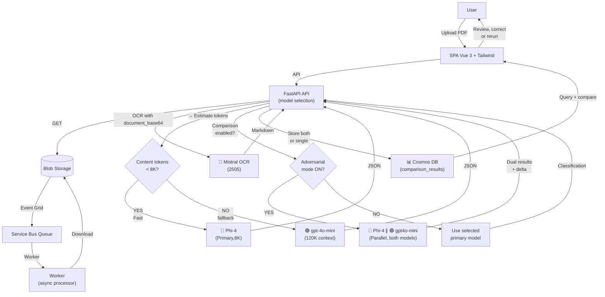

# ClassyMail — GenAI Email Classification

**GenAI that knows exactly where every email belongs.**

**Author:** Olivier Mertens — olmertens@microsoft.com
**Update:** Février 2026 (POC Refonte UI & Infra)

[](https://raw.githubusercontent.com/olivMertens/classimail-agent/main/docs/assets/dashboard_preview.png)
*Click image to view full size*

## Pourquoi ClassyMail ?

**ClassyMail** est un **POC "agent + pipeline"** pour traiter des emails/PDFs **à fort volume**, avec un objectif de **latence stable** et de **coûts observables**.
Il sert à valider rapidement :

- Une architecture **événementielle découplée** (ingestion vs traitement) pour absorber des pics (ex: 10k fichiers).
- Un workflow de **review humaine** (dashboard interactif) + boucle de **reinforcement / fine-tuning**.
- Un mode de déploiement cloud **prod-ready** (Terraform + Azure Container Apps) et une exécution locale simple.
- **Nouveau (Fév 2026)** : Interface "Dark Mode" native, Danger Zone (Reset complet), et support Azure Retail Prices API.

## Comment ça marche (vue d’ensemble)

1) **Upload** d’un PDF dans Blob Storage.
2) **Event Grid** déclenche un message dans **Service Bus** (queue) pour lisser la charge.
3) Un **worker** consomme la queue, télécharge le PDF et lance :
    - OCR via **Mistral OCR** → Markdown
    - Classification via **Phi‑4** (avec fallback possible) → JSON
4) Le résultat est **persisté dans Cosmos DB** (statut, classification, usage/coûts), puis visible dans le **dashboard**.

### Stratégie de Traitement ("Broad Net" & Vision)

Le pipeline applique une **stratégie "Broad Net" (Filet Large)** pour maximiser la précision des Small Language Models (SLM) comme Phi-4 :

1. **Vision à 3 Niveaux (Mistral)** :
   - **Texte** : OCR Markdown standard.
   - **Structure** : Normalisation spatiale via Bounding Boxes.
   - **Enrichissement** : Description générative des images (Alt-Text) pour que le modèle "voie" le contenu non-textuel.

2. **Extraction d'Entités** :
   - Avant de classifier, nous rayons large pour extraire les faits (Noms, Dates, Montants).
   - **Pourquoi ?** Cela déleste le modèle de la recherche d'information. Il reçoit les faits structurés + les définitions de catégories, et peut se concentrer purement sur le **matching d'intention** (le "best possible understanding").

Pour les détails (RBAC, variables, exécution, CI/CD) : voir la section Documentation ci-dessous.

## 📚 Documentation

- Docs home (index) : [docs/INDEX.md](docs/INDEX.md)

### Parcours recommandé (à lire dans cet ordre)

Selon ton objectif :

- **Je veux tester le système E2E** (recommandé pour débuter)
    1. [docs/SCENARIO_E2E.md](docs/SCENARIO_E2E.md) — scénario complet (PDF → Blob → Event Grid → Service Bus → Worker → Cosmos → UI), en local et sur Azure
    2. [docs/LOCAL_DEVELOPMENT.md](docs/LOCAL_DEVELOPMENT.md) — exécution locale, variables `secrets.env`, upload/trigger
    3. [docs/INFRASTRUCTURE.md](docs/INFRASTRUCTURE.md) — provisionner l'infra Azure + récupérer les outputs

- **Je veux comprendre l’architecture** (deep dive)
    1. [docs/ARCHITECTURE.md](docs/ARCHITECTURE.md) — composants, RBAC, scaling, pipeline de traitement
    2. [docs/MODELS.md](docs/MODELS.md) — endpoints, deployments, contraintes tokens, config
    3. [docs/COSTS_LOGIC.md](docs/COSTS_LOGIC.md) — analyse de coûts et comparaison de modèles
    4. [docs/FINE_TUNING_DATA.md](docs/FINE_TUNING_DATA.md) — boucle de review + export JSONL + fine-tune

- **Je veux builder/déployer**
    - [docs/LOCAL_DEVELOPMENT.md](docs/LOCAL_DEVELOPMENT.md) — build/push image, déploiement ACA sans CI
    - [docs/INFRASTRUCTURE.md](docs/INFRASTRUCTURE.md) — déploiement Terraform complet
    - [docs/CICD_GITHUB.md](docs/CICD_GITHUB.md)

### Référence (liste complète)

📊 **Voir [docs/INDEX.md](docs/INDEX.md) pour la navigation complète et organisée**

- [docs/ARCHITECTURE.md](docs/ARCHITECTURE.md) — Architecture système, RBAC, pipeline
- [docs/LOCAL_DEVELOPMENT.md](docs/LOCAL_DEVELOPMENT.md) — Setup local, build, testing
- [docs/INFRASTRUCTURE.md](docs/INFRASTRUCTURE.md) — Terraform, Azure config, Event Grid
- [docs/MODELS.md](docs/MODELS.md) — Configuration des modèles AI
- [docs/COSTS_LOGIC.md](docs/COSTS_LOGIC.md) — Analyse et optimisation des coûts
- [docs/FINE_TUNING_DATA.md](docs/FINE_TUNING_DATA.md) — Fine-tuning workflow
- [docs/CICD_GITHUB.md](docs/CICD_GITHUB.md) — CI/CD GitHub Actions
- [docs/SCENARIO_E2E.md](docs/SCENARIO_E2E.md) — Tests end-to-end

## 🔗 References

- Pricing (Azure AI Foundry models): https://azure.microsoft.com/fr-fr/pricing/details/ai-foundry-models/microsoft/
- Fine-tuning (Azure AI Foundry / Azure OpenAI): https://learn.microsoft.com/en-us/azure/ai-foundry/openai/how-to/fine-tuning?view=foundry-classic&tabs=oai-sdk%2Cazure-openai&pivots=programming-language-python
- Phi Cookbook (community): https://github.com/microsoft/PhiCookBookfin
- Running Phi-4 locally (Foundry Local guide): https://techcommunity.microsoft.com/blog/educatordeveloperblog/running-phi-4-locally-with-microsoft-foundry-local-a-step-by-step-guide/4466304

Ce projet implémente un pipeline de classification d'emails à haut volume et faible latence, capable de gérer des pics de charge (10k fichiers simultanés) grâce à une architecture événementielle découplée, avec un backend FastAPI et un frontend SPA (Vue 3 + Tailwind).

The new frontend provides a dark-mode enabled dashboard to:
- Monitor email processing metrics.
- Upload/drag-and-drop PDF files directly.
- Review and correct classifications with a side-by-side PDF viewer and markdown preview.
- Analyze costs and usage.
- Configure settings.



## 🔧 Installation & Exécution (aperçu)

Voir [docs/LOCAL_DEVELOPMENT.md](docs/LOCAL_DEVELOPMENT.md) pour toutes les options (uv/poetry/pip) et le chargement de `secrets.env`.

```bash
uv sync
uv run uvicorn main:app --reload
```

## ⚖️ Adversarial Model Comparison

The system supports **dual-model comparison** for advanced evaluation and fine-tuning, allowing you to run classification with two models simultaneously and compare their outputs.

**IMPORTANT:** For adversarial comparison to work, you must configure **two different models**. Comparing a model against itself provides no value. The system will block comparison if `PHI_DEPLOYMENT` and `PHI_FALLBACK_DEPLOYMENT` are identical.

### Available Models for Comparison

**Primary Model (Configurable via `PHI_DEPLOYMENT`):**
- � **GPT-4.1 Nano** (fast, optimized, 1M+ token context, ✅ fine-tuning supported)
- 🟣 **GPT-5 Mini** (next-gen, 200K token context, ❌ fine-tuning not yet available)
- 🟢 **gpt-4o-mini** (cost-effective, 128K token context, ✅ fine-tuning supported)
- 🔶 **Phi-4** (8K context, ✅ fine-tuning supported, if deployed)

**Fallback/Challenger Model (Configurable via `PHI_FALLBACK_DEPLOYMENT`):**
- 🟢 **gpt-4o-mini** (default, 128K token context)
- 🟠 **gpt-4o** (200K token context, if deployed)

**Comparison Behavior:**
- **Automatic Fallback**: When content > configured primary model context → Uses fallback model automatically
- **Manual Comparison**: You can trigger comparison mode to run **both models in parallel** on any email
- **Results**: Side-by-side comparison shows both classifications with confidence scores and agreement indicators

### Enable Comparison Mode

#### Via Settings (UI)
Navigate to **Settings** → **Advanced** → check **"Enable Model Comparison"**. This enables comparison for all future classifications.

#### Per-Email (API)
```bash
# Sync comparison (wait for results, ~20-30s)
curl -X POST http://localhost:8000/api/emails/{id}/reclassify \
  -H "Content-Type: application/json" \
  -d '{"model": "both", "mode": "sync"}'

# Async comparison (returns 202, processes in background)
curl -X POST http://localhost:8000/api/emails/{id}/reclassify \
  -H "Content-Type: application/json" \
  -d '{"model": "both", "mode": "async"}'
```

### Why Compare Models?

1. **Validation**: Verify Phi-4 results against gpt-4o-mini
2. **Fine-Tuning Data**: Collect disagreement cases for model refinement
3. **Confidence Analysis**: Compare confidence scores (higher delta = less certain)
4. **Safety Net**: Ensure fallback model agrees on critical classifications

### Comparison Results

Results include:
- **Phi-4 classification**: Primary result
- **gpt-4o-mini classification**: Fallback result
- **Confidence delta**: Absolute difference in top intent confidence (0.0–1.0)
- **Agreement**: `true` if both models detected same intent
- **Execution time**: Total time for dual-model execution (ms)

View results in the **Comparison** tab of the email detail view.

**UI Color Legend:**
- **🔷 Blue Card**: Phi-4 (Primary Model)
- **🟠 Orange Card**: GPT-4o-mini (Audit/Challenger Model)
- **✅ Green Banner**: Consensus reached (Models agree)
- **⚠️ Red Banner**: Divergence detected (Models disagree)

---

## 🤖 Modèles & Data Residency

### Model Selection Strategy

**Primary Model Selection** (via Settings/Env):
- **Phi-4** (Standard, Default): Fast, cost-effective, 8K token context.
- **GPT-5 Nano / Mini**: Next-gen small models (Experimental).
- **GPT-4.1 Nano**: Optimized low-latency model.
- **Custom Model**: You can configure any Azure OpenAI compatible model as primary via `PHI_DEPLOYMENT`.

Phi-4 is the default "Standard" model, but the architecture allows users to select different models for the "Reasoning" or "Classification" tasks. This selection is configurable:
- **Environment Variable**: `PHI_DEPLOYMENT` (at startup)
- **Runtime Settings**: Via the UI Settings panel (Hot-swap capable)

**Token-Based Fallback** (Automatic):
- If content > 8K tokens estimated → use 🟢 gpt-4o-mini (120K context)
- Otherwise → use selected primary model (default: 🔶 Phi-4)

**Environment Variable** (Override):
- `MODEL_SELECTION=phi4` → Always use Phi-4.
- `MODEL_SELECTION=gpt4o-mini` → Always use gpt-4o-mini.
- `MODEL_SELECTION=auto` (default) → Token-based fallback.

### Data Zone Europe Compliance

All models used are compatible with **EU Central (Data Zone Europe)**:

| Model | EU Central | US East | Availability |
|-------|----------|---------|--------------|
| 🔶 Phi-4 (Foundry) | ✅ | ✅ | [Link](https://learn.microsoft.com/en-us/azure/ai-foundry/foundry-models/) |
| 🟢 gpt-4o-mini | ✅ | ✅ | [Link](https://learn.microsoft.com/en-us/azure/ai-foundry/foundry-models/) |
| 🟦 Mistral OCR 2505 | ✅ | ✅ | [Link](https://learn.microsoft.com/en-us/azure/ai-foundry/foundry-models/) |

**Configuration**:
```env
# Set preferred region for compliance validation (optional warning logs)
AZURE_PREFERRED_DATA_ZONE=eu-central
AZURE_REGION=eastus
```

See [docs/RBAC_AUDIT.md](docs/RBAC_AUDIT.md) for identity and role configuration.

CI/CD : [docs/CICD_GITHUB.md](docs/CICD_GITHUB.md)

Tests rapides : voir [docs/LOCAL_DEVELOPMENT.md](docs/LOCAL_DEVELOPMENT.md)
1. **UI** : validation/correction (FastAPI Dashboard)
2. **Golden Dataset** : `classification.needs_review=false`, `reviewed=true`
3. **Export Foundry** : JSONL hebdomadaire
4. **Fine-Tune** : LoRA sur Phi-4
5. **Déploiement** : `Phi-4-Custom` (même endpoint)

---

## 🧪 Génération de données (POC / Demo)

Pour démontrer le POC (stress OCR + classification + boucle de review/fine-tuning), le repo inclut un générateur de PDFs « email-like » volontairement bruités :

- Script: [scripts/generate_dummy_pdfs.py](scripts/generate_dummy_pdfs.py)
- Objectif: produire 50–100 emails aléatoires, souvent longs (~300 mots), avec bruit (FR/EN/ES, argot, SMS, typos, forwards, multi-sujets…)

Exemples:

```bash
# Dépendance du générateur PDF (uniquement pour ce script)
pip install fpdf2

# Générer 1 PDF (pratique pour vérifier le nom unique/id) — le script affiche le chemin du fichier
python scripts/generate_dummy_pdfs.py --count 1 --out dataset/pdf

python scripts/generate_dummy_pdfs.py --count 75 --target-words 300
python scripts/generate_dummy_pdfs.py --count 100 --target-words 320 --out dataset/pdf
```

Notes:
- Les fichiers sont nommés avec un suffixe unique (timestamp + UUID court), par ex:
    `sample_001_<categorie>_<timestamp>_<id>.pdf`
- Quand `--count <= 3`, le script affiche le chemin complet des fichiers générés.

### Simuler un PDF corrompu (end-to-end)

Objectif: vérifier que le pipeline détecte un PDF illisible dès l'étape 1 (download) et que l'UI affiche clairement l'erreur.

Pré-requis:
- App démarrée (local ou ACA)
- Variables Storage configurées (`AZURE_STORAGE_ACCOUNT_URL`, `AZURE_STORAGE_CONTAINER`)

Exemples:

```bash
# Local
python scripts/simulate_corrupted_pdf.py --base-url http://localhost:8000

# ACA (remplacer l'URL)
python scripts/simulate_corrupted_pdf.py --base-url https://<your-app>.<region>.azurecontainerapps.io
```

Résultat attendu:
- Un item `status=ERROR` apparaît dans l'onglet `⚠ Erreurs`, avec `error_stage=download` + un petit `processing_log`.

### Option LLM (Azure OpenAI / Foundry compatible)

Le script peut générer/étendre le contenu via un LLM avant de créer les PDFs.

Variables d'environnement:

- `AZURE_OPENAI_ENDPOINT` (obligatoire)
- `AZURE_OPENAI_DEPLOYMENT` (optionnel, défaut: `gpt-4o-mini`)
- `AZURE_OPENAI_API_VERSION` (optionnel, défaut: `2024-10-01-preview`)
- `AZURE_OPENAI_TIMEOUT` (optionnel)

Exemple PowerShell:

```powershell
$env:AZURE_OPENAI_ENDPOINT = "https://<resource>.openai.azure.com"
$env:AZURE_OPENAI_DEPLOYMENT = "gpt-4o-mini"
# Optionnel (si auth par key)
$env:AZURE_OPENAI_API_KEY = "<key>"
```

Authentification (fallback automatique):

- **API key**: définir `AZURE_OPENAI_API_KEY`
- **Entra ID (recommandé)**: ne pas définir la key, et s'authentifier via `DefaultAzureCredential` (ex: `az login`).
- Scope configurable via `AZURE_OPENAI_SCOPE` (défaut: `https://cognitiveservices.azure.com/.default`).

```bash
python scripts/generate_dummy_pdfs.py --count 75 --target-words 300 --use-aoai
```

## 🧩 Backend FastAPI

### Endpoints

- `POST /webhook/ingest` : Webhook Event Grid → Service Bus.
- `GET /api/emails` : Liste (page, status, search), multi-intents.
- `GET /api/emails/{id}` : Détail (SAS, markdown, classification multi-intents).
- `PATCH /api/emails/{id}` : Validation (`intents` array, status=PROCESSED).

### Observability & Coûts
- **OpenTelemetry** (OTLP) via `OTEL_EXPORTER_OTLP_ENDPOINT`
- **Usage & coûts** stockés par email (`usage.phi4.usage`, `usage.phi4_cost_usd`, `usage.mistral.estimated_pages`, `usage.mistral.cost_usd`)

### Worker

- SB + `Semaphore(5)`, validation PDF (header `%PDF`) → base64
- **Mistral OCR** `document_base64`
- **Phi-4 multi-intents** JSON
- `needs_review` via règles (scores, intents count)
- Cosmos upsert
- **PDF corrompu / illisible (stage 1: download)**: l'item est marqué `status=ERROR`, sauvegardé dans Cosmos avec `error_stage=download`, et envoyé en DLQ.
- **Autres échecs (OCR / classify)**: `status=ERROR` + `error_stage=ocr|classify` (visible dans l'UI), DLQ.

### Export CSV

- CLI (recommandé): `python -m classificationg2s.cli --export-csv data/output.csv`
- Export fine-tuning JSONL: `python -m classificationg2s.cli --export-finetune-jsonl data/fine_tune.jsonl`
- Colonnes : `intents`, `needs_review`, `global_complexity`

---

## 💻 Frontend SPA (Vue 3 + Tailwind)

Le projet inclut une application frontend moderne dans le dossier `frontend/`.

- **Stack** : Vue 3, Vite, Tailwind CSS, Headless UI.
- **Features** :
    - Dashboard analytique (KPIs, graphes).
    - Vue liste avec filtres (statut, recherche full-text, dates).
    - Vue détail optimisée pour la review (PDF split-screen, Markdown, formulaire JSON).
    - Upload Drag & Drop.
    - Dark mode natif.
- **Build** : `npm run build` génère les assets dans `static/dist/`. FastAPI sert `index.html` comme point d'entrée SPA.

---

## 🔧 Installation & Exécution

### Setup Frontend (Dev)
Pour développer le frontend avec le Hot Module Replacement (HMR) :

```bash
cd frontend
npm install
npm run dev
```
L'URL locale sera typiquement `http://localhost:5173`. Configurez le proxy Vite ou CORS si nécessaire pour taper sur l'API Python (`http://localhost:8000`).

### Setup Backend (uv)
```bash
uv lock
uv sync
uv run uvicorn classificationg2s.app:app --reload
```
Le backend sert le frontend compilé à l'adresse racine `/`.

Entrypoint historique (si besoin): `uvicorn main:app --reload`

Note: Python 3.11/3.12 recommended (Azure SDK support on 3.13 may lag).

### Avec Poetry
```bash
poetry install
poetry run uvicorn main:app --reload
```

### Avec pip
```bash
pip install -r requirements.txt
uvicorn main:app --reload
```

### Remplir `secrets.env` après Terraform
Les valeurs proviennent des outputs Terraform (voir `terraform output`).

```dotenv
# --- Services Azure (Terraform outputs) ---
AZURE_SERVICE_BUS_FQDN=<namespace>.servicebus.windows.net
AZURE_SERVICE_BUS_QUEUE=pdf-processing-queue

AZURE_STORAGE_ACCOUNT_URL=https://<storage>.blob.core.windows.net/
AZURE_STORAGE_CONTAINER=pdf-inputs

AZURE_COSMOS_ENDPOINT=https://<cosmos>.documents.azure.com:443/
AZURE_COSMOS_DB=emailsdb
AZURE_COSMOS_CONTAINER=emails

# Cosmos key (uniquement si RBAC data-plane est désactivé)
# AZURE_COSMOS_KEY=<cosmos-primary-key>

# --- Identité (Azure Container Apps / Local) ---
# Si l'app tourne avec une User Assigned Managed Identity, définissez AZURE_CLIENT_ID
# (cf. Terraform output: APP_ID_CLIENT_ID)
AZURE_CLIENT_ID=3ae24af5-97c6-437f-a4d2-521fbd5524d4

# --- Azure AI Foundry / Azure OpenAI compatible endpoint ---
# Terraform output: AI_ENDPOINT
AZURE_AI_ENDPOINT=https://<aifoundry>.cognitiveservices.azure.com/

# Endpoints des modèles (par défaut pointe vers l'endpoint Foundry)
MISTRAL_ENDPOINT=${AZURE_AI_ENDPOINT}
MISTRAL_DEPLOYMENT=mistral-ocr-2505
MISTRAL_MODE=maas

PHI_ENDPOINT=${AZURE_AI_ENDPOINT}
PHI_DEPLOYMENT=phi-4

# Fallback model (long-context safety net)
PHI_FALLBACK_DEPLOYMENT=gpt-4o-mini

# --- Coûts (visibles dans l'UI) ---
PHI4_COST_PER_1K_INPUT=0.000107
PHI4_COST_PER_1K_OUTPUT=0.00043
MISTRAL_OCR_COST_PER_1K_PAGES=1.0

# --- Observabilité ---
# OTEL_EXPORTER_OTLP_ENDPOINT=http://localhost:4318/v1/traces

# Log Analytics Workspace ID (pour querying Application Insights logs)
LOG_ANALYTICS_WORKSPACE_ID=9f225d73-351d-471e-9371-c15d265e9bd4

# Application Insights connection string (Terraform output)
# APPLICATIONINSIGHTS_CONNECTION_STRING=InstrumentationKey=...;IngestionEndpoint=https://...
```

### CI/CD

CI/CD setup lives in:
- GitHub Actions: [docs/CICD_GITHUB.md](docs/CICD_GITHUB.md)

See the docs for the full YAML examples, authentication options (OIDC vs secrets), and recommended environment protections.


---

## ✨ Fonctionnalités Clés
- Ingestion Event Grid → Service Bus → Worker async (`Semaphore(5)`).
- OCR Mistral (`/v1/ocr` MaaS, `document_base64`), fallback inference `{deployment}:ocr`.
- Classification Phi‑4 multi-intentions (JSON strict) + `needs_review` (seuil 0.9).
- Fallback automatique vers un modèle long-contexte (ex: `gpt-4o-mini`) si le markdown OCR dépasse la fenêtre de contexte du modèle principal.
- Coûts & usage par email (pages, tokens, €), visibles UI + export CSV.
- Observabilité OpenTelemetry (HTTPx, spans custom `gen_ai.*`).
- CI/CD GitHub Actions (uv, ACR, Azure Container Apps).
- Terraform Foundry (Hub + Project + Deployments + RBAC `Cognitive Services User`).

Pour les détails (variables, logique, pricing), voir [docs/MODELS.md](docs/MODELS.md).

## 📄 Format RFAT (JSON)
```json
{
    "id": "pdf-inputs/2025/01/mail123.pdf",
    "file_url": "https://...",
    "classification": {
        "detected_intents": [
            {"intent": "Attestation habitation", "confidence": 0.97, "justification": "..."},
            {"intent": "Dommages électriques", "confidence": 0.91, "justification": "..."}
        ],
        "global_complexity": "Simple",
        "needs_review": false
    },
    "usage": {
        "phi4": {"prompt_tokens": 120, "completion_tokens": 45, "total_tokens": 165},
        "phi4_cost_usd": 0.00012,
        "mistral": {"estimated_pages": 2, "cost_usd": 0.002}
    }
}
```

## 🛠 Fine-tuning Phi‑4 (LoRA) & GPT‑4o-mini (Azure)
Voir [docs/FINE_TUNING_DATA.md](docs/FINE_TUNING_DATA.md) pour les détails (anonymisation, format JSONL, split train/validation).

1. **Collecte** : `needs_review=false` (validations humaines) dans Cosmos DB.
2. **Export JSONL** (chat) :
    - CLI : `uv run python main.py --export-finetune-jsonl ./data/fine_tune_all.jsonl`
    - HTTP : `GET /api/emails/export-finetune-jsonl`
3. **Split** : produire **2 fichiers**
    - `data/training_set.jsonl`
    - `data/validation_set.jsonl`
    Exemple (90/10) dans la doc.
4. **Foundry / Azure AI** :
    - Créer datasets (train/validation)
    - Lancer fine-tune (LoRA `phi-4` ou GPT‑4o-mini) via UI/CLI
    - Déployer `phi-4-custom` ou `gpt-4o-mini-custom` (endpoint OpenAI Chat compatible)
5. **Configuration** : `PHI_DEPLOYMENT=phi-4-custom` (ou fallback `gpt-4o-mini-custom`), `PHI_ENDPOINT` = endpoint Foundry.

Références :
- Doc fine-tuning Azure AI Foundry/Azure OpenAI : https://learn.microsoft.com/en-us/azure/ai-foundry/openai/how-to/fine-tuning?view=foundry-classic&tabs=oai-sdk%2Cazure-openai&pivots=programming-language-python
- Tutoriel officiel (GPT-4o-mini, end-to-end) : https://learn.microsoft.com/en-us/azure/ai-foundry/openai/tutorials/fine-tune?view=foundry-classic&tabs=command-line

## 🧱 Terraform (Foundry)
- `infra/main.tf` : crée **Foundry** (AIServices), **Project**, **Deployments** (`phi-4`, `mistral-ocr-2505`), **RBAC** `Cognitive Services User` pour l'identité `app_id`.
- Commandes :
    ```bash
    terraform init -upgrade
    terraform plan -out main.tfplan
    terraform apply main.tfplan
    ```

## 🔐 Lancement local (uv)
Créer `secrets.env` :
```
AZURE_SERVICE_BUS_FQDN=...
AZURE_SERVICE_BUS_QUEUE=pdf-processing-queue
AZURE_STORAGE_ACCOUNT_URL=...
AZURE_STORAGE_CONTAINER=pdf-inputs
AZURE_COSMOS_ENDPOINT=...
AZURE_COSMOS_KEY=...
MISTRAL_ENDPOINT=...
MISTRAL_DEPLOYMENT=mistral-ocr-2505
MISTRAL_MODE=maas
PHI_ENDPOINT=...
PHI_DEPLOYMENT=phi-4
PHI_FALLBACK_ENDPOINT=...
PHI_FALLBACK_DEPLOYMENT=gpt-4o-mini
PHI_PRIMARY_MAX_INPUT_TOKENS=8000
PHI_FALLBACK_MAX_INPUT_TOKENS=120000
PHI_RESERVED_OUTPUT_TOKENS=1000
PHI4_COST_PER_1K_INPUT=0.000107
PHI4_COST_PER_1K_OUTPUT=0.00043
FALLBACK_COST_PER_1K_INPUT=0
FALLBACK_COST_PER_1K_OUTPUT=0
MISTRAL_OCR_COST_PER_1K_PAGES=1.0
OTEL_EXPORTER_OTLP_ENDPOINT=...
```

```bash
uv sync
uv run --env-file secrets.env uvicorn main:app --reload
```

## 📜 Rôles & Accès (RBAC)

| Principal | Ressource | Rôle |
| --- | --- | --- |
| Identité managée ACA | Storage Account | Storage Blob Data Contributor |
| Identité managée ACA | Service Bus Namespace | Azure Service Bus Data Receiver/Sender |
| Identité managée ACA | Cosmos DB (SQL) | Cosmos SQL Built-in Data Contributor (RBAC) |
| Identité managée ACA | AI Foundry (AIServices) | Cognitive Services User |
| Event Grid | Service Bus Queue | Event delivery via system topic subscription |
| ACA (pull image) | Azure Container Registry | AcrPull |


## 🔐 Variables d’environnement

### Managed Identity & Security (Recommended)

**🔐 Best Practice:** Use Azure Managed Identity for authentication to Azure services (no keys/secrets required).

**Deployed Configuration (email-poc-rg):**
- **Managed Identity**: `email-poc-id`
- **Client ID**: `3ae24af5-97c6-437f-a4d2-521fbd5524d4` (Exemple aléatoire - sera différent sur votre souscription)
- **Principal ID**: `fdf02fa5-2cd5-42f9-9b78-5cb7905d94d0` (Exemple aléatoire - sera différent sur votre souscription)

**Required RBAC Role Assignments:**
- ✅ **Service Bus**: `Azure Service Bus Data Sender`, `Azure Service Bus Data Receiver`
- ✅ **Storage**: `Storage Blob Data Contributor` (Reader is insufficient for uploads)
- ✅ **Cosmos DB**: `Cosmos DB Built-in Data Contributor` (database scope: `emailsdb`)
- ✅ **AI Foundry**: `Cognitive Services User`
- ✅ **Container Registry**: `AcrPull`

**⚠️ Security Note:** Avoid using `AZURE_AI_KEY` and `AZURE_COSMOS_KEY` in production. Rely on Managed Identity (`DefaultAzureCredential`) for all Azure service authentication.

### Services Azure (Core)

| Variable | Description | Par défaut |
| --- | --- | --- |
| `AZURE_CLIENT_ID` | Client ID identité managée (requis pour ACA) | `3ae24af5-97c6-437f-a4d2-521fbd5524d4` |
| `AZURE_SERVICE_BUS_FQDN` | Namespace Service Bus (ex: `myns.servicebus.windows.net`) | ✓ requis |
| `AZURE_SERVICE_BUS_QUEUE` | Nom de la queue | `pdf-processing-queue` |
| `AZURE_STORAGE_ACCOUNT_URL` | URL compte storage (ex: `https://acct.blob.core.windows.net`) | ✓ requis |
| `AZURE_STORAGE_CONTAINER` | Container des PDFs | `pdf-inputs` |
| `AZURE_COSMOS_ENDPOINT` | Endpoint Cosmos DB | ✓ requis |
| `AZURE_COSMOS_KEY` | Clé Cosmos (**non recommandé**, préférer MSI/RBAC) | — |
| `AZURE_COSMOS_DB` | DB Cosmos | `emailsdb` |
| `AZURE_COSMOS_CONTAINER` | Container Cosmos | `emails` |

### Azure AI / Foundry Models

| Variable | Description | Par défaut |
| --- | --- | --- |
| `AZURE_AI_ENDPOINT` | Endpoint Foundry / Azure OpenAI | ✓ requis |
| `AZURE_AI_KEY` | Clé API (**non recommandé**, préférer `DefaultAzureCredential` + role `Cognitive Services User`) | — |
| `AZURE_AI_API_VERSION` | API version | `2024-08-01-preview` |
| `AZURE_AI_SCOPE` | OAuth scope | `https://cognitiveservices.azure.com/.default` |

### Classification (Phi-4 + Fallback)

| Variable | Description | Par défaut |
| --- | --- | --- |
| `PHI_ENDPOINT` | Endpoint Phi (défaut: `AZURE_AI_ENDPOINT`) | ✓ requis |
| `PHI_DEPLOYMENT` | Déploiement Phi-4 | `phi-4` |
| `PHI_FALLBACK_ENDPOINT` | Endpoint fallback long-contexte (défaut: `PHI_ENDPOINT`) | — |
| `PHI_FALLBACK_DEPLOYMENT` | Déploiement fallback (ex: `gpt-4o-mini`) | `gpt-4o-mini` |
| `PHI_PRIMARY_MAX_INPUT_TOKENS` | Budget tokens prompt (Phi-4) | `8000` |
| `PHI_FALLBACK_MAX_INPUT_TOKENS` | Budget tokens prompt (fallback) | `120000` |
| `PHI_RESERVED_OUTPUT_TOKENS` | Tokens réservés réponse JSON | `1000` |

### OCR (Mistral)

| Variable | Description | Par défaut |
| --- | --- | --- |
| `MISTRAL_ENDPOINT` | Endpoint Mistral (défaut: `AZURE_AI_ENDPOINT`) | ✓ requis |
| `MISTRAL_DEPLOYMENT` | Déploiement Mistral OCR | `mistral-ocr-2505` |
| `MISTRAL_MODE` | Mode MaaS (`maas` ou `inference`) | `maas` |
| `MISTRAL_OCR_MAX_ATTEMPTS` | Tentatives OCR avant abandon | `3` |

### Anonymization & Embeddings (Optional)

| Variable | Description | Par défaut |
| --- | --- | --- |
| `ANONYMIZER_ENDPOINT` | Endpoint anonymisation (défaut: `PHI_ENDPOINT`) | — |
| `ANONYMIZER_DEPLOYMENT` | Déploiement anonymisation | `gpt-4o` |
| `ANONYMIZER_PROMPT_VERSION` | Version prompt anonym. | `v1` |
| `EMBEDDING_ENDPOINT` | Endpoint embeddings (défaut: `PHI_ENDPOINT`) | — |
| `EMBEDDING_DEPLOYMENT` | Déploiement embeddings | `text-embedding-3-small` |
| `VISION_ENDPOINT` | Endpoint vision (défaut: `PHI_ENDPOINT`) | — |
| `VISION_DEPLOYMENT` | Déploiement vision | `gpt-4o` |
| `CHAT_ENDPOINT` | Endpoint chat (défaut: `PHI_ENDPOINT`) | — |
| `CHAT_DEPLOYMENT` | Déploiement chat | `gpt-5.2-chat` |

### Pricing & Thresholds

| Variable | Description | Par défaut |
| --- | --- | --- |
| `PHI4_COST_PER_1K_INPUT` | Prix Phi-4 input/1K tokens (USD) | `0.000107` |
| `PHI4_COST_PER_1K_OUTPUT` | Prix Phi-4 output/1K tokens (USD) | `0.00043` |
| `MISTRAL_OCR_COST_PER_1K_PAGES` | Prix Mistral OCR / 1K pages (USD) | `1.0` |
| `FALLBACK_COST_PER_1K_INPUT` | Prix fallback input/1K tokens (USD) | `0` |
| `FALLBACK_COST_PER_1K_OUTPUT` | Prix fallback output/1K tokens (USD) | `0` |
| `REVIEW_CONFIDENCE_THRESHOLD` | Score confiance min. pour review | `0.85` |

**💡 Cost-Benefit Insight:** See [docs/MODELS.md](docs/MODELS.md#cost-benefit-analysis-fine-tuned-vs-pre-trained-models) for detailed analysis comparing:
- Fine-tuned Phi-4 (~$15-20/month for 10K emails)
- gpt-5-mini baseline (~$70-80/month, +0.09 quality score)
- Hybrid strategy recommendations based on volume

### Observabilité & Monitoring

| Variable | Description | Par défaut |
| --- | --- | --- |
| `OTEL_EXPORTER_OTLP_ENDPOINT` | Endpoint OpenTelemetry (ex: `http://localhost:4318`) | — |
| `OTEL_SERVICE_NAME` | Nom du service telemetry (API: `classificationg2s-api`, Worker: `classificationg2s-worker`) | `classificationg2s-api` |
| `APPLICATIONINSIGHTS_CONNECTION_STRING` | App Insights connection string | ✓ requis (Azure) |
| `LOG_ANALYTICS_WORKSPACE_ID` | Workspace ID pour logs (ex: `9f225d73-351d-471e-9371-c15d265e9bd4`) | ✓ requis (Azure) |

### Interface Utilisateur (Features)

| Variable | Description | Par défaut |
| --- | --- | --- |
| `UI_SHOW_INFO_MODAL` | Afficher la modal d'information au démarrage | `true` |
| `UI_SHOW_DEVELOPER_TAB` | Afficher l'onglet Developer dans le dashboard | `true` |
| `ORGANIZATION_NAME` | Nom organisation affiché dans l'UI (branding) | `ClassiMail` |
| `MAX_UPLOAD_SIZE` | Taille max upload (MB, interface) | `10` |

### Autres

| Variable | Description | Par défaut |
| --- | --- | --- |
| `COSMOS_QUERY_MAX_LIMIT` | Limite pagination Cosmos | `20` |
| `UPLOAD_MAX_BYTES` | Taille max upload (bytes) | `10485760` (10MB) |
| `ENABLE_WORKER` | Active le mode worker (traitement Service Bus) | `false` (API), `true` (Worker) |

> **💡 DefaultAzureCredential Configuration:** Tous les services utilisent **DefaultAzureCredential** pour l'authentification (pas de clés/secrets). Accorder les rôles RBAC nécessaires à l'identité managée :
> - **Service Bus**: `Azure Service Bus Data Sender` + `Azure Service Bus Data Receiver`
> - **Storage**: `Storage Blob Data Contributor` + `Storage Blob Data Reader`
> - **Cosmos DB**: `Cosmos DB Built-in Data Contributor` (scope: database `emailsdb`)
> - **AI Foundry**: `Cognitive Services User`
> - **Container Registry**: `AcrPull` (pour déploiement ACA)
>
> **Sécurité**: Ne pas utiliser `AZURE_AI_KEY` ni `AZURE_COSMOS_KEY` en production. Les identités managées assurent une authentification plus sécurisée.

---

##

1. **Corruption PDF** : vérification `%PDF` → `ValueError`. Le message est abandonné, retry automatique Service Bus. Après `maxDeliveryCount`, message en DLQ.
2. **Erreurs IA (Mistral/Phi)** : exceptions httpx → abandon message → retry. Mettre des alertes sur DLQ.
3. **Cosmos indisponible** : abandon message → retry. Cosmos haute disposibilité.
4. **Reprocess** : vider la DLQ vers la queue principale (`az servicebus message dead-letter`).

---

##

1.  **Terraform** : `cd infra && terraform apply`
2.  **App** : Deployer le conteneur Docker sur l'instance Container App créée.
3.  **Configuration** : Identité Managée (`email-poc-id`) de l'App avec droits :
    - `Cognitive Services User` (AI Foundry)
    - `Azure Service Bus Data Sender` + `Azure Service Bus Data Receiver` (Service Bus)
    - `Storage Blob Data Contributor` + `Storage Blob Data Reader` (Storage)
    - `Cosmos DB Built-in Data Contributor` (Cosmos DB, database scope)
    - `AcrPull` (Container Registry)

### CI/CD GitHub Actions (uv + Azure Container Apps)

Voir `.github/workflows/deploy.yml`.


- `AZURE_CREDENTIALS` : JSON service principal (Azure login)
- `AZURE_SUBSCRIPTION_ID` : Subscription ID
- `AZURE_RESOURCE_GROUP` : RG cible
- `ACR_LOGIN_SERVER` : `<acrName>.azurecr.io`
- `ACR_USERNAME` / `ACR_PASSWORD` : crédentials ACR

Image : `${ACR_LOGIN_SERVER}/classimail-agent:${GITHUB_SHA}`
Déploiement : `azure/container-apps-deploy-action@v2` ingress externe, port 8000.

---

##

```bash
uv run uvicorn main:app --reload
# puis
curl -X POST http://localhost:8000/webhook/ingest -H "Content-Type: application/json" -d '[{"eventType":"Microsoft.Storage.BlobCreated","data":{"url":"https://acct.blob.core.windows.net/pdf-inputs/my.pdf"}}]'
```

---

##

- `pyproject.toml` (Poetry/uv)
- `requirements.txt`
- `uv.lock`
- `.gitignore` (Python + FastAPI + data/)
