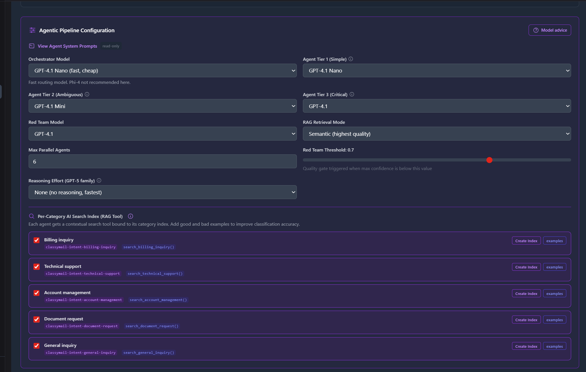

# Per-Category AI Search Indexes

> Idempotent, per-intent Azure AI Search indexes for agentic classification with human-curated good and bad examples.

## Why Per-Category Indexes?

Each classification category has its own dedicated AI Search index (`classymail-intent-{slug}`). This design enables:

- **RAG Grounding**: Specialized agents query their own index for reference examples before making a decision
- **Human Feedback Loop**: Corrections from reviewers become negative examples that teach the model what *doesn't* belong
- **Idempotent Management**: Indexes are created on demand and never destroyed unless explicitly deleted — safe to re-run
- **Per-Category Toggle**: The `enabled_indexes` setting lets you enable/disable RAG per category without deleting data

## How It Works End-to-End



```
User adds category → POST /api/settings
     ↓
User clicks "Ensure Index" → POST /api/admin/ai-search/indexes/ensure
     ↓
Index classymail-intent-{slug} created (idempotent: skips if exists)
     ↓
User adds good/bad examples → POST /api/admin/ai-search/indexes/{slug}/examples
     ↓
During classification, specialized agent calls search_{slug} tool
     ↓
Tool queries AI Search → returns positive + negative examples
     ↓
Agent calibrates confidence based on reference examples
```

## Adding Good and Bad Examples

There are **5 ways** to populate AI Search indexes with examples:

### 1. Manual paste in the Settings UI

**Settings > Processing > Agentic > Per-Category AI Search > Examples**

Click "Examples" on any category, select Good/Bad, paste email content, and click "Add Example". The system auto-creates the index and generates embeddings. An info button (ℹ) explains how it works with a complete guide.

### 2. One-Click Reinforcement (Email Detail Modal)

When viewing a correctly classified email, click the **"Reinforce"** button in the Email Detail Modal. This pushes the email's OCR content as a `human_reinforced` positive example into each of its classified category indexes.

### 3. Auto-Feed from User Corrections

When a user corrects a classification via the Email Detail Modal ("Validate & Save"):
- **Old (wrong) categories** → email pushed as a **negative example** with the correction reason
- **New (correct) categories** → email pushed as a **positive example** with `label_source: "human_corrected"`

This happens automatically in the background — no extra action needed. Corrections immediately improve future agentic classifications.

### 4. REST API

```bash
# Good example (email that correctly matches "billing-inquiry")
curl -X POST /api/admin/ai-search/indexes/billing-inquiry/examples \
  -H "Content-Type: application/json" \
  -d '{
    "content": "From: marie@acme.fr\nSubject: Invoice discrepancy\n\nI received invoice #INV-4782 for EUR 1245 but my contract specifies EUR 980...",
    "is_positive": true,
    "label_source": "human_verified"
  }'

# Bad example (email wrongly classified as "billing-inquiry")
curl -X POST /api/admin/ai-search/indexes/billing-inquiry/examples \
  -H "Content-Type: application/json" \
  -d '{
    "content": "From: mike@company.org\nSubject: Password reset\n\nI cannot log into my account. I have tried resetting my password 3 times...",
    "is_positive": false,
    "correction_reason": "NOT billing - this is a technical support / account access issue",
    "label_source": "human_corrected"
  }'
```

### 5. Seed Script

```bash
uv run python scripts/seed_ai_search.py
```

This script creates indexes and uploads 35 sample emails (5 positive + 2 negative per category) with embeddings. It is fully idempotent — re-running preserves existing data.

## Reinforcement API

| Method | Endpoint | Description |
|--------|----------|-------------|
| `POST` | `/api/emails/{id}/reinforce` | Push email as positive example into its classified categories |

Response: `{"status": "ok", "reinforced": ["billing-inquiry"], "count": 1}`

## What Makes a Good Embeddable Example?

### Ideal Content (embeds well)

| Type | Content | Why |
|------|---------|-----|
| **Plain text email** | 500-3000 chars with From/Date/Subject headers | Strong embedding signal, matches what the pipeline processes |
| **Markdown OCR output** | Extracted text from PDF emails | Exactly what the specialized agent sees during classification |
| **Multilingual** | French, English, German, etc. | The embedding model (`text-embedding-3-small`) handles multilingual content |
| **Domain-specific** | Real vocabulary: invoice numbers, error codes, legal terms | Captures the semantic fingerprint of each category |

### Content to Avoid (embeds poorly)

| Type | Why it fails |
|------|-------------|
| **Raw binary/PDF** | Not searchable text — embeddings need readable content |
| **Very short (\<50 chars)** | Weak embedding signal, insufficient for semantic matching |
| **Heavy HTML markup** | Tags dominate the embedding, pushes actual content out |
| **Generic filler text** | "Please see attached" — no category-specific signal |

### Label Source Hierarchy

The specialized agent prompt weights sources differently:

| Source | Weight | When to use |
|--------|--------|-------------|
| `human_verified` | Highest | Expert manually confirmed this is correct |
| `human_reinforced` | High | LLM classified correctly, human confirmed |
| `human_corrected` | High | LLM misclassified, human fixed → becomes negative example |
| `llm_classified` | Normal | LLM auto-classified, no human review |

## How Examples Reach the Agent Prompt

When a specialized agent runs for a category:

1. **Tool injection** — `_build_specialized_prompt()` in [classymail/agents/specialized.py](../classymail/agents/specialized.py) adds a `search_{slug}` tool definition to the agent's available tools

2. **Forced tool call** — The agent is forced to call the search tool with key phrases from the email (`tool_choice: {function: search_{slug}}`)

3. **AI Search retrieval** — `search_intent_index()` in [classymail/agents/tools/ai_search_tool.py](../classymail/agents/tools/ai_search_tool.py) queries the per-intent index using vector + semantic search

4. **Result formatting** — `_format_tool_result()` structures results into a readable format the LLM can reason about:

```
POSITIVE EXAMPLES (emails correctly classified as this intent):
  [human_verified] relevance=0.94
  > I received invoice #INV-4782 for EUR 1245 but my contract specifies...

NEGATIVE EXAMPLES (emails WRONGLY classified as this intent):
  [human_corrected] relevance=0.72
  > I cannot log into my account. I have tried resetting my password...
  REASON: NOT billing - this is a technical support / account access issue
```

5. **Agent decision** — The agent compares the new email against these reference examples and calibrates its confidence score accordingly

## API Reference

| Method | Endpoint | Description |
|--------|----------|-------------|
| `GET` | `/api/admin/ai-search/indexes` | List all indexes with doc counts |
| `POST` | `/api/admin/ai-search/indexes/ensure` | Idempotent create for one category |
| `POST` | `/api/admin/ai-search/indexes/ensure-all` | Ensure indexes for all categories |
| `DELETE` | `/api/admin/ai-search/indexes/{slug}` | Delete a category's index |
| `GET` | `/api/admin/ai-search/indexes/{slug}/examples` | List examples in an index |
| `POST` | `/api/admin/ai-search/indexes/{slug}/examples` | Add a good or bad example |
| `DELETE` | `/api/admin/ai-search/indexes/{slug}/examples/{doc_id}` | Remove a specific example |

## Settings

The `agentic` block in settings controls AI Search behavior:

```json
{
  "agentic": {
    "enabled": true,
    "retrieval_mode": "semantic",
    "search_top_k": 5,
    "enabled_indexes": {
      "billing-inquiry": true,
      "technical-support": true,
      "account-management": false
    }
  }
}
```

- `retrieval_mode` — `vector` | `hybrid` | `semantic` (default: `semantic`)
- `search_top_k` — Max documents retrieved per agent query (default: 5)
- `enabled_indexes` — Per-category on/off toggle. Empty object = all enabled

## Idempotency Guarantees

| Operation | Behavior |
|-----------|----------|
| `ensure_index(slug)` | Creates if missing, skips if exists (no data loss) |
| `seed_ai_search.py` | Creates indexes if missing, uses `mergeOrUpload` with deterministic IDs |
| `upsert_example()` | Each call generates a new UUID — duplicates are possible by design (different data points) |
| `ensure_indexes_for_categories()` | Bulk ensure — safe to call on every app startup |

## Architecture

```
classymail/agents/
  tools/
    ai_search_tool.py        # Per-intent search retrieval (vector/hybrid/semantic)
    ai_search_index.py        # Idempotent CRUD for indexes + examples

classymail/api/routers/admin/
  ai_search.py                # REST API for index management

scripts/
  seed_ai_search.py           # Deploy + seed 35 sample emails across 5 indexes
```

## Related Docs

- [AGENTIC_CLASSIFICATION](AGENTIC_CLASSIFICATION.md) — Full agentic architecture
- [CUSTOMIZATION](CUSTOMIZATION.md) — Category taxonomy configuration
- [INFRASTRUCTURE](INFRASTRUCTURE.md) — Terraform AI Search resource
