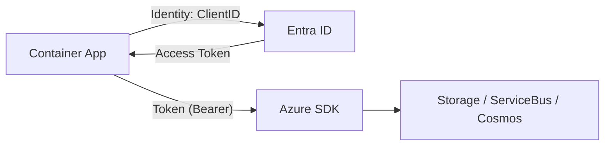
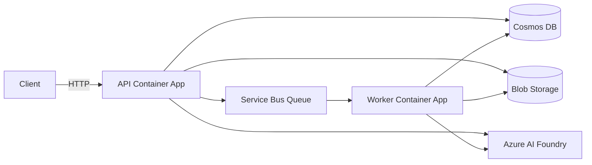

# ARCHITECTURE

## 1. Architecture Solution (Mermaid)

Pattern : Event-Driven + Container Apps + AI Foundry (Mistral OCR & Phi‑4)

**Flux de données :**

1. **Ingestion :** Le PDF arrive dans le Blob Storage (Container `pdf-inputs`).
2. **Trigger :**
   *   **Cas 1 (Upload API)** : Le fichier est blobé par l'API, qui crée immédiatement une entrée "PENDING" dans la DB et pousse un message direct dans le Service Bus (Visibilité immédiate).
   *   **Cas 2 (Depôt Portal/FTP)** : Azure Event Grid détecte le fichier (`BlobCreated`) et publie un message dans Service Bus (Visibilité après traitement par le worker).
3. **OCR (Extraction) :** Le worker (FastAPI) télécharge le PDF et l'envoie au modèle OCR (Mistral) pour obtenir du Markdown.
4. **Intelligence (Classification) :** Le Markdown est envoyé au modèle LLM (Phi‑4, avec fallback possible) pour produire un JSON strict multi-intents.
5. **Stockage :** Le résultat (JSON + usage/coût) est stocké dans Cosmos DB (et export CSV possible côté app).

```mermaid
flowchart TD
    subgraph Client [Environnement Client]
        PDF[PDF Email]
    end
    subgraph Storage[Storage]
        BlobIn[(Blob Storage: pdf-inputs)]
    end
    subgraph Ingestion[Ingestion]
        EG[Event Grid]
        SB[(Service Bus Queue)]
    end
    subgraph Compute[Azure Container Apps]
        API[API + UI (FastAPI)]
        W[Worker (python -m classificationg2s.worker_main)]
    end
    subgraph AI[AI Foundry - MaaS]
        Mistral[Mistral Document AI 25.05\n(mistral-document-ai-2505)]
        Phi4[Phi-4]
    end
    subgraph Data[Cosmos DB]
        Cosmos[(Classifications)]
    end

    PDF -->|Upload UI| API
    PDF -->|Upload Portal/FTP| BlobIn

    API -->|1. Write Blob| BlobIn
    API -->|2. Create PENDING| Cosmos
    API -->|3. Manual Trigger (Fast)| SB

    BlobIn -->|Event: BlobCreated (Slow)| EG
    EG -->|Topic Subsctiption: .pdf| SB

    SB -->|Message| W
    W -->|%PDF -> base64| Mistral
    Mistral -->|Markdown + usage| W
    W -->|Prompt multi-intents| Phi4
    Phi4 -->|JSON + usage| W
    W -->|Update: PROCESSED| Cosmos
    API -->|Read: polling| Cosmos
    API -->|UI| UI[Dashboard]

    classDef compute fill:#2563eb,stroke:#1d4ed8,color:#fff
    classDef ai fill:#16a34a,stroke:#15803d,color:#fff
    classDef storage fill:#71717a,stroke:#52525b,color:#fff
    classDef data fill:#f97316,stroke:#ea580c,color:#fff
    class API,W compute
    class Mistral,Phi4 ai
    class BlobIn storage
    class Cosmos data
```

## 2. Séquence de traitement

```mermaid
sequenceDiagram
    autonumber
    actor User
    participant UI as Dashboard
    participant API
    participant Blob as Blob Storage
    participant SB as Service Bus
    participant EG as Event Grid
    participant ACA as Container App (Worker)
    participant Cosmos

    box "User Upload Flow" #e6f3ff
    User->>UI: Upload PDF
    UI->>API: POST /api/upload
    API->>Blob: Upload Byte Stream
    API->>Cosmos: Create "PENDING" Record
    API->>SB: Send Message (blob_url)
    API-->>UI: 200 OK (List updated)
    end

    box "Portal Upload Flow" #fff0e6
    User->>Blob: Upload File via Portal
    Blob->>EG: BlobCreated Event
    EG->>SB: Route to Queue (Latency ~30s)
    end

    box "Async Processing" #efffef
    SB->>ACA: Consume Message
    ACA->>Blob: Download PDF
    ACA->>ACA: OCR & Classification
    ACA->>Cosmos: Update Status (PROCESSED)
    end

    loop Every 30s
        UI->>API: GET /api/emails
        API->>Cosmos: Query Status
        Cosmos-->>UI: Updated List
    end
```

## 3. Sécurité & Accès (RBAC)

Le système repose exclusivement sur des **Identités Managées** (User Assigned Identity) pour éviter la gestion de secrets (Access Keys). L'application n'utilise **pas** de connection strings contenant des secrets (sauf Application Insights, qui est non-sensible).

### Matrice des Rôles Requis

L'identité managée assignée aux Container Apps (`api` et `worker`) doit disposer des assignations de rôles suivantes sur les ressources Azure :

| Ressource Azure | Rôle RBAC (Nom) | ID du Rôle | Description / Scope |
| :--- | :--- | :--- | :--- |
| **Storage Account** | `Storage Blob Data Contributor` | `ba92f5b4-2d11-453d-a403-e96b0029c9fe` | Lecture/Écriture des PDFs dans le container `pdf-inputs`. |
| **Service Bus** | `Azure Service Bus Data Receiver` | `4f6d3b9b-027b-4f4c-9142-0e5a2a2247e0` | Permet au `worker` de consommer les messages de la queue. |
| **Service Bus** | `Azure Service Bus Data Sender` | `69a216fc-b8fb-44d8-bc22-1f3c2cd27a39` | Permet à l'API (et DLQ retry) d'envoyer des messages. |
| **Cosmos DB (SQL)** | `Cosmos DB Built-in Data Contributor` | `00000000-0000-0000-0000-000000000002` | **Data Plane RBAC**. Lecture/Écriture des documents JSON. *Note: Ce n'est pas un rôle IAM Azure classique, mais un rôle SQL natif Cosmos.* |
| **AI Foundry** | `Cognitive Services User` | `a97b65f3-2400-443d-9d23-a1288a8760ba` | Invocation des modèles (Phi-4, Mistral) via l'endpoint MaaS. |
| **Container Registry**| `AcrPull` | `7f951dda-4ed3-4680-a7ca-43fe172d538d` | Pull de l'image Docker par l'environnement Container Apps. |

### Flux d'Identité


1. L'application utilise `DefaultAzureCredential` (Python Azure SDK).
2. En local, elle utilise l'identité du développeur (`az login`).
3. Sur Azure, elle utilise la `managed_identity_client_id` injectée via la variable d'environnement `AZURE_CLIENT_ID`.

## 4. Stratégie Réseau (Network)

### Mode Public (Configuration POC Actuelle)
Pour faciliter le déploiement du POC, les ressources (Cosmos DB, Storage, Service Bus) autorisent l'accès réseau public, mais limitent qui peut se connecter :

- **Cosmos DB** : Le pare-feu est configuré pour autoriser l'accès depuis **"Azure Datacenters"** (option `Allow access from Azure Portal/Internal`).
    - *Implémentation technique* : Autorisation de l'IP virtuelle `0.0.0.0`.
    - *Pourquoi ?* Les Container Apps sans injection VNet n'ont pas d'IP sortante fixe et ne sont pas dans un réseau privé. Cette exception permet à n'importe quel service Azure (dont vos Container Apps) d'atteindre la base de données, l'authentification RBAC (Identité Managée) assurant la sécurité applicative.

### Mode Privé (Production Entreprise)
Pour isoler totalement le système d'Internet (VNet Injection), l'architecture cible doit être modifiée comme suit :

1.  **Virtual Network (VNet)** : Créer un VNet Azure avec un subnet dédié (ex: `snet-apps`) délégué à `Microsoft.App/environments`.
2.  **ACA VNet Injection** : Déployer l'environnement Container App (Managed Environment) en mode **Internal** dans ce subnet. L'application ne sera accessible que depuis le VNet (ou via un Application Gateway / API Management devant).
3.  **Private Endpoints (PE)** :
    - Désactiver l'accès public sur Cosmos DB, Storage, Service Bus et AI Foundry.
    - Créer un **Private Endpoint** pour chaque service PaaS, connecté au VNet.
    - Configurer des zones **Private DNS** (`privatelink.documents.azure.com`, `privatelink.blob.core.windows.net`, etc.) pour que l'URI standard résolve vers l'IP privée.
4.  **Flux** : Le trafic sortant des Container Apps restera dans le backbone Azure privé via les Private Endpoints. L'exception pare-feu `0.0.0.0` sur Cosmos DB devra être retirée.

## 5. Observabilité & Coûts

- OpenTelemetry spans custom `gen_ai.*` : pages (Mistral), tokens (Phi‑4).
- Coûts par email (UI & CSV) : pricing dépend du tenant/région. Les coûts sont configurables via variables d’environnement et doivent être alignés sur la page officielle Azure.

## 5. Fine-tuning LoRA (Phi‑4)

1. Collecte `needs_review=false` dans Cosmos.
2. Export JSONL (Foundry Dataset).
3. Fine-tune LoRA sur `phi-4` via Foundry (UI/CLI) avec 1000–2000 exemples.
4. Déployer `phi-4-custom` et mettre `PHI_DEPLOYMENT`.

## 6. Terraform (Foundry)

- `azapi_resource` AIServices (Foundry) + Project + Deployments (Phi‑4, Mistral OCR)
- RBAC `Cognitive Services User` pour l'identité ACA

## 6. Déploiement & Docker local

- Build : `docker build -t <acr>.azurecr.io/classimail-agent:local .`
- Push : `az acr login --name <acr>; docker push <acr>.azurecr.io/classimail-agent:local`
- ACA : `az containerapp update --name classimail-agent --resource-group <rg> --image <acr>.azurecr.io/classimail-agent:local`

## 7. Pourquoi cette architecture est efficiente ?

- **OCR** spécialisé (Mistral) facturé **1 €/1K pages** vs multimodal tokens coûteux.
- **SLM Phi‑4** : **0.000107 €/1K input**, **0.00043 €/1K output**, _context_ 128K, LoRA possible.
- **Parallélisme** : Container Apps + `Semaphore(5)` + Service Bus (back-pressure).
- **Coût approximatif POC 10k emails** (2 pages/ email, 300 tokens input, 100 output) :
    - Mistral : 20k pages ≈ 20 €
    - Phi‑4 : (3M tokens in ≈ 0.32 €) + (1M out ≈ 0.43 €) ≈ 0.75 €
    - Infra (ACA/Storage) : faible
    - **Total ~21 €**

## 8. Architecture “au fil de l’eau” (Post-POC)

**Objectif** : traitement en continu des mails entrants (<1 min) avec bursts matinaux.

**Évolutions clés** :

- **Auto-scale** Container Apps (KEDA) sur métriques **Service Bus** (queue length) ➜ min=1, max=50+.
- **Quota management** :
    - Sur-provisionner `Semaphore` via env (ex: 10) sur plusieurs réplicas.
    - Utiliser **Provisioned Throughput** Foundry si SLA strict ou gros volumes.
- **Stockage** : séparer containers `input`/`output`, lifecycle rules, partition Cosmos sur `/id` (déjà fait), ajouter **TTL** si besoin purge.
- **Observabilité** : alertes DLQ Service Bus, quotas Foundry (429), dashboards OTel (pages/tokens).
- **Fiabilité** : dead-letter requeue job (timer), pipeline de rattrapage (scripts az servicebus).
- **Sécurité** : MSI + RBAC existant (inchangé), revues périodiques droits.

**Flux** : identique, avec scaling horizontal >1 instance ACA et KEDA sur SB queue.


## 2. Nouveau vs Ancien

**Nouveau (API + Worker séparés sur ACA) :**



- API expose `/healthz` + `/readyz` (alias `/health`, `/ready`).
- Worker scale avec KEDA (scaler azure-servicebus, identité managée).
- Même image pour les deux; worker: `python -m classificationg2s.worker_main`.

**Ancien (mono-process):** API + worker dans le même process, scaling couplé et clients globaux vieillissants.

## 4. Nouveau découpage API + Worker (ACA)


- API expose `/healthz` `/readyz` (alias `/health` `/ready`).
- Worker scale via KEDA (azure-servicebus, managed identity).
- Même image pour API/Worker; worker: `python -m classificationg2s.worker_main`.
- MI `app_id` a les rôles: Storage Blob Data Contributor, Azure Service Bus Data Receiver/Sender, Cosmos DB SQL Data Contributor, Cognitive Services User.
