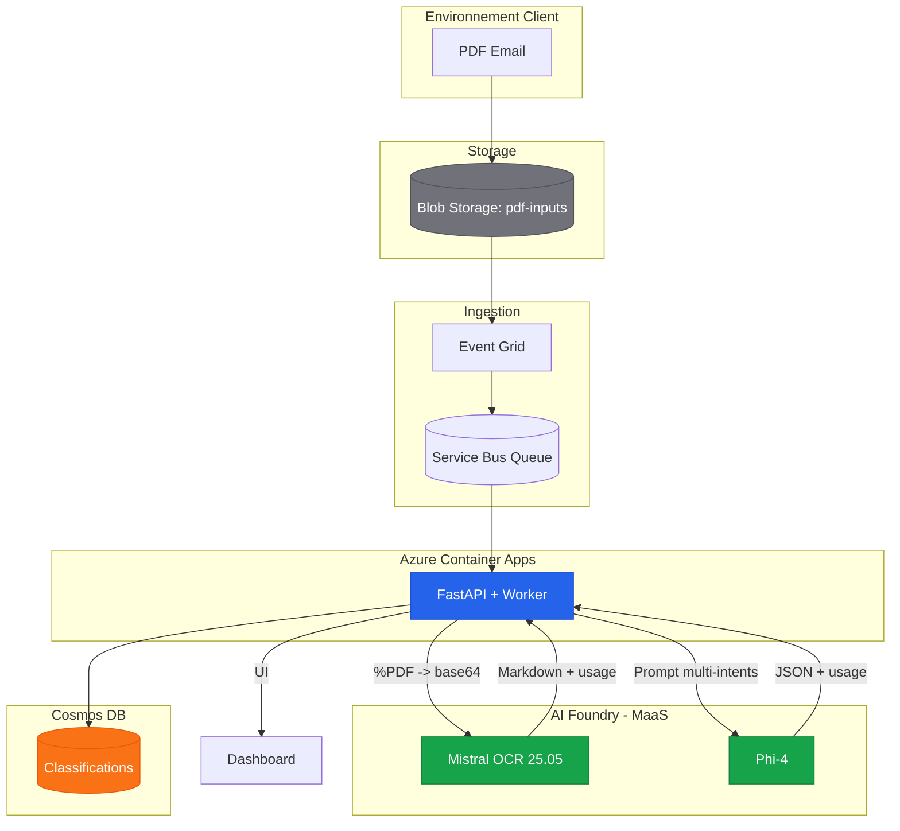
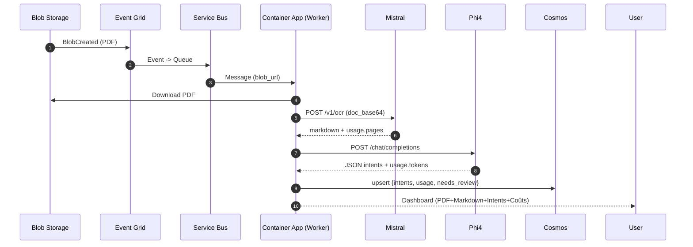

### 1. Architecture Solution (Mermaid)

Pattern : Event-Driven + Container Apps + AI Foundry (Mistral OCR & Phi‑4)

**Flux de données :**

1. **Ingestion :** Le PDF arrive dans le Blob Storage (Container `pdf-inputs`).
2. **Trigger :** Azure Event Grid détecte le fichier et publie un message dans Service Bus.
3. **OCR (Extraction) :** Le worker (FastAPI) télécharge le PDF et l'envoie au modèle OCR (Mistral) pour obtenir du Markdown.
4. **Intelligence (Classification) :** Le Markdown est envoyé au modèle LLM (Phi‑4, avec fallback possible) pour produire un JSON strict multi-intents.
5. **Stockage :** Le résultat (JSON + usage/coût) est stocké dans Cosmos DB (et export CSV possible côté app).

### 2. Séquence de traitement

### 3. Sécurité & Accès
- Identité managée ACA uniquement (pas de clés).
- RBAC : Cognitive Services User (AI Foundry), Storage Blob Data Reader (blob), Service Bus Data Sender/Receiver, Cosmos DB Data Contributor, Event Grid -> Service Bus : Azure Service Bus Data Sender.

### 4. Observabilité & Coûts
- OpenTelemetry spans custom `gen_ai.*` : pages (Mistral), tokens (Phi‑4).
- Coûts par email (UI & CSV) : pricing dépend du tenant/région. Les coûts sont configurables via variables d’environnement et doivent être alignés sur la page officielle Azure.

### 5. Fine-tuning LoRA (Phi‑4)
1. Collecte `needs_review=false` dans Cosmos.
2. Export JSONL (Foundry Dataset).
3. Fine-tune LoRA sur `phi-4` via Foundry (UI/CLI) avec 1000–2000 exemples.
4. Déployer `phi-4-custom` et mettre `PHI_DEPLOYMENT`.

### 6. Terraform (Foundry)
- `azapi_resource` AIServices (Foundry) + Project + Deployments (Phi‑4, Mistral OCR)
- RBAC `Cognitive Services User` pour l'identité ACA

### 6. Déploiement & Docker local
- Build : `docker build -t <acr>.azurecr.io/classimail-agent:local .`
- Push : `az acr login --name <acr>; docker push <acr>.azurecr.io/classimail-agent:local`
- ACA : `az containerapp update --name classimail-agent --resource-group <rg> --image <acr>.azurecr.io/classimail-agent:local`

### 7. Pourquoi cette architecture est efficiente ?
- **OCR** spécialisé (Mistral) facturé **1 €/1K pages** vs multimodal tokens coûteux.
- **SLM Phi‑4** : **0.000107 €/1K input**, **0.00043 €/1K output**, _context_ 128K, LoRA possible.
- **Parallélisme** : Container Apps + `Semaphore(5)` + Service Bus (back-pressure).
- **Coût approximatif POC 10k emails** (2 pages/ email, 300 tokens input, 100 output) :
    - Mistral : 20k pages ≈ 20 €
    - Phi‑4 : (3M tokens in ≈ 0.32 €) + (1M out ≈ 0.43 €) ≈ 0.75 €
    - Infra (ACA/Storage) : faible
    - **Total ~21 €**

### 8. Architecture “au fil de l’eau” (Post-POC)

**Objectif** : traitement en continu des mails entrants (<1 min) avec bursts matinaux.

**Évolutions clés** :
- **Auto-scale** Container Apps (KEDA) sur métriques **Service Bus** (queue length) ➜ min=1, max=50+.
- **Quota management** :
    - Sur-provisionner `Semaphore` via env (ex: 10) sur plusieurs réplicas.
    - Utiliser **Provisioned Throughput** Foundry si SLA strict ou gros volumes.
- **Stockage** : séparer containers `input`/`output`, lifecycle rules, partition Cosmos sur `/id` (déjà fait), ajouter **TTL** si besoin purge.
- **Observabilité** : alertes DLQ Service Bus, quotas Foundry (429), dashboards OTel (pages/tokens).
- **Fiabilité** : dead-letter requeue job (timer), pipeline de rattrapage (scripts az servicebus).
- **Sécurité** : MSI + RBAC existant (inchangé), revues périodiques droits.

**Flux** : identique, avec scaling horizontal >1 instance ACA et KEDA sur SB queue.

