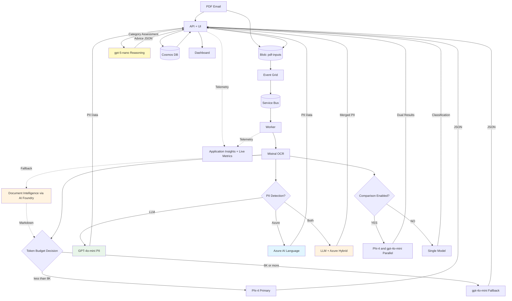
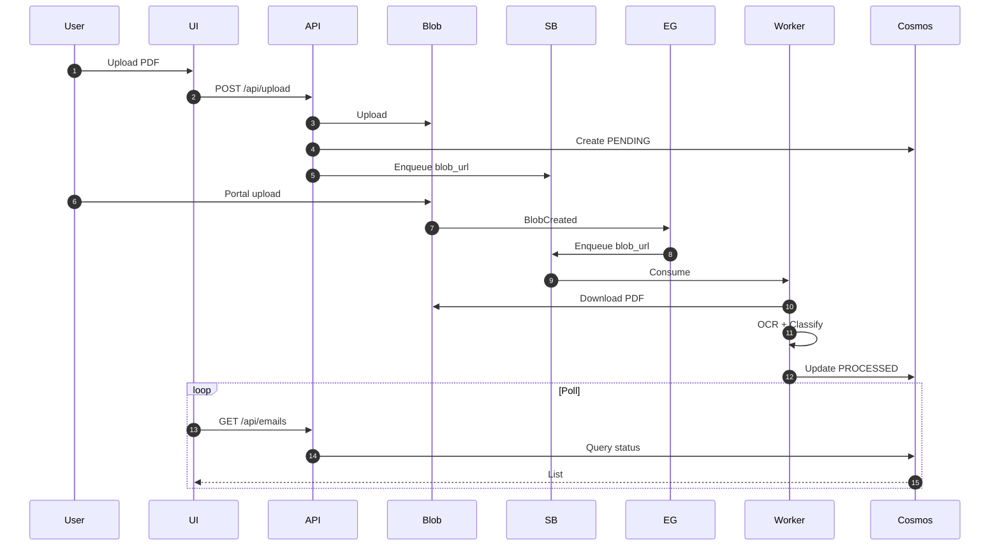
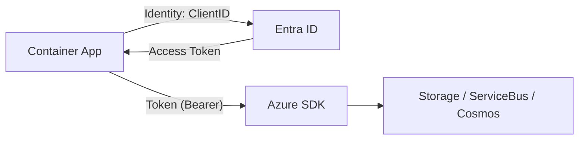
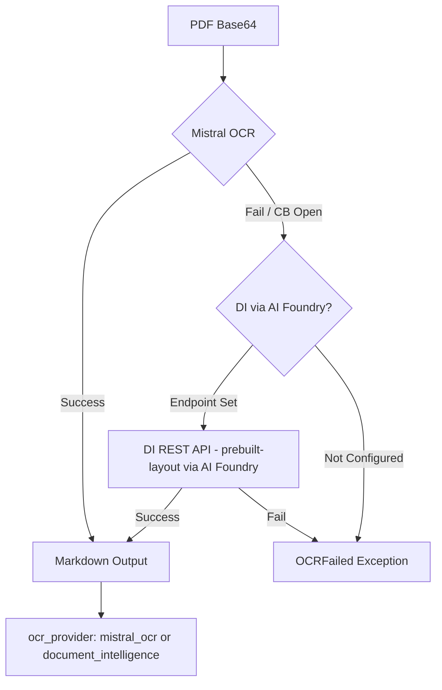
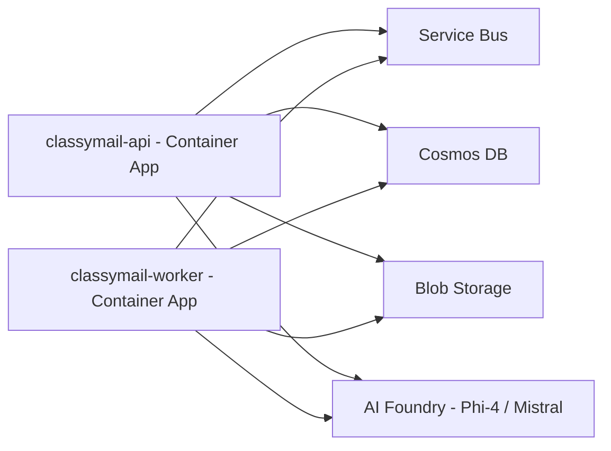
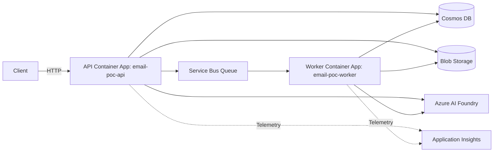

# ARCHITECTURE

> 📊 **Interactive Diagrams**: Each diagram below has zoom 🔍 and download 📥 buttons. See [README_DIAGRAMS.md](./README_DIAGRAMS.md) for usage guide.
>
> **Alternative**: Use the [Mermaid Export Tool](./mermaid-export.html) to export any diagram as PNG/SVG.

## 1. Architecture Solution (Mermaid)

Pattern : Event-Driven + Container Apps + AI Foundry (Mistral OCR & Phi‑4)

**Flux de données :**

1. **Ingestion :** Le PDF arrive dans le Blob Storage (Container `pdf-inputs`).
2. **Trigger :**
   *   **Cas 1 (Upload API)** : Le fichier est blobé par l'API, qui crée immédiatement une entrée "PENDING" dans la DB et pousse un message direct dans le Service Bus (Visibilité immédiate).
   *   **Cas 2 (Depôt Portal/FTP)** : Azure Event Grid détecte le fichier (`BlobCreated`) et publie un message dans Service Bus (Visibilité après traitement par le worker).
3. **OCR (Extraction) :** Le worker (FastAPI) télécharge le PDF et l'envoie au modèle OCR (Mistral) pour obtenir du Markdown. En cas d'échec (timeout, quota, circuit breaker ouvert), le pipeline bascule automatiquement vers **Azure Document Intelligence** (prebuilt-layout, texte uniquement).
4. **Intelligence (Classification) :**
   *   **Standard Mode**: Markdown sent to Primary LLM (Phi-4). Fallback to GPT-4o-mini if token budget exceeded.
   *   **Adversarial Mode**: Markdown sent to BOTH Phi-4 and GPT-4o-mini in parallel. Both results are stored for "Blue/Orange" comparison in UI.
5. **Stockage :** Le résultat (JSON + usage/coût) est stocké dans Cosmos DB (et export CSV possible côté app).

## 2. Séquence de traitement

## 3. Sécurité & Accès (RBAC)

Le système repose exclusivement sur des **Identités Managées** (User Assigned Identity) pour éviter la gestion de secrets (Access Keys). L'application n'utilise **pas** de connection strings contenant des secrets (sauf Application Insights, qui est non-sensible).

### Matrice des Rôles Requis

L'identité managée assignée aux Container Apps (`api` et `worker`) doit disposer des assignations de rôles suivantes sur les ressources Azure :

| Ressource Azure | Rôle RBAC (Nom) | ID du Rôle | Description / Scope |
| :--- | :--- | :--- | :--- |
| **Storage Account** | `Storage Blob Data Contributor` | `ba92f5b4-2d11-453d-a403-e96b0029c9fe` | **Écriture**: Upload des PDFs entrants, écriture des logs. |
| **Storage Account** | `Storage Blob Data Reader` | `2a2b9908-6ea1-4ae2-8e65-a410df84e7d1` | **Lecture**: Worker télécharge les PDFs, API stream les PDFs vers le navigateur pour visualisation. |
| **Service Bus** | `Azure Service Bus Data Receiver` | `4f6d3b9b-027b-4f4c-9142-0e5a2a2247e0` | Permet au `worker` de consommer les messages de la queue. |
| **Service Bus** | `Azure Service Bus Data Sender` | `69a216fc-b8fb-44d8-bc22-1f3c2cd27a39` | Permet à l'API (et DLQ retry) d'envoyer des messages. |
| **Cosmos DB (SQL)** | Custom App Role (`readMetadata` + CRUD) | Terraform-managed (`app_role`) | **Data Plane RBAC** au scope **Account**. Lecture/Écriture des documents JSON. *Note: Ce n'est pas un rôle IAM Azure classique, mais un rôle SQL natif Cosmos. Voir [RBAC_AUDIT.md](RBAC_AUDIT.md).* |
| **AI Foundry Project** | `Cognitive Services User` | `a97b65f3-2400-443d-9d23-a1288a8760ba` | **Modèles Déployés**: Phi-4 (Classification primaire), Mistral Document AI 2505 (OCR + Vision), GPT-5-nano (Category Assessment, reasoning), GPT-5.2-chat (Conversational AI), GPT-4o-mini (Fallback + PII), text-embedding-3-small (Embeddings) |
| **Azure AI Language** ⚙️ | `Cognitive Services Language Reader` | `36e80216-4058-40c5-bf25-3b30a0199a10` | **PII Detection Native API** (optionnel, `deploy_language_service=true`). Service TextAnalytics avec 43+ catégories PII prédéfinies. |
| **Document Intelligence** (via AI Foundry) | `Cognitive Services User` | `a97b65f3-2400-443d-9d23-a1288a8760ba` | **OCR Fallback** — uses the AI Foundry endpoint by default (`Cognitive Services User` on AI Foundry covers DI access). Optionally deployable as standalone resource (`deploy_document_intelligence=true`). |
| **Container Registry**| `AcrPull` | `7f951dda-4ed3-4680-a7ca-43fe172d538d` | Pull de l'image Docker par l'environnement Container Apps. |
| **Application Insights** | `Monitoring Metrics Publisher` | `3913510d-42f4-4e42-8a64-420c390055eb` | Télémétrie OpenTelemetry (traces distribuées, métriques). |
| **Event Grid System Topic** | `EventGrid EventSubscription Contributor` | `428e0ff0-5e57-4d9c-a221-2c70d0e0a443` | Abonnement aux événements Blob Storage → Service Bus. |
| **Log Analytics Workspace** | `Log Analytics Reader` | `73c42c96-874c-492b-b04d-ab87d138a893` | Lecture des logs centralisés & requêtes diagnostiques (KQL) depuis l'API UI. |

### Flux d'Identité

1. L'application utilise `DefaultAzureCredential` (Python Azure SDK).
2. En local, elle utilise l'identité du développeur (`az login`).
3. Sur Azure, elle utilise la `managed_identity_client_id` injectée via la variable d'environnement `AZURE_CLIENT_ID`.

## 4. Stratégie Réseau (Network)

### Mode Public (Configuration POC Actuelle)
Pour faciliter le déploiement du POC, les ressources (Cosmos DB, Storage, Service Bus) autorisent l'accès réseau public, mais limitent qui peut se connecter :

- **Cosmos DB** : Le pare-feu est configuré pour autoriser l'accès depuis **"Azure Datacenters"** (option `Allow access from Azure Portal/Internal`).
    - *Implémentation technique* : Autorisation de l'IP virtuelle `0.0.0.0`.
    - *Pourquoi ?* Les Container Apps sans injection VNet n'ont pas d'IP sortante fixe et ne sont pas dans un réseau privé. Cette exception permet à n'importe quel service Azure (dont vos Container Apps) d'atteindre la base de données, l'authentification RBAC (Identité Managée) assurant la sécurité applicative.

### Mode Privé (Production Entreprise)
Pour isoler totalement le système d'Internet (VNet Injection), l'architecture cible doit être modifiée comme suit :

1.  **Virtual Network (VNet)** : Créer un VNet Azure avec un subnet dédié (ex: `snet-apps`) délégué à `Microsoft.App/environments`.
2.  **ACA VNet Injection** : Déployer l'environnement Container App (Managed Environment) en mode **Internal** dans ce subnet. L'application ne sera accessible que depuis le VNet (ou via un Application Gateway / API Management devant).
3.  **Private Endpoints (PE)** :
    - Désactiver l'accès public sur Cosmos DB, Storage, Service Bus et AI Foundry.
    - Créer un **Private Endpoint** pour chaque service PaaS, connecté au VNet.
    - Configurer des zones **Private DNS** (`privatelink.documents.azure.com`, `privatelink.blob.core.windows.net`, etc.) pour que l'URI standard résolve vers l'IP privée.
4.  **Flux** : Le trafic sortant des Container Apps restera dans le backbone Azure privé via les Private Endpoints. L'exception pare-feu `0.0.0.0` sur Cosmos DB devra être retirée.

## 4.1. PII Detection (GDPR Compliance)

Trois méthodes de détection PII configurables (Settings > Processing):

1. **LLM-based (default)**: GPT-4o-mini JSON mode. Contextuel (~€0.002/email).
2. **Azure AI Language**: Service natif 40+ catégories (SSN, cartes, passeports). ~€0.001/email. Terraform: `deploy_language_service=true`.
3. **Hybrid**: Combine LLM + Azure Language, déduplique résultats.

**Architecture**: `pii_detection.py` dispatcher → `pii_detection_azure.py` (TextAnalyticsClient + MI). Résultats: `EmailRecord.pii_detected` + `pii_data`.

## 4.2. OCR Fallback — Document Intelligence (via AI Foundry)

Le pipeline OCR implémente un mécanisme de fallback résilient :

1. **Mistral OCR (Primary)** : OCR spécialisé via Azure AI Foundry. `MISTRAL_OCR_MAX_ATTEMPTS=2` tentatives avec retry exponentiel.
2. **Document Intelligence (Fallback)** : Si Mistral échoue (timeout, quota 429, circuit breaker ouvert), le pipeline bascule vers Azure Document Intelligence (prebuilt-layout) **via l'endpoint AI Foundry**.

**Endpoint AI Foundry** : Par défaut, `AZURE_DOCUMENT_INTELLIGENCE_ENDPOINT` pointe vers l'endpoint AI Foundry (`https://<prefix>-aifoundry.cognitiveservices.azure.com/`). L'accès DI est inclus dans le rôle `Cognitive Services User` déjà assigné à la Managed Identity sur AI Foundry — **aucune ressource Document Intelligence séparée n'est nécessaire**.

> **Option standalone** : Si besoin d'une ressource DI dédiée (quotas séparés, isolation), activez `deploy_document_intelligence=true` dans Terraform.

**Circuit Breakers** :
- `mistral_breaker` : fail_max=5, reset_timeout=60s
- `doc_intelligence_breaker` : fail_max=3, reset_timeout=30s (plus agressif car c'est le fallback)

**ConnectTimeout** : Les erreurs `httpx.ConnectTimeout` ne sont pas réessayées (fast-fail vers le fallback) pour éviter l'expiration des locks Service Bus.

**Tracking** : Le champ `ocr_provider` dans `EmailRecord` enregistre le provider utilisé (`mistral_ocr` ou `document_intelligence`). Le dashboard affiche un badge ambre quand Document Intelligence est utilisé.

## 5. Observabilité & Monitoring

### OpenTelemetry Stack

ClassyMail uses the **Azure Monitor OpenTelemetry Distro** (`azure-monitor-opentelemetry`) for full observability: distributed tracing, metrics, logging, and Live Metrics.  The telemetry module (`classymail/core/telemetry.py`) supports a two-tier setup:

| Tier | Package | Features |
|:-----|:--------|:---------|
| **Full distro** (production) | `azure-monitor-opentelemetry` | Application Map, Agents View, **Live Metrics**, GenAI tracing, auto-instrumentation (FastAPI, HTTPX, requests) |
| **Exporter-only** (local dev) | `azure-monitor-opentelemetry-exporter` | Trace-only, lighter footprint |

> **Live Metrics** streams real-time telemetry (requests, failures, dependencies) with ~1s latency.
> Requires `APPLICATIONINSIGHTS_CONNECTION_STRING` and `azure-monitor-opentelemetry` package.
> The `LiveEndpoint` in the connection string points to the regional Live Metrics ingestion (e.g. `swedencentral.livediagnostics.monitor.azure.com`).

### Application Map

[Application Map](https://learn.microsoft.com/en-us/azure/azure-monitor/app/app-map) shows the full topology of ClassyMail's distributed components:

Application Map automatically discovers these nodes using **cloud role names** from OpenTelemetry resource attributes:

| Resource Attribute | Value | Purpose |
|:-------------------|:------|:--------|
| `service.name` | `classymail-api` / `classymail-worker` | Cloud role name (each node on the map) |
| `service.namespace` | `classymail` | Groups both roles under one logical application |
| `service.instance.id` | hostname (auto) | Differentiates replicas for drill-down |

These are set via `OTEL_SERVICE_NAME` and `OTEL_RESOURCE_ATTRIBUTES` environment variables in Terraform (`#infra/main.tf`).

### Agents View (Preview)

[Agents View](https://learn.microsoft.com/en-us/azure/azure-monitor/app/agents-view) provides GenAI-specific monitoring in **Application Insights > Agents (Preview)**:

- **Token usage & costs** per model (Phi-4, Mistral OCR, GPT-4o-mini)
- **Tool calls** and model invocation patterns
- **End-to-end transaction details** with GenAI-aware simple view
- **Error analysis** for LLM pipeline failures

Enable via the environment variable `AZURE_MONITOR_ENABLE_GENAI_TRACES=true` (already set in Terraform).

The LLM pipeline (`#classymail/services/llm_pipeline.py`) and anonymizer (`#classymail/services/anonymizer.py`) emit `gen_ai.*` span attributes following [OpenTelemetry GenAI Semantic Conventions](https://opentelemetry.io/docs/specs/semconv/gen-ai/):

| Attribute | Example |
|:----------|:--------|
| `gen_ai.system` | `azure_openai`, `mistral` |
| `gen_ai.operation` | `chat.completions`, `document.ocr` |
| `gen_ai.request.model` | `Phi-4`, `mistral-document-ai-2505` |
| `gen_ai.usage.input_tokens` | 3500 |
| `gen_ai.usage.output_tokens` | 250 |

> **AI Foundry Integration**: To see agents in AI Foundry Monitoring tab as well, connect the Application Insights resource to the AI Foundry Project in the Azure Portal.

### Custom Metrics

- OpenTelemetry spans with `gen_ai.*` attributes: pages (Mistral), tokens (Phi-4)
- Per-email cost calculation (UI & CSV export): pricing configurable via environment variables

## 6. Fine-tuning LoRA (Phi‑4)

1. Collecte `needs_review=false` dans Cosmos.
2. Export JSONL (Foundry Dataset).
3. Fine-tune LoRA sur `phi-4` via Foundry (UI/CLI) avec 1000–2000 exemples.
4. Déployer `phi-4-custom` et mettre `PHI_DEPLOYMENT`.

## 7. Terraform (Foundry)

- `azapi_resource` AIServices (Foundry) + Project + Deployments (Phi‑4, Mistral OCR, GPT-5-nano)
- RBAC `Cognitive Services User` pour l'identité ACA
- Application Insights + Log Analytics Workspace (telemetry, Live Metrics)
- KEDA scaler azure-servicebus pour le worker

## 8. Déploiement & Docker local

- Build : `docker build -t <acr>.azurecr.io/classymail:local .`
- Push : `az acr login --name <acr>; docker push <acr>.azurecr.io/classymail:local`
- ACA : `az containerapp update --name <prefix>-api --resource-group <prefix>-rg --image <acr>.azurecr.io/classymail:local`

## 9. Pipeline Processing Details

> 📊 **Interactive Diagrams**: Zoom and download controls available. See [README_DIAGRAMS.md](./README_DIAGRAMS.md).

This section explains the end-to-end processing pipeline (PDF → OCR → classification → dashboard), plus assumptions, design decisions, and improvement ideas.

### Assumptions

- PDFs are uploaded into a known container (default: `pdf-inputs`).
- PDFs ≥ 30 pages are split into 30-page chunks; each chunk is sent as `document_url` to Mistral OCR and merged.
- Event Grid emits a `BlobCreated` event. The worker supports either:
    - our internal message: `{ "blob_url": "https://..." }` (e.g. via `/webhook/ingest`)
    - raw Event Grid event payload delivered to Service Bus (it extracts `data.url`).
- Worker can fetch the blob using Entra ID (RBAC), without Shared Key.
- OCR output is Markdown (can be large), and classification expects a strict JSON result.
- "Correct" classification is represented as a multi-intent list with confidence + justification.

### Key decisions (and why)

- **Service Bus queue as buffer**: isolates ingestion bursts from OCR/LLM rate limits; provides retries + DLQ.
- **Two-step AI (OCR then classifier)**: keeps classification prompts structured; avoids expensive multimodal token costs.
- **Strict JSON output**: simplifies post-processing, validation, and storage; enables consistent fine-tuning datasets.
- **Fallback model**: long OCR markdown can exceed the primary model's context window; fallback keeps the pipeline resilient.
- **RBAC-first (no keys)**: aligns with common enterprise policies (Storage OAuth-only, Service Bus local auth disabled, Cosmos RBAC).
- **Bounded OCR payloads**: chunk PDFs ≥ 30 pages into 30-page parts to stay within service limits.
- **Idempotent storage (upsert)**: repeated processing should not create duplicates; enables safe retries.

### Improvement ideas

- **Message de-duplication**: store a hash of `blob_url` or file ETag to avoid reprocessing duplicates.
- **Chunking strategy**: for very long OCR markdown, classify per section/page then merge.
- **Retry policy by error type**: retry only transient errors; DLQ for validation errors (bad PDF, malformed OCR).
- **Human-in-the-loop loop closure**: persist corrections as "golden labels" for fine-tuning export.
- **Metrics**: per-step latency (download/OCR/LLM), tokens/pages, error rates, DLQ depth.
- **Data retention**: TTL policies in Cosmos for raw OCR markdown if not required long-term.

## 10. Pourquoi cette architecture est efficiente ?

- **OCR** spécialisé (Mistral) facturé **1 €/1K pages** vs multimodal tokens coûteux.
- **SLM Phi‑4** : **0.000107 €/1K input**, **0.00043 €/1K output**, _context_ 128K, LoRA possible.
- **Parallélisme** : Container Apps + `Semaphore(5)` + Service Bus (back-pressure).
- **Coût approximatif POC 10k emails** (2 pages/ email, 300 tokens input, 100 output) :
    - Mistral : 20k pages ≈ 20 €
    - Phi‑4 : (3M tokens in ≈ 0.32 €) + (1M out ≈ 0.43 €) ≈ 0.75 €
    - Infra (ACA/Storage) : faible
    - **Total ~21 €**

## 11. Architecture "au fil de l'eau" (Post-POC)

**Objectif** : traitement en continu des mails entrants (<1 min) avec bursts matinaux.

**Évolutions clés** :

- **Auto-scale** Container Apps (KEDA) sur métriques **Service Bus** (queue length) ➜ min=1, max=50+.
- **Quota management** :
    - Sur-provisionner `Semaphore` via env (ex: 10) sur plusieurs réplicas.
    - Utiliser **Provisioned Throughput** Foundry si SLA strict ou gros volumes.
- **Stockage** : séparer containers `input`/`output`, lifecycle rules, partition Cosmos sur `/id` (déjà fait), ajouter **TTL** si besoin purge.
- **Observabilité** : alertes DLQ Service Bus, quotas Foundry (429), dashboards OTel (pages/tokens).
- **Fiabilité** : dead-letter requeue job (timer), pipeline de rattrapage (scripts az servicebus).
- **Sécurité** : MSI + RBAC existant (inchangé), revues périodiques droits.

**Flux** : identique, avec scaling horizontal >1 instance ACA et KEDA sur SB queue.

## 12. Déploiement ACA (API + Worker séparés)

- API expose `/healthz` + `/readyz` (alias `/health`, `/ready`).
- Worker scale avec KEDA (scaler azure-servicebus, min=1, max=10).
- Même image Docker pour les deux; worker: `python -m classymail.worker_main`.
- MI `app_id` a les rôles: Storage Blob Data Contributor, Azure Service Bus Data Receiver/Sender, Custom App Role Cosmos (readMetadata + CRUD), Cognitive Services User, Cognitive Services Language Reader.
