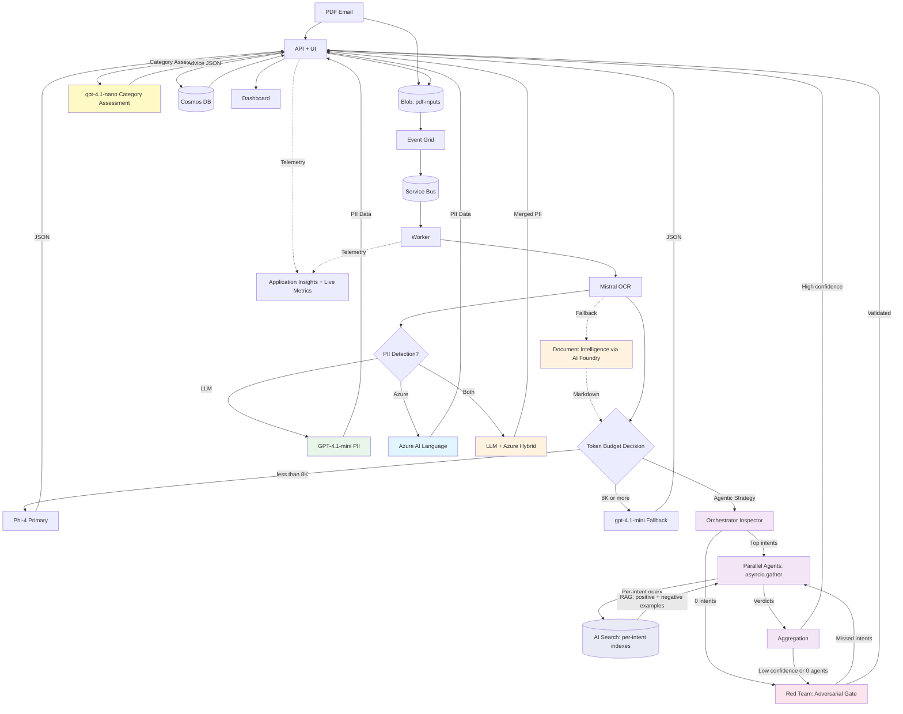
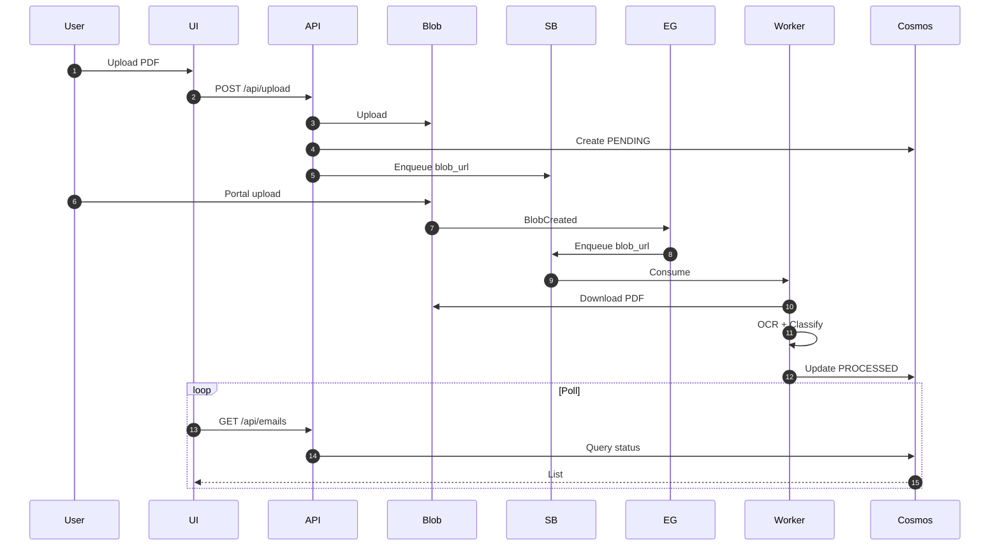
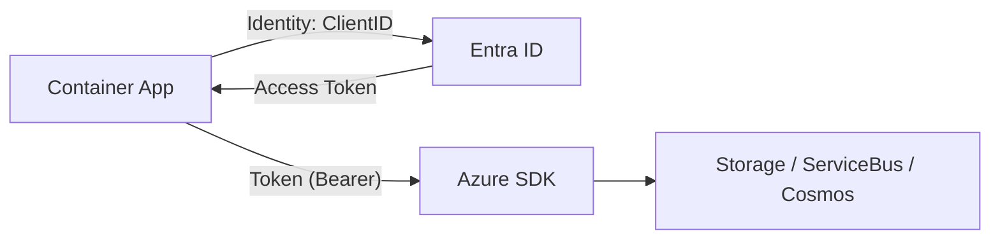
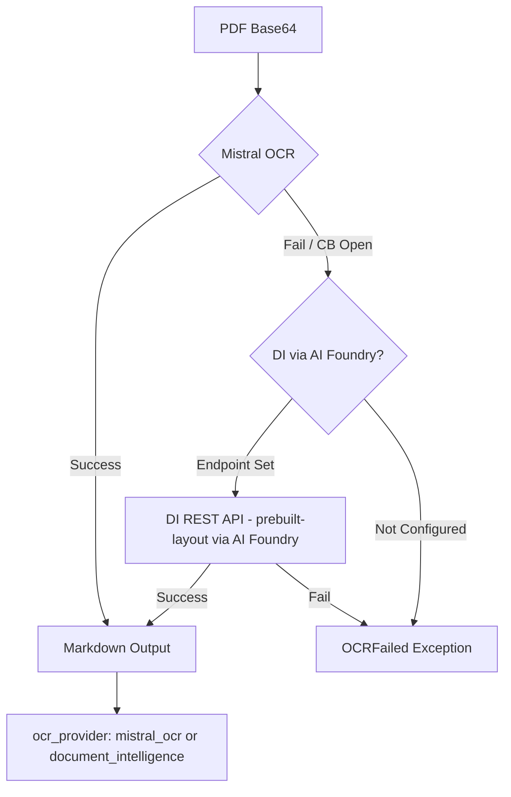
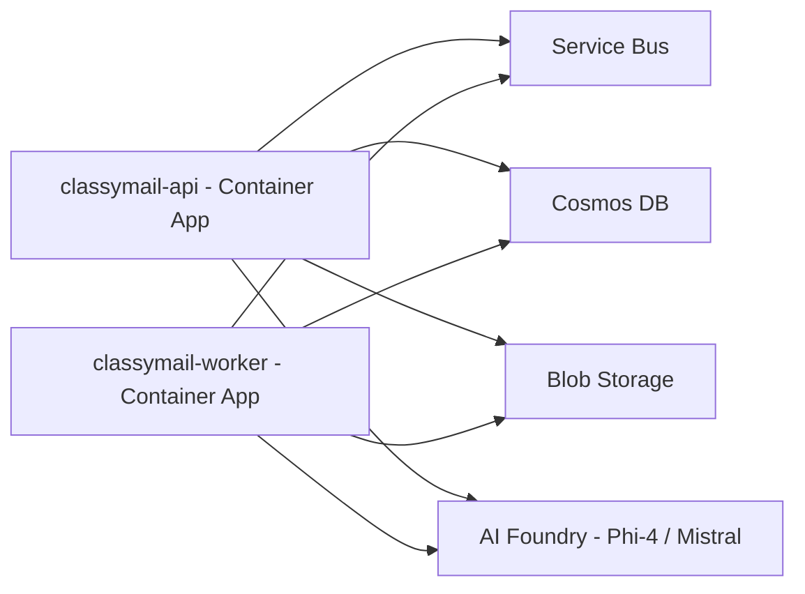
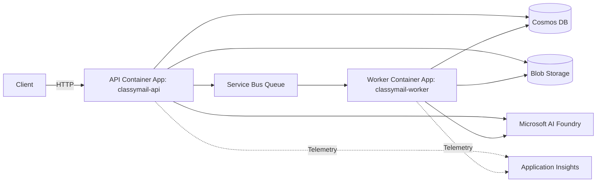

# ARCHITECTURE

> 📊 **Interactive Diagrams**: Each diagram below has zoom 🔍 and download 📥 buttons.
>
> **Alternative**:

## 1. Architecture Solution (Mermaid)

Pattern: Event-Driven + Container Apps + AI Foundry (Mistral OCR & Phi-4)

**Data flow:**

1. **Ingestion:** The PDF arrives in Blob Storage (Container `pdf-inputs`).
2. **Trigger:**
   *   **Case 1 (API Upload)**: The file is stored by the API, which immediately creates a "PENDING" entry in the DB and pushes a message directly to Service Bus (immediate visibility).
   *   **Case 2 (Portal/FTP Upload)**: Azure Event Grid detects the file (`BlobCreated`) and publishes a message to Service Bus (visible after worker processing).
3. **OCR (Extraction):** The worker (FastAPI) downloads the PDF and sends it to the OCR model (Mistral) to extract Markdown. On failure (timeout, quota, open circuit breaker), the pipeline automatically falls back to **Azure Document Intelligence** (prebuilt-layout, text only).
4. **Intelligence (Classification):**
   *   **Standard Mode**: Markdown sent to Primary LLM (Phi-4). Fallback to GPT-4.1-mini if token budget exceeded.
   *   **Agentic Mode** (NEW): Multi-agent pipeline with expert orchestrator inspector, parallel specialized agents (per-intent RAG via AI Search), adversarial Red Team quality gate that can request extra agents for missed intents. See [AGENTIC_CLASSIFICATION.md](AGENTIC_CLASSIFICATION.md).
5. **Storage:** The result (JSON + usage/cost) is stored in Cosmos DB (with CSV export available from the app).

## 2. Processing Sequence

## 3. Security & Access (RBAC)

The system relies exclusively on **Managed Identities** (User Assigned Identity) to avoid secret management (Access Keys). The application does **not** use connection strings containing secrets (except Application Insights, which is non-sensitive).

### Required Role Matrix

The managed identity assigned to Container Apps (`api` and `worker`) must have the following role assignments on Azure resources:

| Azure Resource | RBAC Role (Name) | Role ID | Description / Scope |
|:--- |:--- |:--- |:--- |
| **Storage Account** | `Storage Blob Data Contributor` | `ba92f5b4-2d11-453d-a403-e96b0029c9fe` | **Write**: Upload incoming PDFs, write logs. |
| **Storage Account** | `Storage Blob Data Reader` | `2a2b9908-6ea1-4ae2-8e65-a410df84e7d1` | **Read**: Worker downloads PDFs, API streams PDFs to the browser for viewing. |
| **Service Bus** | `Azure Service Bus Data Owner` | `090c5cfd-751d-490a-894a-3ce6f1109419` | Allows the API to send messages, the `worker` to consume them, and queue-stats monitoring to read queue runtime properties. |
| **Cosmos DB (SQL)** | Custom App Role (`readMetadata` + CRUD) | Terraform-managed (`app_role`) | **Data Plane RBAC** at **Account** scope. Read/Write JSON documents. *Note: This is not a standard Azure IAM role, but a Cosmos native SQL role. See [RBAC_AUDIT.md](RBAC_AUDIT.md).* |
| **AI Foundry Project** | `Cognitive Services User` | `a97b65f3-24c7-4388-baec-2e87135dc908` | **Deployed Models**: Phi-4 (Primary classification), Mistral Document AI 2512 (OCR + Vision), GPT-4.1-nano (Category Assessment + agentic defaults), GPT-5.1 (Conversational reasoning AI), GPT-4.1-mini (Fallback + PII/anonymization/vision), text-embedding-3-small (Embeddings) |
| **Azure AI Language** ⚙️ | `Cognitive Services Language Reader` | `36e80216-4058-40c5-bf25-3b30a0199a10` | **Native PII Detection API** (optional, `deploy_language_service=true`). TextAnalytics service with 43+ predefined PII categories. |
| **Document Intelligence** (via AI Foundry) | `Cognitive Services User` | `a97b65f3-24c7-4388-baec-2e87135dc908` | **OCR Fallback** — uses the AI Foundry endpoint by default (`Cognitive Services User` on AI Foundry covers DI access). Optionally deployable as standalone resource (`deploy_document_intelligence=true`). |
| **Azure AI Search** | `Search Index Data Contributor` | `8ebe5a00-799e-43f5-93ac-243d3dce84a7` | **Agentic RAG** — per-intent indexes for specialized agent grounding (`deploy_ai_search=true`). Read/write documents in search indexes. |
| **Container Registry**| `AcrPull` | `7f951dda-4ed3-4680-a7ca-43fe172d538d` | Pull Docker image for the Container Apps environment. |
| **Application Insights** | `Monitoring Metrics Publisher` | `3913510d-42f4-4e42-8a64-420c390055eb` | OpenTelemetry telemetry (distributed traces, metrics). |
| **Event Grid System Topic** | `EventGrid EventSubscription Contributor` | `428e0ff0-5e57-4d9c-a221-2c70d0e0a443` | Subscribe to Blob Storage events → Service Bus. |
| **Log Analytics Workspace** | `Log Analytics Reader` | `73c42c96-874c-492b-b04d-ab87d138a893` | Read centralized logs & diagnostic queries (KQL) from the API UI. |

### Identity Flow

1. The application uses `DefaultAzureCredential` (Python Azure SDK).
2. Locally, it uses the developer's identity (`az login`).
3. On Azure, it uses the `managed_identity_client_id` injected via the `AZURE_CLIENT_ID` environment variable.

## 4. Network Strategy

### Public Mode (Current POC Configuration)
For ease of POC deployment, resources (Cosmos DB, Storage, Service Bus) allow public network access, but restrict who can connect:

- **Cosmos DB**: The firewall is configured to allow access from **"Azure Datacenters"** (option `Allow access from Azure Portal/Internal`).
    - *Technical implementation*: Authorization of virtual IP `0.0.0.0`.
    - *Why?* Container Apps without VNet injection don't have fixed outbound IPs and are not in a private network. This exception allows any Azure service (including your Container Apps) to reach the database, with RBAC authentication (Managed Identity) ensuring application security.

### Private Mode (Enterprise Production)
To fully isolate the system from the Internet (VNet Injection), the target architecture should be modified as follows:

1.  **Virtual Network (VNet)**: Create an Azure VNet with a dedicated subnet (ex: `snet-apps`) delegated to `Microsoft.App/environments`.
2.  **ACA VNet Injection**: Deploy the Container App environment (Managed Environment) in **Internal** mode in this subnet. The application will only be accessible from the VNet (or via an Application Gateway / API Management in front).
3.  **Private Endpoints (PE)**:
    - Disable public access on Cosmos DB, Storage, Service Bus, and AI Foundry.
    - Create a **Private Endpoint** for each PaaS service, connected to the VNet.
    - Configure **Private DNS** zones (`privatelink.documents.azure.com`, `privatelink.blob.core.windows.net`, etc.) so the standard URI resolves to the private IP.
4.  **Flow**: Outbound traffic from Container Apps stays within the Azure private backbone via Private Endpoints. The `0.0.0.0` firewall exception on Cosmos DB should be removed.

## 4.1. PII Detection (GDPR Compliance)

Three configurable PII detection methods (Settings > Processing):

1. **LLM-based (default)**: GPT-4.1-mini JSON mode. Contextual (~$0.002/email).
2. **Azure AI Language**: Native service with 40+ categories (SSN, cards, passports). ~$0.001/email. Terraform: `deploy_language_service=true`.
3. **Hybrid**: Combines LLM + Azure Language, deduplicates results.

**Architecture**: `pii_detection.py` dispatcher → `pii_detection_azure.py` (TextAnalyticsClient + MI). Results: `EmailRecord.pii_detected` + `pii_data`.

## 4.2. OCR Fallback — Document Intelligence (via AI Foundry)

The OCR pipeline implements a resilient fallback mechanism:

1. **Mistral OCR (Primary)**: Specialized OCR via Microsoft AI Foundry. `MISTRAL_OCR_MAX_ATTEMPTS=2` attempts with exponential retry.
2. **Document Intelligence (Fallback)**: If Mistral fails (timeout, quota 429, open circuit breaker), the pipeline falls back to Azure Document Intelligence (prebuilt-layout) **via the AI Foundry endpoint**.

**Endpoint AI Foundry**: By default, `AZURE_DOCUMENT_INTELLIGENCE_ENDPOINT` points to the AI Foundry endpoint (`https://<prefix>-aifoundry.cognitiveservices.azure.com/`). DI access is included in the `Cognitive Services User` role already assigned to the Managed Identity on AI Foundry — **no separate Document Intelligence resource is needed**.

> **Standalone option**: If a dedicated DI resource is needed (separate quotas, isolation), enable `deploy_document_intelligence=true` in Terraform.

**Circuit Breakers**:
- `mistral_breaker`: fail_max=5, reset_timeout=60s
- `doc_intelligence_breaker`: fail_max=3, reset_timeout=30s (more aggressive since it's the fallback)

**ConnectTimeout**: `httpx.ConnectTimeout` errors are not retried (fast-fail to fallback) to avoid Service Bus lock expiration.

**Tracking**: The `ocr_provider` field in `EmailRecord` records the provider used (`mistral_ocr` or `document_intelligence`). The dashboard displays an amber badge when Document Intelligence is used.

## 5. Observability & Monitoring

### OpenTelemetry Stack

ClassyMail uses the **Azure Monitor OpenTelemetry Distro** (`azure-monitor-opentelemetry`) for full observability: distributed tracing, metrics, logging, and Live Metrics.  The telemetry module (`classymail/core/telemetry.py`) supports a two-tier setup:

| Tier | Package | Features |
|:-----|:--------|:---------|
| **Full distro** (production) | `azure-monitor-opentelemetry` | Application Map, Agents View, **Live Metrics**, GenAI tracing, auto-instrumentation (FastAPI, HTTPX, requests) |
| **Exporter-only** (local dev) | `azure-monitor-opentelemetry-exporter` | Trace-only, lighter footprint |

> **Live Metrics** streams real-time telemetry (requests, failures, dependencies) with ~1s latency.
> Requires `APPLICATIONINSIGHTS_CONNECTION_STRING` and `azure-monitor-opentelemetry` package.
> The `LiveEndpoint` in the connection string points to the regional Live Metrics ingestion (e.g. `swedencentral.livediagnostics.monitor.azure.com`).

### Application Map

[Application Map](https://learn.microsoft.com/en-us/azure/azure-monitor/app/app-map) shows the full topology of ClassyMail's distributed components:

Application Map automatically discovers these nodes using **cloud role names** from OpenTelemetry resource attributes:

| Resource Attribute | Value | Purpose |
|:-------------------|:------|:--------|
| `service.name` | `classymail-api` / `classymail-worker` | Cloud role name (each node on the map) |
| `service.namespace` | `classymail` | Groups both roles under one logical application |
| `service.instance.id` | hostname (auto) | Differentiates replicas for drill-down |

These are set via `OTEL_SERVICE_NAME` and `OTEL_RESOURCE_ATTRIBUTES` environment variables in Terraform (`#infra/main.tf`).

### Agents View (Preview)

[Agents View](https://learn.microsoft.com/en-us/azure/azure-monitor/app/agents-view) provides GenAI-specific monitoring in **Application Insights > Agents (Preview)**:

- **Token usage & costs** per model (Phi-4, Mistral OCR, GPT-4.1-mini, GPT-5.1)
- **Tool calls** and model invocation patterns
- **End-to-end transaction details** with GenAI-aware simple view
- **Error analysis** for LLM pipeline failures

Enable via the environment variable `AZURE_MONITOR_ENABLE_GENAI_TRACES=true` (already set in Terraform).

The LLM pipeline (`#classymail/services/llm_pipeline.py`) and anonymizer (`#classymail/services/anonymizer.py`) emit `gen_ai.*` span attributes following [OpenTelemetry GenAI Semantic Conventions](https://opentelemetry.io/docs/specs/semconv/gen-ai/):

| Attribute | Example |
|:----------|:--------|
| `gen_ai.system` | `azure_openai`, `mistral` |
| `gen_ai.operation` | `chat.completions`, `document.ocr` |
| `gen_ai.request.model` | `Phi-4`, `mistral-document-ai-2512` |
| `gen_ai.usage.input_tokens` | 3500 |
| `gen_ai.usage.output_tokens` | 250 |

> **AI Foundry Integration**: To see agents in AI Foundry Monitoring tab as well, connect the Application Insights resource to the AI Foundry Project in the Azure Portal.

### Custom Metrics

- OpenTelemetry spans with `gen_ai.*` attributes: pages (Mistral), tokens (Phi-4)
- Per-email cost calculation (UI & CSV export): pricing configurable via environment variables

## 6. Fine-tuning LoRA (Phi-4)

1. Collect `needs_review=false` in Cosmos.
2. Export JSONL (Foundry Dataset).
3. Fine-tune LoRA on `phi-4` via Foundry (UI/CLI) with 1000-2000 examples.
4. Deploy `phi-4-custom` and set `PHI_DEPLOYMENT`.

## 7. Terraform (Foundry)

- `azapi_resource` AIServices (Foundry) + Project + Deployments (Phi‑4, Mistral OCR, GPT-4.1-nano, GPT-4.1-mini, GPT-5.1)
- RBAC `Cognitive Services User` for the ACA identity
- Application Insights + Log Analytics Workspace (telemetry, Live Metrics)
- KEDA scaler azure-servicebus for the worker

## 8. Deployment & Local Docker

- Build: `docker build -t <acr>.azurecr.io/classymail:local .`
- Push: `az acr login --name <acr>; docker push <acr>.azurecr.io/classymail:local`
- ACA: `az containerapp update --name <prefix>-api --resource-group <prefix>-rg --image <acr>.azurecr.io/classymail:local`

## 9. Pipeline Processing Details

> **Note**: Interactive diagram viewer was removed. View diagrams directly in GitHub or any Mermaid-compatible renderer.

This section explains the end-to-end processing pipeline (PDF → OCR → classification → dashboard), plus assumptions, design decisions, and improvement ideas.

### Assumptions

- PDFs are uploaded into a known container (default: `pdf-inputs`).
- PDFs ≥ 30 pages are split into 30-page chunks; each chunk is sent as `document_url` to Mistral OCR and merged.
- Event Grid emits a `BlobCreated` event. The worker supports either:
    - our internal message: `{ "blob_url": "https://..." }` (e.g. via `/webhook/ingest`)
    - raw Event Grid event payload delivered to Service Bus (it extracts `data.url`).
- Worker can fetch the blob using Entra ID (RBAC), without Shared Key.
- OCR output is Markdown (can be large), and classification expects a strict JSON result.
- "Correct" classification is represented as a multi-intent list with confidence + justification.

### Key decisions (and why)

- **Service Bus queue as buffer**: isolates ingestion bursts from OCR/LLM rate limits; provides retries + DLQ.
- **Two-step AI (OCR then classifier)**: keeps classification prompts structured; avoids expensive multimodal token costs.
- **Strict JSON output**: simplifies post-processing, validation, and storage; enables consistent fine-tuning datasets.
- **Fallback model**: long OCR markdown can exceed the primary model's context window; fallback keeps the pipeline resilient.
- **RBAC-first (no keys)**: aligns with common enterprise policies (Storage OAuth-only, Service Bus local auth disabled, Cosmos RBAC).
- **Bounded OCR payloads**: chunk PDFs ≥ 30 pages into 30-page parts to stay within service limits.
- **Idempotent storage (upsert)**: repeated processing should not create duplicates; enables safe retries.

### Improvement ideas

- **Message de-duplication**: store a hash of `blob_url` or file ETag to avoid reprocessing duplicates.
- **Chunking strategy**: for very long OCR markdown, classify per section/page then merge.
- **Retry policy by error type**: retry only transient errors; DLQ for validation errors (bad PDF, malformed OCR).
- **Human-in-the-loop loop closure**: persist corrections as "golden labels" for fine-tuning export.
- **Metrics**: per-step latency (download/OCR/LLM), tokens/pages, error rates, DLQ depth.
- **Data retention**: TTL policies in Cosmos for raw OCR markdown if not required long-term.

## 10. Why This Architecture Is Efficient

- **Specialized OCR** (Mistral) billed at **1 €/1K pages** vs expensive multimodal tokens.
- **SLM Phi‑4**: **$0.000107/1K input**, **$0.00043/1K output**, 128K context, LoRA-capable.
- **Parallelism**: Container Apps + `Semaphore(5)` + Service Bus (back-pressure).
- **~Cost for 10K emails** (2 pages/email, 300 tokens input, 100 output):
    - Mistral: 20K pages ~ $20
    - Phi‑4: (3M tokens in ≈ 0.32 €) + (1M out ≈ 0.43 €) ≈ 0.75 €
    - Infra (ACA/Storage): minimal
    - **Total ~$21**

## 11. Streaming Architecture (Post-POC)

**Goal**: continuous processing of incoming emails (<1 min) with morning bursts.

**Key evolutions**:

- **Auto-scale** Container Apps (KEDA) on **Service Bus** metrics (queue length) ➨ min=1, max=50+.
- **Quota management**:
    - Over-provision `Semaphore` via env (e.g. 10) across multiple replicas.
    - Use **Provisioned Throughput** in Foundry for strict SLAs or high volumes.
- **Storage**: Separate `input`/`output` containers, lifecycle rules, Cosmos partition on `/id` (already done), add **TTL** for data purge if needed.
- **Observability**: Service Bus DLQ alerts, Foundry quota alerts (429), OTel dashboards (pages/tokens).
- **Reliability**: Dead-letter requeue job (timer), catch-up pipeline (az servicebus scripts).
- **Security**: MSI + existing RBAC (unchanged), periodic access reviews.

**Flow**: Identical, with horizontal scaling >1 ACA instance and KEDA on SB queue.

## 12. ACA Deployment (Separate API + Worker)

- API exposes `/healthz` + `/readyz` (aliases `/health`, `/ready`).
- Worker scales with KEDA (azure-servicebus scaler, min=1, max=10).
- Same Docker image for both; worker runs: `python -m classymail.worker_main`.
- Managed Identity has roles: Storage Blob Data Contributor, Azure Service Bus Data Owner, Custom Cosmos App Role (readMetadata + CRUD), Cognitive Services User, Cognitive Services Language Reader.
