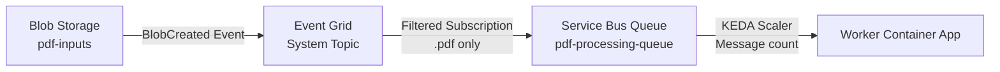

# Infrastructure & Deployment Guide

> 🏗️ **Comprehensive Guide**: Terraform provisioning, resource configuration, Event Grid setup, RBAC, and network strategy.

## Table of Contents

1. [Overview](#overview)
2. [Terraform Deployment](#terraform-deployment)
3. [Resource Configuration](#resource-configuration)
4. [Event Grid Configuration](#event-grid-configuration)
5. [RBAC & Managed Identity](#rbac--managed-identity)
6. [Network Strategy](#network-strategy)
7. [Verification & Troubleshooting](#verification--troubleshooting)

---

## Overview

Terraform provisions the complete Azure infrastructure:
- Storage Account + container `pdf-inputs`
- Event Grid → Service Bus queue
- Service Bus namespace + queue
- Cosmos DB (serverless) + database/container
- Azure AI Foundry / Azure AI Services + project
- User-Assigned Managed Identity + RBAC roles

---

## Terraform Deployment

### Quick Start (Windows)

```powershell
.\infra\deploy.ps1
```

Target specific tenant/subscription:

```powershell
.\infra\deploy.ps1 -TenantId <TENANT_ID> -SubscriptionId <SUBSCRIPTION_ID>
```

### Manual Deployment

```powershell
# Login
az login
# Multi-tenant: az login --tenant <TENANT_ID>

# Set subscription
az account set --subscription <SUBSCRIPTION_ID>

# Initialize Terraform
terraform -chdir=infra init -upgrade

# Plan
terraform -chdir=infra plan -var "subscription_id=<SUBSCRIPTION_ID>" -out tfplan

# Apply
terraform -chdir=infra apply tfplan
```

### Why Pass `subscription_id`?

Some AzureRM provider versions don't auto-detect subscription from Azure CLI. The `deploy.ps1` script detects the active subscription (`az account show`) and passes it to Terraform.

### Repository Hygiene

**Commit:**
- `main.tf`
- `.terraform.lock.hcl`
- `deploy.ps1`
- `terraform.tfvars.example`

**Do NOT commit:**
- `.terraform/`
- `terraform.tfstate*`
- `tfplan`
- `terraform.tfvars` (real values)

---

## Resource Configuration

### Mandatory Environment Variables per Service

#### API Service (`-api`)

| Variable | Description | Example |
|----------|-------------|---------|
| `AZURE_CLIENT_ID` | Managed Identity Client ID | `3ae24af5-97c6-437f-a4d2-521fbd5524d4` |
| `AZURE_SERVICE_BUS_FQDN` | Service Bus Hostname | `email-poc-sbus.servicebus.windows.net` |
| `AZURE_SERVICE_BUS_QUEUE` | Queue Name | `pdf-processing-queue` |
| `AZURE_STORAGE_ACCOUNT_URL` | Blob Storage Endpoint | `https://emailpocst.blob.core.windows.net` |
| `AZURE_STORAGE_CONTAINER` | Blob Container | `pdf-inputs` |
| `AZURE_COSMOS_ENDPOINT` | Cosmos DB URI | `https://email-poc-cosmos.documents.azure.com:443/` |
| `AZURE_COSMOS_DB` | Database Name | `emailsdb` |
| `AZURE_COSMOS_CONTAINER` | Container Name | `emails` |
| `AZURE_AI_ENDPOINT` | Azure AI Foundry Endpoint | `https://email-poc-aifoundry.cognitiveservices.azure.com/` |
| `APPLICATIONINSIGHTS_CONNECTION_STRING` | App Insights telemetry | `InstrumentationKey=...;IngestionEndpoint=...` |
| `LOG_ANALYTICS_WORKSPACE_ID` | Log Analytics Workspace ID | `9f225d73-351d-471e-9371-c15d265e9bd4` |
| `OTEL_SERVICE_NAME` | OpenTelemetry service name | `classificationg2s-api` |
| `ENABLE_WORKER` | Enable background processing? | `false` (API only) |
| `ORGANIZATION_NAME` | UI branding/destination name | `G2S`, `Groupama`, or `ClassyMail` (default) |
| `UI_SHOW_INFO_MODAL` | Show info modal button | `true` (default) |
| `UI_SHOW_DEVELOPER_TAB` | Show developer tab | `true` (default) |
| `MAX_UPLOAD_SIZE` | Max upload size (MB) | `10` (default) |

**⚠️ Security Note:** Do NOT set `AZURE_AI_KEY` in production. Use Managed Identity authentication (`DefaultAzureCredential`) with the `Cognitive Services User` role.

#### Worker Service (`-worker`)

| Variable | Description | Example |
|----------|-------------|---------|
| **`ENABLE_WORKER`** | **MANDATORY** | `true` |
| `AZURE_CLIENT_ID` | Managed Identity Client ID | `3ae24af5-97c6-437f-a4d2-521fbd5524d4` |
| `AZURE_SERVICE_BUS_FQDN` | Service Bus Hostname | `email-poc-sbus.servicebus.windows.net` |
| `AZURE_SERVICE_BUS_QUEUE` | Queue Name | `pdf-processing-queue` |
| `AZURE_STORAGE_ACCOUNT_URL` | Blob Storage Endpoint | `https://emailpocst.blob.core.windows.net` |
| `AZURE_STORAGE_CONTAINER` | Blob Container | `pdf-inputs` |
| `AZURE_COSMOS_ENDPOINT` | Cosmos DB URI | `https://email-poc-cosmos.documents.azure.com:443/` |
| `AZURE_COSMOS_DB` | Database Name | `emailsdb` |
| `AZURE_COSMOS_CONTAINER` | Container Name | `emails` |
| `AZURE_AI_ENDPOINT` | Azure AI Foundry Endpoint | `https://email-poc-aifoundry.cognitiveservices.azure.com/` |
| `PHI_DEPLOYMENT` | Classification Model Deployment Name | `Phi-4` |
| `MISTRAL_DEPLOYMENT` | OCR Model Deployment | `mistral-document-ai-2505` |
| `MISTRAL_MODE` | Mistral API mode | `maas` |
| `EMBEDDING_DEPLOYMENT` | Embeddings Model Deployment | `text-embedding-3-small` |
| `APPLICATIONINSIGHTS_CONNECTION_STRING` | App Insights telemetry | `InstrumentationKey=...;IngestionEndpoint=...` |
| `LOG_ANALYTICS_WORKSPACE_ID` | Log Analytics Workspace ID | `9f225d73-351d-471e-9371-c15d265e9bd4` |
| `OTEL_SERVICE_NAME` | OpenTelemetry service name | `classificationg2s-worker` |

**⚠️ Security Note:** Do NOT set `AZURE_AI_KEY` in production. Use Managed Identity authentication (`DefaultAzureCredential`) with the `Cognitive Services User` role.

**💡 Worker Configuration:** The Worker container does NOT need UI configuration variables (`UI_SHOW_INFO_MODAL`, `UI_SHOW_DEVELOPER_TAB`, `MAX_UPLOAD_SIZE`, `ORGANIZATION_NAME`) since it doesn't serve the web interface.

> **Note:** Keep `MISTRAL_DEPLOYMENT` consistent across Terraform, config defaults, and AI Foundry deployment (`mistral-document-ai-2505`).

### Chatbot Variables (Injected into Container Apps)

- **API** Container App receives:
  - `CHAT_ENDPOINT` = AI Foundry endpoint
  - `CHAT_DEPLOYMENT` = `gpt-5.2-chat`
  - `CHAT_API_VERSION` = `2024-08-01-preview`
- **Worker** does not need chatbot variables
- **Optional:** `COSMOS_QUERY_MAX_LIMIT` (default `20`)

### Images & Container Registry

- `variable "container_image"` **required**: Public image (e.g., `mcr.microsoft.com/azuredocs/containerapps-helloworld:latest`) or private (e.g., `<monacr>.azurecr.io/ClassyMail-agent:tag`)
- ACR **not required** for public images
- ACR private: set `acr_name` (+ `acr_resource_group` if different) for Terraform to assign **AcrPull** role to managed identity

---

## Event Grid Configuration

### Architecture Overview

The connection between Blob Storage and Service Bus uses **Azure Event Grid**:



### Required Terraform Resources

#### 1. Event Grid System Topic

```hcl
resource "azurerm_eventgrid_system_topic" "storage_events" {
  name                   = "evgt-${var.project_name}-storage"
  resource_group_name    = azurerm_resource_group.rg.name
  location               = azurerm_resource_group.rg.location
  source_arm_resource_id = azurerm_storage_account.storage.id
  topic_type             = "Microsoft.Storage.StorageAccounts"
}
```

#### 2. Event Grid Subscription (Routes .pdf to Service Bus)

```hcl
resource "azurerm_eventgrid_event_subscription" "blob_to_servicebus" {
  name  = "evgs-blob-to-sb"
  scope = azurerm_eventgrid_system_topic.storage_events.id

  service_bus_queue_endpoint_id = azurerm_servicebus_queue.pdf_queue.id

  included_event_types = ["Microsoft.Storage.BlobCreated"]

  subject_filter {
    subject_ends_with = ".pdf"
  }

  subject_filter {
    subject_ends_with = ".PDF"
  }
}
```

#### 3. Service Bus Local Authentication (Critical)

```hcl
resource "azurerm_servicebus_namespace" "sb" {
  name                = "sb-${var.project_name}"
  location            = azurerm_resource_group.rg.location
  resource_group_name = azurerm_resource_group.rg.name
  sku                 = "Standard"

  local_auth_enabled = true  # ← REQUIRED for Event Grid delivery
}
```

**Why?** Event Grid uses SAS (Shared Access Signature) authentication. If `local_auth_enabled = false`, messages are silently dropped.

---

## RBAC & Managed Identity

### Deployed Configuration (email-poc-rg)

**Managed Identity Details:**
- **Name**: `email-poc-id`
- **Client ID**: `3ae24af5-97c6-437f-a4d2-521fbd5524d4`
- **Principal ID**: `fdf02fa5-2cd5-42f9-9b78-5cb7905d94d0`
- **Resource Group**: `email-poc-rg`
- **Location**: `swedencentral`

### Role Assignment Matrix (Verified)

The Container Apps use a **User-Assigned Managed Identity** with the following role assignments verified in Azure:

| Azure Resource | Role Name | Role Definition ID | Scope | Status |
|----------------|-----------|-------------------|-------|--------|
| **Blob Storage** | Storage Blob Data Contributor | `ba92f5b4-2d11-453d-a403-e96b0029c9fe` | Storage Account (`emailpocst`) | ✅ Verified |
| **Blob Storage** | Storage Blob Data Reader | `2a2b9908-6ea1-4ae2-8e65-a410df84e7d1` | Storage Account (`emailpocst`) | ✅ Verified |
| **Service Bus** | Azure Service Bus Data Sender | `69a216fc-b8fb-44d8-bc22-1f3c2cd27a39` | Service Bus Namespace (`email-poc-sbus`) | ✅ Verified |
| **Service Bus** | Azure Service Bus Data Receiver | `4f6d3b9b-027b-4f4c-9142-0e5a2a2247e0` | Service Bus Namespace (`email-poc-sbus`) | ✅ Verified |
| **Cosmos DB** | Cosmos DB Built-in Data Contributor | `00000000-0000-0000-0000-000000000002` | Database Scope (`/dbs/emailsdb`) | ✅ Verified |
| **AI Foundry** | Cognitive Services User | `a97b65f3-24c7-4388-baec-2e87135dc908` | AI Services Account (`email-poc-aifoundry`) | ✅ Verified |
| **Container Registry** | AcrPull | `7f951dda-4ed3-4680-a7ca-43fe172d538d` | ACR (`emailpocacrxr0bjv`) | ✅ Verified |

### Terraform Configuration

```hcl
# Storage Contributor
resource "azurerm_role_assignment" "storage_contributor" {
  scope                = azurerm_storage_account.storage.id
  role_definition_name = "Storage Blob Data Contributor"
  principal_id         = azurerm_user_assigned_identity.aca_identity.principal_id
}

# Service Bus Sender
resource "azurerm_role_assignment" "servicebus_sender" {
  scope                = azurerm_servicebus_namespace.sb.id
  role_definition_name = "Azure Service Bus Data Sender"
  principal_id         = azurerm_user_assigned_identity.aca_identity.principal_id
}

# Service Bus Receiver
resource "azurerm_role_assignment" "servicebus_receiver" {
  scope                = azurerm_servicebus_namespace.sb.id
  role_definition_name = "Azure Service Bus Data Receiver"
  principal_id         = azurerm_user_assigned_identity.aca_identity.principal_id
}

# Cosmos DB Contributor (SQL RBAC)
resource "azurerm_cosmosdb_sql_role_assignment" "cosmos_contributor" {
  resource_group_name = azurerm_resource_group.rg.name
  account_name        = azurerm_cosmosdb_account.cosmos.name
  role_definition_id  = "${azurerm_cosmosdb_account.cosmos.id}/sqlRoleDefinitions/00000000-0000-0000-0000-000000000002"
  principal_id        = azurerm_user_assigned_identity.aca_identity.principal_id
  scope               = azurerm_cosmosdb_account.cosmos.id
}

# AI Foundry User
resource "azurerm_role_assignment" "ai_user" {
  scope                = azurerm_cognitive_account.ai.id
  role_definition_name = "Cognitive Services User"
  principal_id         = azurerm_user_assigned_identity.aca_identity.principal_id
}
```

### Cosmos DB RBAC (Data-Plane) - Database Scope Assignment

This project uses ** Cosmos SQL data-plane RBAC** (`azurerm_cosmosdb_sql_role_assignment`).

**Important:** The Cosmos DB role assignment is configured at the **database scope** (`/dbs/emailsdb`), not at the account level. This is intentional to:
- Follow principle of least privilege
- Avoid granting excessive permissions to other databases in the same account
- Ensure metadata operations (`readMetadata`) work correctly

**Deployed Configuration:**
```plaintext
Principal ID: fdf02fa5-2cd5-42f9-9b78-5cb7905d94d0
Role: Cosmos DB Built-in Data Contributor (00000000-0000-0000-0000-000000000002)
Scope: /subscriptions/ec8bd34d-34d2-4b35-a587-2904775884b1/resourceGroups/email-poc-rg/providers/Microsoft.DocumentDB/databaseAccounts/email-poc-cosmos/dbs/emailsdb
```

**Verification Command:**
```bash
az cosmosdb sql role assignment list \
  --account-name email-poc-cosmos \
  --resource-group email-poc-rg \
  --query "[?principalId=='fdf02fa5-2cd5-42f9-9b78-5cb7905d94d0']"
```

### Policy-Compatible Defaults

- Storage: OAuth-only (no Shared Key)
- Service Bus: Local auth enabled for Event Grid compatibility
- Cosmos: Entra ID (RBAC) by default; no Cosmos key required

---

## Network Strategy

### Current (Public POC)

- All services accessible via public endpoints
- Cosmos DB: Firewall allows `0.0.0.0` (Azure services)
- Container Apps: External ingress enabled

This is the POC configuration.

### Production (Private VNet)

**Objective:** Isolate system from Internet (VNet Injection)

**Required Changes:**

1. **Virtual Network (VNet)**: Create VNet with subnet delegated to `Microsoft.App/environments`

2. **ACA VNet Injection**: Deploy Container App Environment in **Internal** mode

3. **Private Endpoints (PE)**:
   - Disable public access on Cosmos DB, Storage, Service Bus, AI Foundry
   - Create Private Endpoint for each PaaS service
   - Configure **Private DNS** zones (`privatelink.documents.azure.com`, `privatelink.blob.core.windows.net`, etc.)

4. **Firewall Exceptions**: Remove Cosmos DB `0.0.0.0` exception

**Outcome:** Traffic stays within Azure backbone via Private Endpoints.

---

## Verification & Troubleshooting

### Check Event Grid Subscription

```bash
az eventgrid event-subscription list \
  --source-resource-id $(az storage account show -n <storage-account-name> -g <resource-group> --query id -o tsv)
```

### Test Blob Upload → Queue Message

```bash
# Upload test file
az storage blob upload \
  --account-name <storage-account-name> \
  --container-name pdf-inputs \
  --name test.pdf \
  --file ./test.pdf \
  --auth-mode login

# Wait ~30 seconds, check queue
az servicebus queue show \
  --resource-group <resource-group> \
  --namespace-name <servicebus-namespace> \
  --name pdf-processing-queue \
  --query "countDetails.activeMessageCount"
```

If count > 0, Event Grid → Service Bus is working.

### Verify Managed Identity Roles

```bash
az role assignment list \
  --assignee <managed-identity-client-id> \
  --all \
  --query "[].{Role:roleDefinitionName, Scope:scope}" \
  --output table
```

### Troubleshooting: Messages not arriving in Service Bus

**Causes:**
1. `local_auth_enabled = false` on Service Bus
2. Event Grid subscription filter mismatch
3. Event Grid System Topic misconfigured

**Fix:**
```bash
az servicebus namespace update \
  --resource-group <rg> \
  --name <namespace> \
  --enable-local-auth true
```

### Troubleshooting: Worker not picking up messages

**Causes:**
1. `ENABLE_WORKER` not set to `true`
2. KEDA scaler not configured
3. Managed Identity missing "Azure Service Bus Data Receiver" role

**Fix:**
```bash
az containerapp show \
  --name email-poc-worker \
  --resource-group <rg> \
  --query "properties.template.containers[0].env[?name=='ENABLE_WORKER'].value"
```

### Troubleshooting: Cosmos DB "Unauthorized"

**Cause:** Managed Identity missing "Cosmos DB Built-in Data Contributor" role

**Fix:**
```bash
az cosmosdb sql role assignment create \
  --account-name <cosmos-account> \
  --resource-group <rg> \
  --role-definition-id 00000000-0000-0000-0000-000000000002 \
  --principal-id <managed-identity-principal-id> \
  --scope "/dbs/emailsdb"
```

---

## See Also

- [LOCAL_DEVELOPMENT.md](LOCAL_DEVELOPMENT.md) - Local setup & testing
- [ARCHITECTURE.md](ARCHITECTURE.md) - System architecture
- [RBAC_AUDIT.md](RBAC_AUDIT.md) - RBAC troubleshooting
- [CLI_SETUP.md](CLI_SETUP.md) - CLI commands reference
