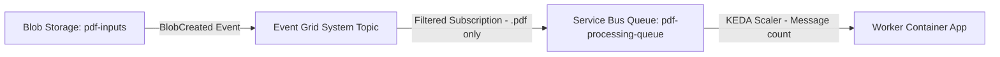

# Infrastructure & Deployment Guide

> 🏗️ **Comprehensive Guide**: Terraform provisioning, resource configuration, Event Grid setup, RBAC, and network strategy.
>
> 📌 **Note**: This project originated as a POC but has evolved into a production-ready MVP with enterprise-grade features including vector search, PII detection, multi-model classification, and comprehensive monitoring.
>
> 📝 **Naming convention**: `<prefix>` refers to your Terraform `prefix` variable (default: `classymail`). Most Azure resource names are derived from it. The two Container Apps are named from a separate `app_name` variable (default: `classymail`), so they stay `classymail-api` / `classymail-worker` even if `prefix` differs. If Terraform state and the live Container Apps drift apart, see [INFRA_STATE_RECONCILE](INFRA_STATE_RECONCILE.md).

## Table of Contents

1. [Overview](#overview)
2. [Custom Tags](#custom-tags-optional)
3. [Terraform Deployment](#terraform-deployment)
4. [Resource Configuration](#resource-configuration)
5. [Event Grid Configuration](#event-grid-configuration)
6. [RBAC & Managed Identity](#rbac--managed-identity)
7. [Network Strategy](#network-strategy)
8. [Verification & Troubleshooting](#verification--troubleshooting)

---

## Overview

Terraform provisions the complete Azure infrastructure:
- Storage Account + container `pdf-inputs`
- Event Grid → Service Bus queue
- Service Bus namespace + queue
- Cosmos DB (serverless) + database/container
- Microsoft AI Foundry / Azure AI Services + project
- **Optional: Azure AI Language** service for native PII detection (TextAnalytics kind, Standard SKU)
- User-Assigned Managed Identity + RBAC roles
- **Required AI Model Deployments** (see below)

---

## Custom Tags (Optional)

🏷️ Resource tagging is **optional** and configurable. By default, ClassyMail mandatory tags are applied to all resources.

> **Details**: See [CUSTOMIZATION.md](CUSTOMIZATION.md#corporate-mandatory-tags) for the full tag table and Azure Policy enforcement.
>
> **To disable**: Set `custom_tags_enabled = false` in `terraform.tfvars` to disable corporate tags.

Tags are applied via `local.common_tags` in `infra/main.tf` and optionally enforced by Azure Policy (`infra/policy.tf`).

```bash
# Verify tags on a resource
az resource show --ids <RESOURCE_ID> --query tags -o json
```

---

## Required AI Model Deployments

**CRITICAL:** The following model deployments MUST exist in your Microsoft AI Foundry / Azure OpenAI resource for the MVP to function:

| Model | Deployment Name | Environment Variable | Purpose | Required |
|-------|----------------|---------------------|---------|----------|
| **Mistral Document AI 2512** | `mistral-document-ai-2512` | `MISTRAL_DEPLOYMENT` | OCR + Vision extraction | ✅ MANDATORY |
| **Phi-4** | `Phi-4` | `PHI_DEPLOYMENT` | Primary classification (8K) | ✅ MANDATORY |
| **GPT-4.1-mini** | `gpt-4.1-mini` | `PHI_FALLBACK_DEPLOYMENT` | Fallback classification + PII detection/anonymization + vision (GA, retires 2027-10-14) | ✅ MANDATORY |
| **text-embedding-3-small** | `text-embedding-3-small` | `EMBEDDING_DEPLOYMENT` | Vector embeddings (RAG) | ✅ MANDATORY |
| **GPT-5.1** | `gpt-5.1` | `CHAT_DEPLOYMENT` | Chatbot reasoning model (GA, retires 2027-05-15) | ⚠️ RECOMMENDED |
| **GPT-4.1-nano** | `gpt-4.1-nano` | Category assessment / agentic defaults | Category assessment AI + agentic orchestrator/tier1 (GA, retires 2027-10-14) | ⚠️ RECOMMENDED |

---

## Optional Azure Services

### Azure AI Language (PII Detection)

**Purpose:** Native PII/PHI detection with 43+ predefined entity categories (SSN, passport, credit cards, etc.)

**Deployment:**
```terraform
# In terraform.tfvars
deploy_language_service = true  # Default: false
```

**Configuration:**
- **Kind:** `TextAnalytics` (Cognitive Services)
- **SKU:** `S` (Standard)
- **Authentication:** Managed Identity (RBAC) - `Cognitive Services Language Reader` role
- **Fallback:** API key via `AZURE_LANGUAGE_KEY` environment variable (optional)

**Usage:** Settings > Processing > Detection Method → "Azure AI Language Service" or "Both (Hybrid)"

**Cost:** ~€1.00 per 1,000 text records (1 email = 1 record) → ~€0.001/email

**When to Use:**
- ✅ Compliance requirements (GDPR, HIPAA, industry regulatory)
- ✅ Need for 43+ predefined PII categories
- ✅ Budget allows (~€0.001/email fixed cost)
- ❌ Cost-sensitive deployments (use LLM-based method instead)

---

### Optional: Azure Document Intelligence (OCR Fallback)

**Purpose:** Fallback OCR provider when Mistral OCR is unavailable (timeout, quota exceeded, circuit breaker open).

**Standalone Resource (Recommended):**

Document Intelligence is deployed as a **standalone `FormRecognizer` resource**. The AI Foundry v2 generic endpoint (`AIServices` kind) does **not** reliably serve the `/documentintelligence/` REST path (returns 400).

```terraform
# In terraform.tfvars
deploy_document_intelligence = true   # Recommended: standalone DI for OCR fallback
doc_intelligence_sku         = "S0"   # Default: S0 (F0 for free tier)
```

- **Kind:** `FormRecognizer` (Cognitive Services)
- **SKU:** `S0` (Standard) or `F0` (Free — 500 pages/month)
- **Model:** `prebuilt-layout` (text-only Markdown extraction)
- **API Version:** `2024-11-30` (configurable via `DOC_INTELLIGENCE_API_VERSION`)
- **Authentication:** Managed Identity (RBAC) - `Cognitive Services User` role on the DI resource
- **Environment Variable:** `AZURE_DOCUMENT_INTELLIGENCE_ENDPOINT` (auto-set by Terraform to standalone endpoint)

**Usage:** Automatic — pipeline falls back to Document Intelligence when Mistral OCR fails. No UI configuration needed.

**Cost:** ~$1.50 per 1,000 pages (S0 tier). Only used when Mistral OCR is unavailable.

**When to Use:**
- ✅ Production environments requiring high OCR availability
- ✅ Mistral OCR experiencing frequent quota limits (429 errors)
- ✅ Need for graceful degradation without manual intervention
- ❌ Development/testing (Mistral OCR alone is sufficient)

---

## Required AI Model Deployments (continued)

**Deployment Instructions:**

1. **Navigate to Microsoft AI Foundry**: https://ai.azure.com/
2. **Select your AI Hub**: `<your-project>-aihub` (created by Terraform)
3. **Go to Deployments** → **+ Create Deployment**
4. **Deploy each model** with the EXACT deployment names shown above

**Why Exact Names Matter:**
- The application code references these deployment names directly
- Mismatch between deployment name and environment variable will cause 404 errors
- Default configuration assumes standard naming convention (e.g., `Phi-4`, `gpt-4.1-mini`)

**Terraform Note:**
- Terraform creates the AI Foundry account and project
- Model deployments must be created manually via Azure Portal/CLI (not yet supported in azurerm provider)
- Future enhancement: Use `azapi_resource` to automate model deployments

**Verification:**
```bash
# List all deployments in your AI Foundry project
az cognitiveservices account deployment list \
  --name <ai-foundry-account-name> \
  --resource-group <resource-group> \
  --query "[].{Name:name, Model:properties.model.name, Version:properties.model.version}" \
  --output table
```

---

## Terraform Deployment

### Quick Start (Windows)

```powershell
.\infra\deploy.ps1
```

Target specific tenant/subscription:

```powershell
.\infra\deploy.ps1 -TenantId <TENANT_ID> -SubscriptionId <SUBSCRIPTION_ID>
```

### Quick Start (Linux/macOS)

```bash
bash infra/deploy.sh
# Target tenant/subscription:
bash infra/deploy.sh --tenant-id <TENANT_ID> --subscription-id <SUBSCRIPTION_ID>
```

### Verify / Repair Role Assignments

Both deploy scripts discover the app managed identity and **add only the missing**
RBAC role assignments (idempotent). This runs automatically after a successful
apply, and can be run standalone to double-check an existing resource group
without touching Terraform:

```powershell
.\infra\deploy.ps1 -VerifyOnly -ResourceGroup <prefix>-rg
```

```bash
bash infra/deploy.sh --verify-only --resource-group <prefix>-rg
```

The Cosmos DB data-plane access uses a Terraform-managed custom SQL role — it is
verified and reported (warn) rather than recreated. See
[RBAC_AUDIT.md](RBAC_AUDIT.md) for the full role matrix.

### Manual Deployment

```powershell
# Login
az login
# Multi-tenant: az login --tenant <TENANT_ID>

# Set subscription
az account set --subscription <SUBSCRIPTION_ID>

# Initialize Terraform
terraform -chdir=infra init -upgrade

# Plan
terraform -chdir=infra plan -var "subscription_id=<SUBSCRIPTION_ID>" -out tfplan

# Apply
terraform -chdir=infra apply tfplan
```

### Why Pass `subscription_id`?

Some AzureRM provider versions don't auto-detect subscription from Azure CLI. The `deploy.ps1` script detects the active subscription (`az account show`) and passes it to Terraform.

### Repository Hygiene

**Commit:**
- `main.tf`
- `.terraform.lock.hcl`
- `deploy.ps1`
- `deploy.sh`
- `terraform.tfvars.example`

**Do NOT commit:**
- `.terraform/`
- `terraform.tfstate*`
- `tfplan`
- `terraform.tfvars` (real values)

---

## Resource Configuration

### Mandatory Environment Variables per Service

#### API Service (`-api`)

| Variable | Description | Example |
|----------|-------------|---------|
| `AZURE_CLIENT_ID` | Managed Identity Client ID | `<your-managed-identity-client-id>` |
| `AZURE_SERVICE_BUS_FQDN` | Service Bus Hostname | `<prefix>-sbus.servicebus.windows.net` |
| `AZURE_SERVICE_BUS_QUEUE` | Queue Name | `pdf-processing-queue` |
| `AZURE_STORAGE_ACCOUNT_URL` | Blob Storage Endpoint | `https://<prefix>sto<region>.blob.core.windows.net` |
| `AZURE_STORAGE_CONTAINER` | Blob Container | `pdf-inputs` |
| `AZURE_COSMOS_ENDPOINT` | Cosmos DB URI | `https://<prefix>-cosmos.documents.azure.com:443/` |
| `AZURE_COSMOS_DB` | Database Name | `emailsdb` |
| `AZURE_COSMOS_CONTAINER` | Container Name | `emails` |
| `AZURE_AI_ENDPOINT` | Microsoft AI Foundry Endpoint | `https://<prefix>-aifoundry.cognitiveservices.azure.com/` |
| `APPLICATIONINSIGHTS_CONNECTION_STRING` | App Insights telemetry | `InstrumentationKey=...;IngestionEndpoint=...` |
| `LOG_ANALYTICS_WORKSPACE_ID` | Log Analytics Workspace ID | `<YOUR_LOG_ANALYTICS_WORKSPACE_ID>` |
| `OTEL_SERVICE_NAME` | OpenTelemetry service name | `classymail-api` |
| `ENABLE_WORKER` | Enable background processing? | `false` (API only) |
| `ORGANIZATION_NAME` | UI branding/destination name | `ClassyMail`, `ClassyMail`, or `ClassyMail` (default) |
| `UI_SHOW_INFO_MODAL` | Show info modal button | `true` (default) |
| `UI_SHOW_DEVELOPER_TAB` | Show developer tab | `true` (default) |
| `MAX_UPLOAD_SIZE` | Max upload size (MB) | `10` (default) |

**⚠️ Security Note:** Do NOT set `AZURE_AI_KEY` in production. Use Managed Identity authentication (`DefaultAzureCredential`) with the `Cognitive Services User` role.

#### Worker Service (`-worker`)

| Variable | Description | Example |
|----------|-------------|---------|
| **`ENABLE_WORKER`** | **MANDATORY** | `true` |
| `AZURE_CLIENT_ID` | Managed Identity Client ID | `<your-managed-identity-client-id>` |
| `AZURE_SERVICE_BUS_FQDN` | Service Bus Hostname | `<prefix>-sbus.servicebus.windows.net` |
| `AZURE_SERVICE_BUS_QUEUE` | Queue Name | `pdf-processing-queue` |
| `AZURE_STORAGE_ACCOUNT_URL` | Blob Storage Endpoint | `https://<prefix>sto<region>.blob.core.windows.net` |
| `AZURE_STORAGE_CONTAINER` | Blob Container | `pdf-inputs` |
| `AZURE_COSMOS_ENDPOINT` | Cosmos DB URI | `https://<prefix>-cosmos.documents.azure.com:443/` |
| `AZURE_COSMOS_DB` | Database Name | `emailsdb` |
| `AZURE_COSMOS_CONTAINER` | Container Name | `emails` |
| `AZURE_AI_ENDPOINT` | Microsoft AI Foundry Endpoint | `https://<prefix>-aifoundry.cognitiveservices.azure.com/` |
| `PHI_DEPLOYMENT` | Classification Model Deployment Name | `Phi-4` |
| `MISTRAL_DEPLOYMENT` | OCR Model Deployment | `mistral-document-ai-2512` |
| `MISTRAL_MODE` | Mistral API mode | `maas` |
| `EMBEDDING_DEPLOYMENT` | Embeddings Model Deployment | `text-embedding-3-small` |
| `APPLICATIONINSIGHTS_CONNECTION_STRING` | App Insights telemetry | `InstrumentationKey=...;IngestionEndpoint=...` |
| `LOG_ANALYTICS_WORKSPACE_ID` | Log Analytics Workspace ID | `<YOUR_LOG_ANALYTICS_WORKSPACE_ID>` |
| `OTEL_SERVICE_NAME` | OpenTelemetry service name | `classymail-worker` |

**⚠️ Security Note:** Do NOT set `AZURE_AI_KEY` in production. Use Managed Identity authentication (`DefaultAzureCredential`) with the `Cognitive Services User` role.

**💡 Worker Configuration:** The Worker container does NOT need UI configuration variables (`UI_SHOW_INFO_MODAL`, `UI_SHOW_DEVELOPER_TAB`, `MAX_UPLOAD_SIZE`, `ORGANIZATION_NAME`) since it doesn't serve the web interface.

> **🔴 CRITICAL - MISTRAL_DEPLOYMENT Name:** Use **EXACTLY** `mistral-document-ai-2512` for `MISTRAL_DEPLOYMENT`. Typos (e.g., `mistral-ocr-2505`) will cause **HTTP 500 errors** during OCR processing. Verify consistency across:
> - Environment variables: `MISTRAL_DEPLOYMENT=mistral-document-ai-2512`
> - Terraform: `name = "mistral-document-ai-2512"` in `infra/main.tf`
> - `secrets.env` and `secrets.env.example`
> - `write_secrets_env.ps1` PowerShell script
> - All deployment documentation

### Chatbot Variables (Injected into Container Apps)

- **API** Container App receives:
  - `CHAT_ENDPOINT` = AI Foundry endpoint
  - `CHAT_DEPLOYMENT` = `gpt-5.1`
  - `CHAT_API_VERSION` = `preview`
- **Worker** does not need chatbot variables
- **Optional:** `COSMOS_QUERY_MAX_LIMIT` (default `20`)

### Images & Container Registry

- `variable "container_image"` **required**: Public image (e.g., `mcr.microsoft.com/azuredocs/containerapps-helloworld:latest`) or private (e.g., `<monacr>.azurecr.io/classymail-agent:tag`)
- ACR **not required** for public images
- ACR private: set `acr_name` (+ `acr_resource_group` if different) for Terraform to assign **AcrPull** role to managed identity

---

## Event Grid Configuration

### Architecture Overview

The connection between Blob Storage and Service Bus uses **Azure Event Grid**:



### Required Terraform Resources

#### 1. Event Grid System Topic

```hcl
resource "azurerm_eventgrid_system_topic" "storage_events" {
  name                   = "evgt-${var.project_name}-storage"
  resource_group_name    = azurerm_resource_group.rg.name
  location               = azurerm_resource_group.rg.location
  source_arm_resource_id = azurerm_storage_account.storage.id
  topic_type             = "Microsoft.Storage.StorageAccounts"
}
```

#### 2. Event Grid Subscription (Routes .pdf to Service Bus)

```hcl
resource "azurerm_eventgrid_event_subscription" "blob_to_servicebus" {
  name  = "evgs-blob-to-sb"
  scope = azurerm_eventgrid_system_topic.storage_events.id

  service_bus_queue_endpoint_id = azurerm_servicebus_queue.pdf_queue.id

  included_event_types = ["Microsoft.Storage.BlobCreated"]

  subject_filter {
    subject_ends_with = ".pdf"
  }

  subject_filter {
    subject_ends_with = ".PDF"
  }
}
```

#### 3. Service Bus Local Authentication (Critical)

```hcl
resource "azurerm_servicebus_namespace" "sb" {
  name                = "sb-${var.project_name}"
  location            = azurerm_resource_group.rg.location
  resource_group_name = azurerm_resource_group.rg.name
  sku                 = "Standard"

  local_auth_enabled = true  # ← REQUIRED for Event Grid delivery
}
```

**Why?** Event Grid uses SAS (Shared Access Signature) authentication. If `local_auth_enabled = false`, messages are silently dropped.

---

## RBAC & Managed Identity

### Deployed Configuration (<prefix>-rg)

**Managed Identity Details:**
- **Name**: `<prefix>-id` (Terraform: `azurerm_user_assigned_identity.app_id`)
- **Client ID**: set as `AZURE_CLIENT_ID` env var on both Container Apps
- **Principal ID**: used for all RBAC role assignments
- **Resource Group**: `<prefix>-rg`
- **Attached to**: both `classymail-api` and `classymail-worker` Container Apps (names from the `app_name` variable, default `classymail`)

### Role Assignment Matrix (Verified)

The Container Apps use a **User-Assigned Managed Identity** with the following role assignments verified in Azure:

| Azure Resource | Role Name | Terraform Resource | Scope | Conditional |
|----------------|-----------|-------------------|-------|-------------|
| **Blob Storage** | Storage Blob Data Contributor | `aca_storage_contrib` | Storage Account | Always |
| **Service Bus** | Azure Service Bus Data Owner | `aca_sb_owner` | Namespace | Always |
| **Cosmos DB** | Custom App Role (readMetadata + CRUD) | `app_role` + `aca_cosmos_sql_contrib` | Account Scope | `cosmos_use_rbac` |
| **AI Foundry** | Cognitive Services User | `rbac_ai` | AI Foundry Account | Always |
| **Container Registry** | AcrPull | `acr_pull` | ACR | `acr_name != ""` |
| **Language Service** | Cognitive Services Language Reader | `aca_language_reader` | Language Account | `deploy_language_service` |
| **Document Intelligence** | Cognitive Services User | `aca_doc_intelligence_user` | DI Account | `deploy_document_intelligence` (standalone resource, recommended) |

> ⚠️ **Cosmos DB uses a Custom Role** (not the built-in `Cosmos DB Built-in Data Contributor`). The custom role grants `readMetadata` + specific CRUD actions at **Account scope**. See [RBAC_AUDIT.md](RBAC_AUDIT.md) §9 for why.

### Terraform Configuration

```hcl
# Storage Contributor
resource "azurerm_role_assignment" "aca_storage_contrib" {
  scope                = azurerm_storage_account.st.id
  role_definition_name = "Storage Blob Data Contributor"
  principal_id         = azurerm_user_assigned_identity.app_id.principal_id
}

# Service Bus Data Owner (send + receive + read queue runtime properties for monitoring)
resource "azurerm_role_assignment" "aca_sb_owner" {
  scope                = azurerm_servicebus_namespace.sb.id
  role_definition_name = "Azure Service Bus Data Owner"
  principal_id         = azurerm_user_assigned_identity.app_id.principal_id
}

# Cosmos DB Custom Role (readMetadata + data CRUD at Account scope)
resource "azurerm_cosmosdb_sql_role_definition" "app_role" {
  name                = "${var.prefix}-app-role"
  resource_group_name = azurerm_resource_group.rg.name
  account_name        = azurerm_cosmosdb_account.db.name
  type                = "CustomRole"
  assignable_scopes   = [azurerm_cosmosdb_account.db.id]
  permissions {
    data_actions = [
      "Microsoft.DocumentDB/databaseAccounts/readMetadata",
      "Microsoft.DocumentDB/databaseAccounts/sqlDatabases/containers/items/*",
      "Microsoft.DocumentDB/databaseAccounts/sqlDatabases/containers/executeQuery",
      "Microsoft.DocumentDB/databaseAccounts/sqlDatabases/containers/readChangeFeed"
    ]
  }
}

resource "azurerm_cosmosdb_sql_role_assignment" "aca_cosmos_sql_contrib" {
  count               = var.cosmos_use_rbac ? 1: 0
  resource_group_name = azurerm_resource_group.rg.name
  account_name        = azurerm_cosmosdb_account.db.name
  principal_id        = azurerm_user_assigned_identity.app_id.principal_id
  role_definition_id  = azurerm_cosmosdb_sql_role_definition.app_role.id
  scope               = azurerm_cosmosdb_account.db.id  # Account scope!
}

# AI Foundry User
resource "azurerm_role_assignment" "rbac_ai" {
  scope                = azapi_resource.ai_foundry.id
  role_definition_name = "Cognitive Services User"
  principal_id         = azurerm_user_assigned_identity.app_id.principal_id
}
```

### Cosmos DB RBAC (Data-Plane) - Account Scope Assignment

This project uses **Cosmos SQL data-plane RBAC** (`azurerm_cosmosdb_sql_role_assignment`).

**Important:** The Cosmos DB role assignment is configured at the **Account scope** (`/`), not at the database scope.
This is required because the Azure Cosmos DB Python SDK performs a `readMetadata` operation on the account before accessing the database, which requires account-level permissions.

**Deployed Configuration:**
```plaintext
Role: Custom App Role (readMetadata + data actions)
Scope: /subscriptions/.../resourceGroups/<prefix>-rg/providers/Microsoft.DocumentDB/databaseAccounts/<prefix>-cosmos
```

**Verification Command:**
```bash
az cosmosdb sql role assignment list \
  --account-name <prefix>-cosmos \
  --resource-group <prefix>-rg \
  --query "[?principalId=='<managed-identity-principal-id>'].roleDefinitionId"

## Network Strategy

### Current (Production MVP)

- All services accessible via public endpoints
- Cosmos DB: Firewall allows `0.0.0.0` (Azure services)
- Container Apps: External ingress enabled

This is the production-ready MVP configuration, designed for seamless scalability and enterprise deployment. For additional security hardening, consider the Private VNet strategy below.

### Production (Private VNet)

**Objective:** Isolate system from Internet (VNet Injection)

**Required Changes:**

1. **Virtual Network (VNet)**: Create VNet with subnet delegated to `Microsoft.App/environments`

2. **ACA VNet Injection**: Deploy Container App Environment in **Internal** mode

3. **Private Endpoints (PE)**:
   - Disable public access on Cosmos DB, Storage, Service Bus, AI Foundry
   - Create Private Endpoint for each PaaS service
   - Configure **Private DNS zones** zones (`privatelink.documents.azure.com`, `privatelink.blob.core.windows.net`, etc.)

4. **Firewall Exceptions**: Remove Cosmos DB `0.0.0.0` exception

**Outcome:** Traffic stays within Azure backbone via Private Endpoints.

---

## Verification & Troubleshooting

### Check Event Grid Subscription

```bash
az eventgrid event-subscription list \
  --source-resource-id $(az storage account show -n <storage-account-name> -g <resource-group> --query id -o tsv)
```

### Test Blob Upload → Queue Message

```bash
# Upload test file
az storage blob upload \
  --account-name <storage-account-name> \
  --container-name pdf-inputs \
  --name test.pdf \
  --file ./test.pdf \
  --auth-mode login

# Wait ~30 seconds, check queue
az servicebus queue show \
  --resource-group <resource-group> \
  --namespace-name <servicebus-namespace> \
  --name pdf-processing-queue \
  --query "countDetails.activeMessageCount"
```

If count > 0, Event Grid → Service Bus is working.

### Verify Managed Identity Roles

```bash
az role assignment list \
  --assignee <managed-identity-client-id> \
  --all \
  --query "[].{Role:roleDefinitionName, Scope:scope}" \
  --output table
```

### Troubleshooting: Messages not arriving in Service Bus

**Causes:**
1. `local_auth_enabled = false` on Service Bus
2. Event Grid subscription filter mismatch
3. Event Grid System Topic misconfigured

**Fix:**
```bash
az servicebus namespace update \
  --resource-group <rg> \
  --name <namespace> \
  --enable-local-auth true
```

### Troubleshooting: Worker not picking up messages

**Causes:**
1. `ENABLE_WORKER` not set to `true`
2. KEDA scaler not configured
3. Managed Identity missing "Azure Service Bus Data Owner" role

**Fix:**
```bash
az containerapp show \
  --name <prefix>-worker \
  --resource-group <rg> \
  --query "properties.template.containers[0].env[?name=='ENABLE_WORKER'].value"
```

### Troubleshooting: Cosmos DB "Unauthorized"

**Cause:** Managed Identity missing the Custom App Role, or role scoped to database instead of account.

> ⚠️ The scope **must** be the account ID (not `/dbs/emailsdb`), because the Python SDK calls `readMetadata` at account level on initialization.

**Quick fix (uses built-in role as workaround):**
```bash
PRINCIPAL=$(az identity show -n <prefix>-id -g <prefix>-rg --query principalId -o tsv)
ACCOUNT_ID=$(az cosmosdb show -n <prefix>-cosmos -g <prefix>-rg --query id -o tsv)

az cosmosdb sql role assignment create \
  --account-name <prefix>-cosmos \
  --resource-group <prefix>-rg \
  --role-definition-id 00000000-0000-0000-0000-000000000002 \
  --principal-id "$PRINCIPAL" \
  --scope "$ACCOUNT_ID"
```

**Permanent fix:** Run `terraform apply` — the custom role definition and assignment are managed in `main.tf`.

### Troubleshooting: Cosmos DB "Request originated from IP ... through public internet"

**Error:**
```
(Forbidden) Request originated from IP 4.225.209.140 through public internet.
This is blocked by your Cosmos DB account firewall settings.
```

**Root Cause:**

This error occurs when **both** of the following conditions are met:
1. **Terraform Drift**: `publicNetworkAccess` is set to `Disabled` in Azure, but Terraform configuration expects `Enabled`
2. **Container App Outbound IP**: The Container App's outbound IP (`4.225.209.140`) is not in the firewall allowlist

**Critical Finding:**
Even with `ip_range_filter = ["0.0.0.0"]` (Allow Azure Services), if `publicNetworkAccess = Disabled`, **ALL connections are blocked**.

**Verification:**
```bash
# Check current public network access status
az cosmosdb show --name <prefix>-cosmos --resource-group <prefix>-rg \
  --query "{publicAccess:publicNetworkAccess, ipRules:ipRules}" -o json

# Should show:
# "publicAccess": "Enabled"
# "ipRules": [{"ipAddressOrRange": "0.0.0.0"}, ...]

# Check Container App outbound IP
az containerapp show --name <prefix>-api --resource-group <prefix>-rg \
  --query properties.outboundIpAddresses -o json
```

**Fix (Immediate - CLI):**
```bash
# Enable public network access
az cosmosdb update \
  --name <prefix>-cosmos \
  --resource-group <prefix>-rg \
  --public-network-access Enabled
```

**Fix (Permanent - Terraform):**
```bash
# Verify Terraform configuration (should already be correct)
grep -A2 "public_network_access_enabled" infra/main.tf
# Expected: public_network_access_enabled = true

# Apply Terraform to fix drift
cd infra
terraform plan -out=tfplan
terraform apply tfplan
```

**Why This Happens:**
Someone may have manually disabled public network access via Azure Portal or CLI, causing Terraform state drift. Always use `terraform apply` after manual changes to restore the infrastructure to the desired state.

---

## See Also

- [LOCAL_DEVELOPMENT.md](LOCAL_DEVELOPMENT.md) - Local setup & testing
- [ARCHITECTURE.md](ARCHITECTURE.md) - System architecture
- [RBAC_AUDIT.md](RBAC_AUDIT.md) - RBAC troubleshooting
- [CLI_REFERENCE.md](CLI_REFERENCE.md) - CLI commands reference
