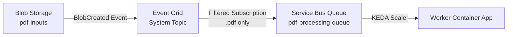

# Infrastructure & Deployment Guide

## Mandatory Environment Variables per Service

### 1. API Service (`-api`)
Responsible for serving the REST API and Dashboard.

| Variable | Description | Example / Default |
|----------|-------------|-------------------|
| `AZURE_SERVICE_BUS_FQDN` | Service Bus Hostname | `email-poc-sbus.servicebus.windows.net` |
| `AZURE_SERVICE_BUS_QUEUE` | Queue Name | `pdf-processing-queue` |
| `AZURE_STORAGE_ACCOUNT_URL` | Blob Storage Endpoint | `https://emailpocst.blob.core.windows.net` |
| `AZURE_STORAGE_CONTAINER` | Blob Container | `pdf-inputs` |
| `AZURE_COSMOS_ENDPOINT` | Cosmos DB URI | `https://email-poc-cosmos.documents.azure.com:443/` |
| `AZURE_COSMOS_DB` | Database Name | `emailsdb` |
| `AZURE_COSMOS_CONTAINER` | Container Name | `emails` |
| `AZURE_AI_ENDPOINT` | Azure AI Foundry Endpoint | `https://email-poc-aifoundry.cognitiveservices.azure.com/` |
| `AZURE_CLIENT_ID` | Managed Identity Client ID | `3ae24af5-97c6-437f...` |
| **`ENABLE_WORKER`** | Enable background processing? | `true` (if running single container), `false` (if split) |

### 2. Worker Service (`-worker`)
Responsible for processing PDFs from the queue.

| Variable | Description | Example / Default |
|----------|-------------|-------------------|
| **`ENABLE_WORKER`** | **MANDATORY** | `true` |
| `AZURE_SERVICE_BUS_FQDN` | Service Bus Hostname | `email-poc-sbus.servicebus.windows.net` |
| `AZURE_SERVICE_BUS_QUEUE` | Queue Name | `pdf-processing-queue` |
| `AZURE_STORAGE_ACCOUNT_URL` | Blob Storage Endpoint | `https://emailpocst.blob.core.windows.net` |
| `AZURE_STORAGE_CONTAINER` | Blob Container | `pdf-inputs` |
| `AZURE_COSMOS_ENDPOINT` | Cosmos DB URI | `https://email-poc-cosmos.documents.azure.com:443/` |
| `AZURE_COSMOS_DB` | Database Name | `emailsdb` |
| `AZURE_COSMOS_CONTAINER` | Container Name | `emails` |
| `AZURE_AI_ENDPOINT` | Azure AI Foundry Endpoint | `https://email-poc-aifoundry.cognitiveservices.azure.com/` |
| `PHI_DEPLOYMENT` | Model Deployment Name | `phi-4` |
| `MISTRAL_DEPLOYMENT` | OCR Model Deployment | `mistral-ocr-2505` |
| `AZURE_CLIENT_ID` | Managed Identity Client ID | `3ae24af5-97c6-437f...` |

---

## Event Grid Configuration (Blob → Service Bus)

### Architecture Overview
The connection between Blob Storage and Service Bus is established via **Azure Event Grid**, not a direct connection.



### Terraform Resources Required

#### 1. Event Grid System Topic (Listens to Storage Events)
```hcl
resource "azurerm_eventgrid_system_topic" "storage_events" {
  name                   = "evgt-${var.project_name}-storage"
  resource_group_name    = azurerm_resource_group.rg.name
  location               = azurerm_resource_group.rg.location
  source_arm_resource_id = azurerm_storage_account.storage.id
  topic_type             = "Microsoft.Storage.StorageAccounts"
}
```

#### 2. Event Grid Subscription (Routes .pdf files to Service Bus)
```hcl
resource "azurerm_eventgrid_event_subscription" "blob_to_servicebus" {
  name  = "evgs-blob-to-sb"
  scope = azurerm_eventgrid_system_topic.storage_events.id

  service_bus_queue_endpoint_id = azurerm_servicebus_queue.pdf_queue.id

  included_event_types = ["Microsoft.Storage.BlobCreated"]

  subject_filter {
    subject_ends_with = ".pdf"
  }

  subject_filter {
    subject_ends_with = ".PDF"
  }
}
```

#### 3. Service Bus Local Authentication (Critical)
```hcl
resource "azurerm_servicebus_namespace" "sb" {
  name                = "sb-${var.project_name}"
  location            = azurerm_resource_group.rg.location
  resource_group_name = azurerm_resource_group.rg.name
  sku                 = "Standard"

  local_auth_enabled = true  # ← REQUIRED for Event Grid delivery
}
```

**Why?** Event Grid uses SAS (Shared Access Signature) authentication to push messages. If `local_auth_enabled = false`, messages will be silently dropped.

---

## RBAC Role Assignments (Managed Identity)

The Container Apps use a **User-Assigned Managed Identity** that requires the following Azure roles:

| Azure Resource | Role Name | Role Definition ID | Scope |
|----------------|-----------|-------------------|-------|
| **Blob Storage** | Storage Blob Data Contributor | `ba92f5b4-2d11-453d-a403-e96b0029c9fe` | Storage Account |
| **Service Bus** | Azure Service Bus Data Sender | `69a216fc-b8fb-44d8-bc22-1f3c2cd27a39` | Service Bus Namespace |
| **Service Bus** | Azure Service Bus Data Receiver | `4f6d3b9b-027b-4f4c-9142-0e5a2a2247e0` | Service Bus Namespace |
| **Cosmos DB** | Cosmos DB Built-in Data Contributor | `00000000-0000-0000-0000-000000000002` | Cosmos DB Account |
| **AI Foundry** | Cognitive Services OpenAI User | `5e0bd9bd-7b93-4f28-af87-19fc36ad61bd` | AI Services Account |

### Terraform Example
```hcl
resource "azurerm_role_assignment" "storage_contributor" {
  scope                = azurerm_storage_account.storage.id
  role_definition_name = "Storage Blob Data Contributor"
  principal_id         = azurerm_user_assigned_identity.aca_identity.principal_id
}

resource "azurerm_role_assignment" "servicebus_sender" {
  scope                = azurerm_servicebus_namespace.sb.id
  role_definition_name = "Azure Service Bus Data Sender"
  principal_id         = azurerm_user_assigned_identity.aca_identity.principal_id
}

resource "azurerm_role_assignment" "servicebus_receiver" {
  scope                = azurerm_servicebus_namespace.sb.id
  role_definition_name = "Azure Service Bus Data Receiver"
  principal_id         = azurerm_user_assigned_identity.aca_identity.principal_id
}

resource "azurerm_cosmosdb_sql_role_assignment" "cosmos_contributor" {
  resource_group_name = azurerm_resource_group.rg.name
  account_name        = azurerm_cosmosdb_account.cosmos.name
  role_definition_id  = "${azurerm_cosmosdb_account.cosmos.id}/sqlRoleDefinitions/00000000-0000-0000-0000-000000000002"
  principal_id        = azurerm_user_assigned_identity.aca_identity.principal_id
  scope               = azurerm_cosmosdb_account.cosmos.id
}

resource "azurerm_role_assignment" "ai_user" {
  scope                = azurerm_cognitive_account.ai.id
  role_definition_name = "Cognitive Services OpenAI User"
  principal_id         = azurerm_user_assigned_identity.aca_identity.principal_id
}
```

---

## Verification Commands

### 1. Check Event Grid Subscription
```bash
az eventgrid event-subscription list \
  --source-resource-id $(az storage account show -n <storage-account-name> -g <resource-group> --query id -o tsv)
```

### 2. Test Blob Upload → Queue Message
```bash
# Upload a test file
az storage blob upload \
  --account-name <storage-account-name> \
  --container-name pdf-inputs \
  --name test.pdf \
  --file ./test.pdf \
  --auth-mode login

# Wait ~30 seconds, then check queue
az servicebus queue show \
  --resource-group <resource-group> \
  --namespace-name <servicebus-namespace> \
  --name pdf-processing-queue \
  --query "countDetails.activeMessageCount"
```
If the count is `> 0`, Event Grid → Service Bus is working.

### 3. Verify Managed Identity Roles
```bash
az role assignment list \
  --assignee <managed-identity-client-id> \
  --all \
  --query "[].{Role:roleDefinitionName, Scope:scope}" \
  --output table
```

---

## Troubleshooting

### Issue: Messages not arriving in Service Bus after blob upload
**Causes:**
1. `local_auth_enabled = false` on Service Bus Namespace.
2. Event Grid subscription filter mismatch (check file extension).
3. Event Grid System Topic not created or misconfigured.

**Fix:**
```bash
# Enable local auth
az servicebus namespace update \
  --resource-group <rg> \
  --name <namespace> \
  --enable-local-auth true
```

### Issue: Worker not picking up messages
**Causes:**
1. `ENABLE_WORKER` not set to `true`.
2. KEDA scaler not configured (check ACA revision).
3. Managed Identity missing "Azure Service Bus Data Receiver" role.

**Fix:**
Verify environment variable in Container App:
```bash
az containerapp show \
  --name email-poc-worker \
  --resource-group <rg> \
  --query "properties.template.containers[0].env[?name=='ENABLE_WORKER'].value"
```

### Issue: Cosmos DB "Unauthorized" errors
**Cause:** Managed Identity missing "Cosmos DB Built-in Data Contributor" role.

**Fix:**
```bash
az cosmosdb sql role assignment create \
  --account-name <cosmos-account> \
  --resource-group <rg> \
  --role-definition-id 00000000-0000-0000-0000-000000000002 \
  --principal-id <managed-identity-principal-id> \
  --scope "/dbs/emailsdb"
```

---

## Network Strategy

### Current (Public POC)
- All services accessible via public endpoints.
- Cosmos DB: Firewall allows `0.0.0.0` (Azure services).
- Container Apps: External ingress enabled.

### Production (Private VNet)
1. Create VNet with dedicated subnet for Container Apps.
2. Enable VNet integration on ACA Environment.
3. Deploy Private Endpoints for:
   - Blob Storage
   - Service Bus
   - Cosmos DB
   - AI Foundry
4. Disable public access on all PaaS services.
5. Configure Private DNS Zones for name resolution.
