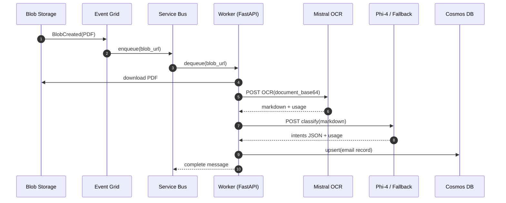

# PIPELINE

This document explains the end-to-end processing pipeline (PDF → OCR → classification → dashboard), plus assumptions, design decisions, and improvement ideas.

## High-level flow

```mermaid
flowchart TD
    user[User / Mailbox Export] -->|Upload PDF| blob[(Blob Storage: pdf-inputs)]
    blob -->|Event Grid| sb[(Service Bus Queue)]
    sb -->|Worker consumes| api[FastAPI Worker/API]
    api -->|Download PDF| blob
    api -->|OCR: %PDF -> base64| ocr[Mistral OCR]
    ocr -->|Markdown + usage| api
    api -->|Classify intents (strict JSON)| llm[Phi-4 (primary)\nFallback: gpt-4o-mini]
    llm -->|JSON + usage| api
    api -->|Upsert| cosmos[(Cosmos DB)]
    api -->|Serve UI + APIs| user
```

## Sequence (message-driven)



## Assumptions

- PDFs are uploaded into a known container (default: `pdf-inputs`).
- Event Grid emits an event that can be transformed into a stable `blob_url`.
- Worker can fetch the blob using Entra ID (RBAC), without Shared Key.
- OCR output is Markdown (can be large), and classification expects a strict JSON result.
- "Correct" classification is represented as a multi-intent list with confidence + justification.

## Key decisions (and why)

- **Service Bus queue as buffer**: isolates ingestion bursts from OCR/LLM rate limits; provides retries + DLQ.
- **Two-step AI (OCR then classifier)**: keeps classification prompts structured; avoids expensive multimodal token costs.
- **Strict JSON output**: simplifies post-processing, validation, and storage; enables consistent fine-tuning datasets.
- **Fallback model**: long OCR markdown can exceed the primary model’s context window; fallback keeps the pipeline resilient.
- **RBAC-first (no keys)**: aligns with common enterprise policies (Storage OAuth-only, Service Bus local auth disabled, Cosmos RBAC).
- **Idempotent storage (upsert)**: repeated processing should not create duplicates; enables safe retries.

## Improvement ideas

- **Message de-duplication**: store a hash of `blob_url` or file ETag to avoid reprocessing duplicates.
- **Chunking strategy**: for very long OCR markdown, classify per section/page then merge.
- **Retry policy by error type**: retry only transient errors; DLQ for validation errors (bad PDF, malformed OCR).
- **Human-in-the-loop loop closure**: persist corrections as “golden labels” for fine-tuning export.
- **Metrics**: per-step latency (download/OCR/LLM), tokens/pages, error rates, DLQ depth.
- **Data retention**: TTL policies in Cosmos for raw OCR markdown if not required long-term.
