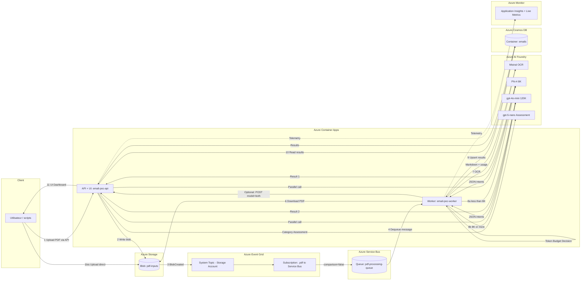

# Scénario de test bout en bout (E2E)
> 📊 **Interactive Diagrams**: Each diagram has zoom 🔍 and download 📥 controls. See [README_DIAGRAMS.md](./README_DIAGRAMS.md).
Ce document décrit un scénario complet pour tester le système de bout en bout : génération de PDFs → dépôt dans Blob Storage → (Event Grid) → Service Bus → worker → stockage dans Cosmos DB → consultation via l’API/UI.

## Objectif

- Générer un lot de PDFs localement (dataset de test)
- Déposer ces PDFs dans le container Blob `pdf-inputs`
- Vérifier que l’événement `Microsoft.Storage.BlobCreated` est routé vers la queue Service Bus
- Laisser le worker consommer et traiter
- Vérifier le résultat côté API/UI (Cosmos)

## Flux E2E (ressources Azure)

Le flux suivant correspond à l’architecture déployée (API + worker séparés, Event Grid → Service Bus direct).



### Étapes (lecture rapide)

1) Le PDF est déposé soit via l’API (`POST /api/upload`), soit directement dans le container Blob `pdf-inputs`.
2) Si l’upload passe par l’API, l’app écrit dans Blob (préfixe `uploads/YYYY/MM/DD/`).
3) Azure Storage émet un événement `Microsoft.Storage.BlobCreated`.
4) Event Grid route cet événement vers Service Bus (filtre `.pdf`).
5) Le worker consomme la queue (message interne `{blob_url}` ou payload Event Grid `data.url`).
6) Le worker télécharge le PDF depuis Blob.
7) OCR via Mistral OCR → récupère du Markdown + usage pages.
8) Classification via Phi-4 → récupère un JSON d’intents + usage tokens.
9) Le worker upsert le résultat dans Cosmos DB.
10) L’API lit Cosmos DB et expose `/api/emails`, `/api/stats`, etc.
11) L’UI (servie par l’API) permet de visualiser et corriger/reprocess.

## Prérequis

- Azure CLI installé (`az`) + authentification : `az login`
- Les ressources Azure existent déjà (créées via Terraform)
  - Storage Account + container `pdf-inputs`
  - Event Grid System Topic + subscription `BlobCreated` → Service Bus
  - Service Bus namespace + queue `pdf-processing-queue`
  - Cosmos DB (SQL)
- Python 3.11/3.12 + `uv`

## 1) Récupérer la configuration (secrets.env)

Le plus simple est d’utiliser le script qui détecte les ressources dans le Resource Group et génère `secrets.env`.

### PowerShell

```powershell
# 1) Login
az login

# 2) Générer secrets.env depuis votre RG
pwsh -NoProfile -File .\scripts\write_secrets_env.ps1 -ResourceGroup <rg-name> -OutFile secrets.env -Force
```

Ensuite, chargez les variables d’environnement :

```powershell
Get-Content .\secrets.env | ForEach-Object {
  if ($_ -match '^\s*#' -or $_ -match '^\s*$') { return }
  $k, $v = $_ -split '=', 2
  [Environment]::SetEnvironmentVariable($k, $v)
}
```

## 2) Lancer l’application localement (API + worker)

Par défaut, le worker n’est **pas** démarré dans le process API. Pour un test E2E local (pratique), activez-le :

### PowerShell

```powershell
$env:ENABLE_WORKER = "true"
uv run uvicorn main:app --reload
```

Vérifier que l’API répond :

```powershell
Invoke-RestMethod http://127.0.0.1:8000/healthz
Invoke-RestMethod http://127.0.0.1:8000/readyz
```

## Variante : scénario E2E contre les ressources Azure déployées (sans local)

Cette variante utilise directement les composants déployés dans Azure (Azure Container Apps + Storage + Event Grid + Service Bus + Cosmos).

### A) Découvrir les ressources (Azure CLI)

Prérequis : `az login` puis sélectionner la bonne subscription si besoin.

```powershell
az login
az account set --subscription <subscription-id>

$rg = "<rg-name>"   # ex: <prefix>-rg
$prefix = "<prefix>"  # si vous avez gardé le préfixe Terraform

# URL publique de l'API (Container App avec ingress)
$apiFqdn = az containerapp show -g $rg -n "$prefix-api" --query "properties.configuration.ingress.fqdn" -o tsv
$apiBase = "https://$apiFqdn"

# Storage Account / Service Bus (pour uploads batch et vérifs)
$storageAccountName = az storage account list -g $rg --query "[0].name" -o tsv
$sbNamespace = az servicebus namespace list -g $rg --query "[0].name" -o tsv
```

### B) Vérifier que l’API est OK

```powershell
Invoke-RestMethod "$apiBase/healthz"
Invoke-RestMethod "$apiBase/readyz"
```

Optionnel : suivre les logs du worker (si vous avez les droits).

```powershell
az containerapp logs show -g $rg -n "$prefix-worker" --follow
```

### C) Déposer des PDFs pour déclencher tout le pipeline

Vous avez 2 approches :

1) **Upload via l’API déployée** (le plus simple, car vous ne gérez pas l’accès Storage depuis votre poste)
2) **Upload direct dans Blob** (pratique pour un gros batch, mais nécessite réseau + RBAC data-plane)

#### 1) Upload via l’API déployée (recommandé)

L’endpoint accepte jusqu’à 10 PDFs par requête. L’API écrit dans le container `pdf-inputs` sous `uploads/YYYY/MM/DD/...`.

```powershell
# Exemple avec curl.exe (Windows) : envoyer 1..N fichiers
curl.exe -s -X POST "$apiBase/api/upload" `
  -F "files=@.\dataset\pdf\sample1.pdf" `
  -F "files=@.\dataset\pdf\sample2.pdf"
```

Astuce batch : pour >10 fichiers, faites plusieurs appels (ou utilisez l’upload direct Blob ci-dessous).

#### 2) Upload direct dans Blob (batch)

Prérequis :

- RBAC data-plane au minimum sur le Storage Account (ex: **Storage Blob Data Contributor**)
- Accès réseau au endpoint blob. Selon votre configuration, le Storage peut être privé (Public Network Access désactivé). Dans ce cas, faites l’upload via l’API (ci-dessus) ou utilisez un accès réseau privé (VPN/PE) / ajustez l’infra.

```powershell
$datePath = Get-Date -Format "yyyy/MM/dd"
az storage blob upload-batch `
  --auth-mode login `
  --account-name $storageAccountName `
  --destination pdf-inputs `
  --destination-path "uploads/$datePath/" `
  --source .\dataset\pdf `
  --pattern "*.pdf" `
  --content-type application/pdf
```

### D) Comprendre/valider le déclenchement Event Grid → Service Bus

Chaque blob créé produit un événement `Microsoft.Storage.BlobCreated`. Dans l’IaC de ce repo, Event Grid route ces événements **directement** vers la queue Service Bus (avec un filtre `data.url` qui finit par `.pdf`).

Vous pouvez vérifier l’état “management plane” de la queue (compteurs) :

```powershell
$queue = "pdf-processing-queue"
az servicebus queue show -g $rg --namespace-name $sbNamespace --name $queue --query "countDetails" -o json
```

### E) Vérifier les résultats (API/UI)

Lister les items (stockés dans Cosmos) via l’API publique :

```powershell
Invoke-RestMethod "$apiBase/api/emails?page=1&page_size=20"
Invoke-RestMethod "$apiBase/api/stats"
```

Ouvrir l’UI :

- `$apiBase/`

### F) Rejouer un traitement

1) Récupérer un `id` (via `/api/emails`), puis :

```powershell
$items = Invoke-RestMethod "$apiBase/api/emails?page=1&page_size=20"
$id = $items.items[0].id
Invoke-RestMethod -Method Post "$apiBase/api/emails/$id/reprocess"
```

## 3) Générer un lot de PDFs (script)

Le script génère des PDFs « email-like » pour stress-test OCR + classification.

```powershell
# Exemple: 25 PDFs dans un dossier local
python .\scripts\generate_dummy_pdfs.py --count 25 --out .\dataset_emails_hardcore
```

Résultat : un dossier contenant des fichiers `*.pdf`.

## 4) Déposer les PDFs dans Azure Blob Storage

Deux approches sont possibles :

- A) Upload via l’API (l’API écrit dans Blob)
- B) Upload direct dans Blob (recommandé pour batch)

### A) Upload via l’API (simple)

```powershell
# Upload de 2 fichiers (répéter pour un lot)
$resp = curl.exe -s -X POST http://127.0.0.1:8000/api/upload `
  -F "files=@dataset_emails_hardcore\sample_001_habitation_*.pdf" `
  -F "files=@dataset_emails_hardcore\sample_002_scolaire_*.pdf"

$resp
```

Ce endpoint :

- écrit dans le container `AZURE_STORAGE_CONTAINER` (défaut `pdf-inputs`)
- sous le préfixe `uploads/YYYY/MM/DD/...`
- renvoie un `blob_url` par fichier

### B) Upload direct dans Blob (batch)

#### PowerShell

```powershell
# Déposer tout un dossier en une fois
$datePath = Get-Date -Format "yyyy/MM/dd"
az storage blob upload-batch `
  --auth-mode login `
  --account-name <storageAccountName> `
  --destination pdf-inputs `
  --destination-path "uploads/$datePath/" `
  --source .\dataset_emails_hardcore `
  --pattern "*.pdf" `
  --content-type application/pdf
```

#### Bash (Linux/macOS/Git Bash)

```bash
az storage blob upload-batch \
  --auth-mode login \
  --account-name <storageAccountName> \
  --destination pdf-inputs \
  --destination-path "uploads/$(date +%Y/%m/%d)/" \
  --source ./dataset_emails_hardcore \
  --pattern "*.pdf" \
  --content-type application/pdf
```

## 5) Comprendre le déclenchement Event Grid → Service Bus

Chaque blob créé déclenche un événement Azure Storage :

- `eventType`: `Microsoft.Storage.BlobCreated`
- `data.url`: URL complète du blob (inclut le container + le chemin)

Dans ce repo, Terraform configure une subscription Event Grid qui :

- écoute `Microsoft.Storage.BlobCreated`
- filtre sur `data.url` finissant par `.pdf` / `.PDF`
- envoie l’événement vers la queue Service Bus `pdf-processing-queue`

Conséquence :

- *N PDFs uploadés* ⇒ *N événements BlobCreated* ⇒ *N messages* dans Service Bus

## 6) Vérifier que ça traite bien

### 6.1 Vérifier que la queue reçoit des messages (observabilité)

Le compteur n’est pas toujours instantané, mais vous pouvez inspecter les métriques/compteurs de queue :

```powershell
az servicebus queue show \
  --resource-group <rg-name> \
  --namespace-name <serviceBusNamespaceName> \
  --name pdf-processing-queue \
  --query "countDetails" -o json
```

### 6.2 Vérifier côté API (Cosmos)

```powershell
# Stats globales
Invoke-RestMethod http://127.0.0.1:8000/api/stats

# Derniers items (les IDs sont dans la réponse)
Invoke-RestMethod "http://127.0.0.1:8000/api/emails?page=1&page_size=20"
```

### 6.3 Vérifier via l’UI

Ouvrir : `http://127.0.0.1:8000/`

## 7) Déclencher/rejouer manuellement un traitement

### 7.1 Reprocess à partir d’un item Cosmos

1) Lister les items pour récupérer un `id` :

```powershell
$items = Invoke-RestMethod "http://127.0.0.1:8000/api/emails?page=1&page_size=20"
$items.items[0].id
```

2) Enqueue un reprocess :

```powershell
$id = $items.items[0].id
Invoke-RestMethod -Method Post "http://127.0.0.1:8000/api/emails/$id/reprocess"
```

### 7.2 Enqueue via le webhook (format Event Grid)

```bash
curl -X POST http://127.0.0.1:8000/webhook/ingest \
  -H "Content-Type: application/json" \
  -d '[{"eventType":"Microsoft.Storage.BlobCreated","data":{"url":"<BLOB_URL>"}}]'
```

## Dépannage rapide

- Si rien ne part dans Service Bus après upload direct : vérifier que la subscription Event Grid existe et cible bien la queue, et que le Storage Account peut publier des events (policies/network).
- Si le worker tourne mais ne traite pas : vérifier `AZURE_SERVICE_BUS_FQDN`, `AZURE_SERVICE_BUS_QUEUE`, et l’accès RBAC de l’identité (Receiver).
- Si le traitement échoue : regarder les logs du worker (Container Apps logs en cloud, console en local).
